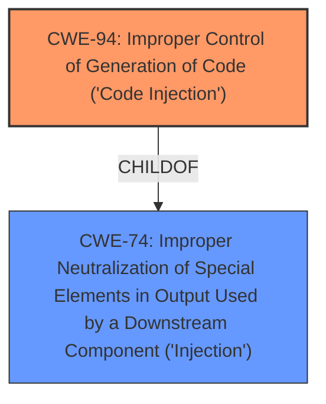

# Analysis for CVE-2022-3384

# Summary
| CWE ID | CWE Name | Confidence | CWE Abstraction Level | CWE Vulnerability Mapping Label | CWE-Vulnerability Mapping Notes |
|---|---|---|---|---|---|
| CWE-94 | Improper Control of Generation of Code ('Code Injection') | 0.9 | Base | Allowed-with-Review | Primary CWE |
| CWE-74 | Improper Neutralization of Special Elements in Output Used by a Downstream Component ('Injection') | 0.6 | Class | Discouraged | Secondary Candidate |

## Evidence and Confidence

*   **Confidence Score:** 0.9
*   **Evidence Strength:** HIGH

## Relationship Analysis
The primary relationship influencing the decision is that **CWE-94** [Improper Control of Generation of Code ('Code Injection')] is a specific type of injection where the injected content is code. **CWE-74** [Improper Neutralization of Special Elements in Output Used by a Downstream Component ('Injection')] is a broader class of injection vulnerabilities.

## Vulnerability Chain
The vulnerability chain starts with **improper input sanitization**, leading to the ability to inject code, and resulting in remote code execution.
  - **Root Cause:** Improper input sanitization (not explicitly a CWE, but the cause)
  - **Weakness:** CWE-94 [Improper Control of Generation of Code ('Code Injection')]
  - **Impact:** Remote Code Execution

## Summary of Analysis
The analysis is based on the provided vulnerability description and the CVE Reference Links Content Summary. The key phrase "improper input sanitization" and the description of the `populate_dropdown_options` function passing user-supplied input through `call_user_func()` without proper sanitization directly support the selection of CWE-94 [Improper Control of Generation of Code ('Code Injection')]. The CVE reference confirms this, stating that the plugin doesn't validate user-supplied input.

The description clearly indicates that the vulnerability involves the construction of a code segment using externally-influenced input, which aligns with the definition of CWE-94 [Improper Control of Generation of Code ('Code Injection')]. While **CWE-74** [Improper Neutralization of Special Elements in Output Used by a Downstream Component ('Injection')] could be considered, it is a more general class, and CWE-94 [Improper Control of Generation of Code ('Code Injection')] provides a more specific and accurate representation of the vulnerability.

The choice of CWE-94 [Improper Control of Generation of Code ('Code Injection')] as the primary CWE is further justified by the MITRE mapping guidance, which acknowledges that this entry is frequently misused for vulnerabilities with a technical impact of "code execution." However, in this case, the vulnerability explicitly involves the construction of a code segment, making CWE-94 [Improper Control of Generation of Code ('Code Injection')] an appropriate choice.

Relevant CWE Information:

# Enhanced Context (25 CWEs)
The following CWEs were identified as potentially relevant to this vulnerability:

## CWE-74: Improper Neutralization of Special Elements in Output Used by a Downstream Component ('Injection')
**Abstraction Level**: Class
**Similarity Score**: 0.77
**Source**: dense

**Description**:
The product constructs all or part of a command, data structure, or record using externally-influenced input from an upstream component, but it does not neutralize or incorrectly neutralizes special elements that could modify how it is parsed or interpreted when it is sent to a downstream component.

**Mapping Guidance**:
- Usage: Discouraged
- Rationale: CWE-74 is high-level and often misused when lower-level weaknesses are more appropriate.

*Technical Explanation:*
CWE-74 [Improper Neutralization of Special Elements in Output Used by a Downstream Component ('Injection')] describes a broad class of injection vulnerabilities. While the vulnerability involves injection, the injected content is specifically code, making CWE-94 [Improper Control of Generation of Code ('Code Injection')] a more precise fit. The MITRE mapping guidance for CWE-74 [Improper Neutralization of Special Elements in Output Used by a Downstream Component ('Injection')] discourages its use when lower-level weaknesses are more appropriate. The overall security implication is that an attacker can inject commands to be executed on the server.

## CWE-94: Improper Control of Generation of Code ('Code Injection')
**Abstraction:** Base
**Status:** Draft

### Description
The product constructs all or part of a code segment using externally-influenced input from an upstream component, but it does not neutralize or incorrectly neutralizes special elements that could modify the syntax or behavior of the intended code segment.

### Extended Description
When a product allows a user's input to contain code syntax, it might be possible for an attacker to craft the code in such a way that it will alter the intended control flow of the product. Such an alteration could lead to arbitrary code execution.

*Technical Explanation:*
CWE-94 [Improper Control of Generation of Code ('Code Injection')] precisely matches the vulnerability description, which involves constructing a code segment (the function call) using user-supplied input without proper neutralization. This allows an attacker to execute arbitrary PHP functions. The security implication is direct code execution on the server.

## Other CWEs Considered and Not Used:
- CWE-790, CWE-138, CWE-116, CWE-78, CWE-88, CWE-96, CWE-434, CWE-79, CWE-352: These CWEs were considered but deemed less relevant as they represent different types of weaknesses (filtering, encoding, OS command injection, XSS, CSRF) that do not directly apply to the code injection aspect of the vulnerability.
- CWE-434 [Unrestricted Upload of File with Dangerous Type] does not apply because the vulnerability involves the execution of PHP functions rather than the upload of files.