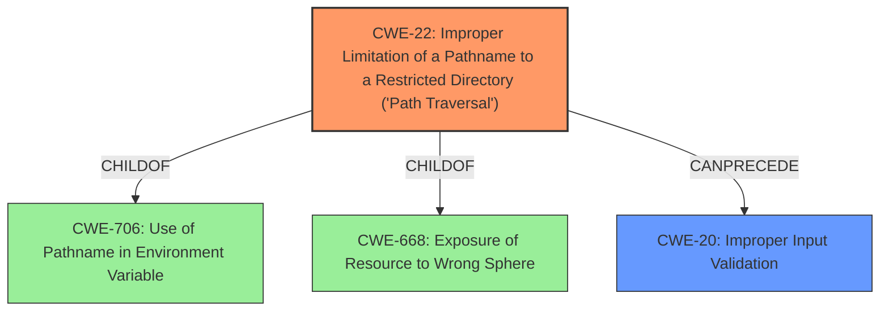

# Analysis Report for CVE-2022-33876

# Vulnerability Analysis Report: CVE-2022-33876

## Description


## Analysis (with Relationship Data)

# Summary

| CWE ID | CWE Name | Confidence | CWE Abstraction Level | CWE Vulnerability Mapping Label | CWE-Vulnerability Mapping Notes |
|---|---|---|---|---|---|
| CWE-22 | Improper Limitation of a Pathname to a Restricted Directory ('Path Traversal') | 0.9 | Base | Allowed | Primary CWE |
| CWE-20 | Improper Input Validation | 0.6 | Class | Discouraged | Secondary Candidate |

## Evidence and Confidence

*   **Confidence Score:** 0.8
*   **Evidence Strength:** HIGH

## Relationship Analysis
The primary CWE is CWE-22, which is a base level CWE. It is a child of CWE-706 (Use of Pathname in Environment Variable) and CWE-668 (Exposure of Resource to Wrong Sphere). CWE-20 is a class level CWE and a parent of many more specific CWEs that address particular types of input validation issues. The relationship between CWE-22 and CWE-20 is that improper input validation can lead to path traversal.



## Vulnerability Chain
The vulnerability chain begins with **improper input validation** (CWE-20), which allows an attacker to craft HTTP requests to retrieve files with specific extensions. This leads to **improper limitation of a pathname to a restricted directory ('Path Traversal')** (CWE-22), enabling the attacker to access files outside the intended directory. The final impact is the disclosure of sensitive information.

## Summary of Analysis
The vulnerability description indicates that there is an **improper input validation** issue that allows an authenticated attacker to retrieve files from the underlying Linux system via crafted HTTP requests. The "CVE Reference Links Content Summary" confirms this, stating "Root cause of vulnerability: Improper input validation in download features" and "Weaknesses/vulnerabilities present: Multiple improper input validation vulnerabilities [CWE-20]". It further states "An authenticated attacker can retrieve files with specific extensions from the underlying Linux system."

Based on this description, the most appropriate CWE is CWE-22, Improper Limitation of a Pathname to a Restricted Directory ('Path Traversal'). This is because the vulnerability allows an attacker to access files outside the intended directory by crafting a pathname. The description explicitly mentions that an attacker can "retrieve files with specific extensions from the underlying Linux system via crafted HTTP requests," which aligns with the core concept of path traversal.

CWE-20, Improper Input Validation, is also relevant because the vulnerability stems from a lack of proper input validation. However, CWE-20 is a class-level CWE and is discouraged when more specific CWEs are available. In this case, CWE-22 is a more specific CWE that accurately describes the vulnerability. While the initial **improper input validation** sets the stage for the attack, the core issue is the ability to traverse the file system, making CWE-22 the primary weakness.

The retriever results also support this conclusion, with CWE-22 having a high score.

I considered other CWEs from the retriever results, such as CWE-78 (Improper Neutralization of Special Elements used in an OS Command ('OS Command Injection')), but this is not the case here, as the attacker is not injecting OS commands. Similarly, CWE-89 (Improper Neutralization of Special Elements used in an SQL Command ('SQL Injection')) is not applicable because the vulnerability does not involve SQL injection. CWE-269 (Improper Privilege Management) and CWE-280 (Improper Handling of Insufficient Permissions or Privileges) were also considered, but these are less relevant because the primary issue is the path traversal vulnerability, not privilege management or permission handling.
I am confident that CWE-22 is the most appropriate CWE for this vulnerability, with CWE-20 as a secondary weakness.


## CWE Relationship Analysis

Current CWEs represent these abstraction levels: .


### Vulnerability Chain Analysis

**Chain starting from CWE-89:**
- 89 (Improper Neutralization of Special Elements used in an SQL Command ('SQL Injection')) - ROOT


**Chain starting from CWE-706:**
- 706 (Use of Incorrectly-Resolved Name or Reference) - ROOT


### CWE Relationship Diagram

```mermaid
graph TD
    classDef primary fill:#f96,stroke:#333,stroke-width:2px
    classDef secondary fill:#69f,stroke:#333
    classDef tertiary fill:#9e9,stroke:#333
```


*Report generated on 2025-03-31 08:51:51*
