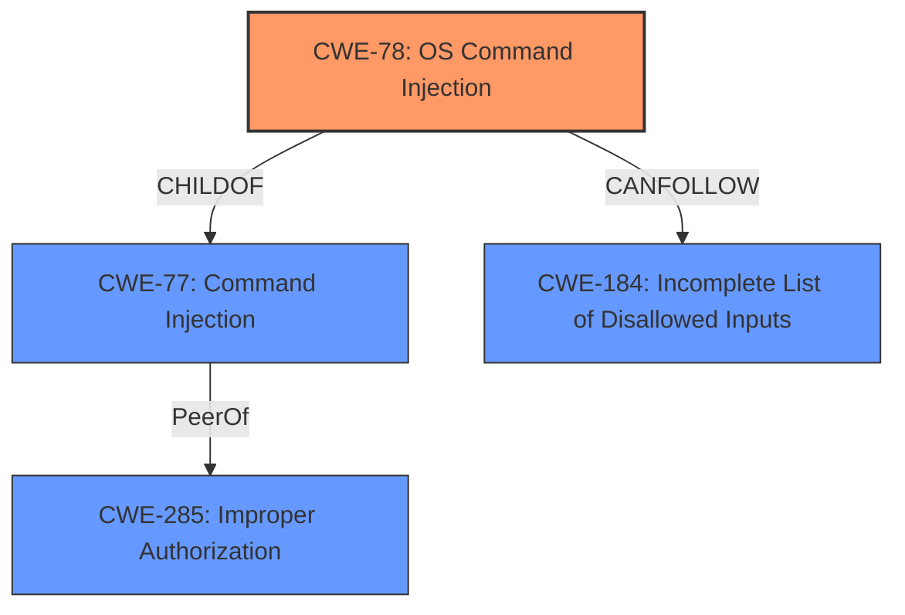

# Enhanced Analysis for CVE-2022-33891

# Summary
| CWE ID | CWE Name | Confidence | CWE Abstraction Level | CWE Vulnerability Mapping Label | CWE-Vulnerability Mapping Notes |
|---|---|---|---|---|---|
| CWE-78 | Improper Neutralization of Special Elements used in an OS Command ('OS Command Injection') | 1.0 | Base | Primary | Allowed |
| CWE-77 | Improper Neutralization of Special Elements used in a Command ('Command Injection') | 0.75 | Class | Secondary | Allowed-with-Review |
| CWE-285 | Improper Authorization | 0.5 | Class | Secondary | Discouraged |

## Evidence and Confidence

*   **Confidence Score:** 0.9
*   **Evidence Strength:** HIGH

## Relationship Analysis
The primary relationship influencing the decision is the child-of relationship between CWE-78 and CWE-77, with CWE-78 being more specific to OS commands. The chain relationship of CANFOLLOW -> CWE-184 (Incomplete List of Disallowed Inputs) is relevant since **improper input sanitization** is noted. The choice of CWE-78 as the base CWE is due to its specificity, whereas CWE-77 is a more general class.



## Vulnerability Chain
The vulnerability chain starts with **improper input sanitization**, leading to **command injection**, and ultimately results in arbitrary shell command execution.
  - **Root Cause:** Improper Input Sanitization in `HttpSecurityFilter`.
  - **Weakness:** Command Injection (CWE-78).
  - **Impact:** Arbitrary Shell Command Execution.
The "CVE Reference Links Content Summary" states that the `HttpSecurityFilter` does not properly sanitize or validate user names, allowing for the injection of arbitrary user names, and this impersonation leads to a permission check function that constructs a shell command with unsanitized input, leading to command injection.

## Summary of Analysis
The primary assessment is based on the provided evidence which clearly indicates a **command injection** vulnerability due to **improper input sanitization**. The "Vulnerability Description Key Phrases" lists both **improper input sanitization** and **command injection**. The "CVE Reference Links Content Summary" also supports that the vulnerability stems from a flaw in the `HttpSecurityFilter` within the Apache Spark UI, which leads to the construction and execution of a Unix shell command based on the attacker-controlled input.

The choice of CWE-78 is justified by the fact that the command being executed is specifically an OS command. While CWE-77 is a more general "Command Injection", CWE-78 provides better specificity. The relationship analysis confirms that CWE-78 is a child of CWE-77, indicating a more specific classification.

CWE-285 was considered, as impersonation is involved. However, the primary issue is not the authorization itself, but rather the **improper sanitization** of input leading to **command injection**. The vulnerability allows for impersonation, but the root cause is the **improper sanitization** that enables the **command injection** in the first place. Therefore, I have chosen to make this a secondary candidate with a lower confidence.

The chosen CWEs are at the optimal level of specificity because they accurately represent the root cause and the immediate consequence of the vulnerability, as described in the provided information.

Relevant CWE Information:

# Enhanced Context (25 CWEs)
The following CWEs were identified as potentially relevant to this vulnerability:

## CWE-274: Improper Handling of Insufficient Privileges
**Abstraction Level**: Base
**Similarity Score**: 0.76
**Source**: dense

**Description**:
The product does not handle or incorrectly handles when it has insufficient privileges to perform an operation, leading to resultant weaknesses.

**Mapping Guidance**:
- Usage: Discouraged
- Rationale: This CWE entry could be deprecated in a future version of CWE.

*Not Selected*: This CWE relates to insufficient privileges, which isn't the core issue here. The problem is with **improper input sanitization** leading to **command injection**, regardless of privilege levels.

## CWE-653: Improper Isolation or Compartmentalization
**Abstraction Level**: Class
**Similarity Score**: 0.76
**Source**: dense

**Description**:
The product does not properly compartmentalize or isolate functionality, processes, or resources that require different privilege levels, rights, or permissions.

**Mapping Guidance**:
- Usage: Allowed
- Rationale: This CWE entry is at the Base level of abstraction, which is a preferred level of abstraction for mapping to the root causes of vulnerabilities.

*Not Selected*: The vulnerability isn't primarily about isolation, but rather about **improper input sanitization** leading to **command injection**.

## CWE-266: Incorrect Privilege Assignment
**Abstraction Level**: Base
**Similarity Score**: 0.76
**Source**: dense

**Description**:
A product incorrectly assigns a privilege to a particular actor, creating an unintended sphere of control for that actor.

**Mapping Guidance**:
- Usage: Allowed
- Rationale: This CWE entry is at the Base level of abstraction, which is a preferred level of abstraction for mapping to the root causes of vulnerabilities.

*Not Selected*: Incorrect privilege assignment isn't the central issue. The main problem is the **improper input sanitization** that allows **command injection**.

## CWE-280: Improper Handling of Insufficient Permissions or Privileges
**Abstraction Level**: Base
**Similarity Score**: 0.75
**Source**: dense

**Description**:
The product does not handle or incorrectly handles when it has insufficient privileges to access resources or functionality as specified by their permissions. This may cause it to follow unexpected code paths that may leave the product in an invalid state.

**Mapping Guidance**:
- Usage: Allowed
- Rationale: This CWE entry is at the Base level of abstraction, which is a preferred level of abstraction for mapping to the root causes of vulnerabilities.

*Not Selected*: The core problem is not the handling of insufficient privileges or permissions, but the **improper input sanitization** allowing for **command injection**.

## CWE-267: Privilege Defined With Unsafe Actions
**Abstraction Level**: Base
**Similarity Score**: 0.75
**Source**: dense

**Description**:
A particular privilege, role, capability, or right can be used to perform unsafe actions that were not intended, even when it is assigned to the correct entity.

**Mapping Guidance**:
- Usage: Allowed
- Rationale: This CWE entry is at the Base level of abstraction, which is a preferred level of abstraction for mapping to the root causes of vulnerabilities.

*Not Selected*: While privilege is involved, the primary weakness is the **improper input sanitization** that enables **command injection**.

## CWE-41: Improper Resolution of Path Equivalence
**Abstraction Level**: Base
**Similarity Score**: 0.75
**Source**: dense

**Description**:
The product is vulnerable to file system contents disclosure through path equivalence. Path equivalence involves the use of special characters in file and directory names. The associated manipulations are intended to generate multiple names for the same object.

**Mapping Guidance**:
- Usage: Allowed
- Rationale: This CWE entry is at the Base level of abstraction, which is a preferred level of abstraction for mapping to the root causes of vulnerabilities.

*Not Selected*: Path equivalence isn't relevant to this **command injection** vulnerability.

## CWE-668: Exposure of Resource to Wrong Sphere
**Abstraction Level**: Class
**Similarity Score**: 0.75
**Source**: dense

**Description**:
The product exposes a resource to the wrong control sphere, providing unintended actors with inappropriate access to the resource.

**Mapping Guidance**:
- Usage: Discouraged
- Rationale: CWE-668 is high-level and is often misused as a catch-all when lower-level CWE IDs might be applicable. It is sometimes used for low-information vulnerability reports [REF-1287]. It is a level-1 Class (i.e., a child of a Pillar). It is not useful for trend analysis.

*Not Selected*: This is too high-level. The core issue is **improper input sanitization** leading to **command injection**.

## CWE-59: Improper Link Resolution Before File Access ('Link Following')
**Abstraction Level**: Base
**Similarity Score**: 0.74
**Source**: dense

**Description**:
The product attempts to access a file based on the filename, but it does not properly prevent that filename from identifying a link or shortcut that resolves to an unintended resource.


## CWE Relationship Analysis

Current CWEs represent these abstraction levels: .


### Vulnerability Chain Analysis

**Chain starting from CWE-266:**
- 266 (Incorrect Privilege Assignment) - ROOT


**Chain starting from CWE-280:**
- 280 (Improper Handling of Insufficient Permissions or Privileges ) - ROOT


### CWE Relationship Diagram

```mermaid
graph TD
    classDef primary fill:#f96,stroke:#333,stroke-width:2px
    classDef secondary fill:#69f,stroke:#333
    classDef tertiary fill:#9e9,stroke:#333
```