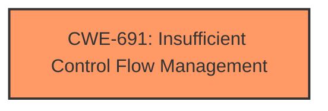

# Raw Analyzer Response for CVE-2022-33902

# Summary
| CWE ID | CWE Name | Confidence | CWE Abstraction Level | CWE Vulnerability Mapping Label | CWE-Vulnerability Mapping Notes |
|---|---|---|---|---|---|
| CWE-691 | Insufficient Control Flow Management | 0.8 | Pillar | Primary | Discouraged |

## Evidence and Confidence

*   **Confidence Score:** 0.8
*   **Evidence Strength:** HIGH

## Relationship Analysis
The primary CWE, CWE-691, is a Pillar, which is a high-level abstraction. There are no direct child relationships for this CWE in the provided data. However, the description matches the root cause indicated in the vulnerability description.

## Vulnerability Chain
The chain of root cause and weaknesses is:
1.  **Root Cause:** **Insufficient Control Flow Management** (CWE-691)
2.  **Impact:** Escalation of Privilege

## Summary of Analysis
The initial assessment strongly points to CWE-691 (**Insufficient Control Flow Management**) as the primary weakness.

The vulnerability description explicitly mentions "**insufficient control flow management**" as the root cause. The CVE Reference Links Content Summary also highlights "**insufficient control flow management** within the Intel® Quartus Prime Pro and Standard edition software." This direct textual evidence significantly strengthens the case for CWE-691.

CWE-691 is a Pillar-level CWE, meaning it's a high-level categorization. While it's generally preferred to map to Base or Variant level CWEs for greater specificity, the available information doesn't provide enough detail to pinpoint a more specific weakness. The usage is Discouraged for CWE-691 because it is a Pillar, but classification research is limited for weaknesses of this type.

I considered other CWEs:
*   CWE-1256 (**Improper Restriction of Software Interfaces to Hardware Features**) was considered given the product. However, the vulnerability description does not mention any hardware features or interfaces, so it was not selected.
*   CWE-284 (**Improper Access Control**): While the impact is privilege escalation, the root cause is specifically control flow management, not a general access control issue.
*   CWE-119 (**Improper Restriction of Operations within the Bounds of a Memory Buffer**): There's no mention of memory buffers or out-of-bounds operations.
*   CWE-287 (**Improper Authentication**) and CWE-20 (**Improper Input Validation**) are not directly supported by the vulnerability description.

Based on the evidence, CWE-691 is the most appropriate, despite being a high-level categorization. The confidence is relatively high (0.8) due to the explicit mention of "insufficient control flow management" in the vulnerability description.

Relevant CWE Information:
*   CWE-691: Insufficient Control Flow Management
    *   Abstraction: Pillar
    *   Status: Draft
    *   Description: The code does not sufficiently manage its control flow during execution, creating conditions in which the control flow can be modified in unexpected ways.
    *   Mapping Guidance:
        *   Usage: Discouraged
        *   Rationale: This CWE entry is extremely high-level, a Pillar. However, classification research is limited for weaknesses of this type, so there can be gaps or organizational difficulties within CWE that force use of this weakness, even at such a high level of abstraction.
        *   Comments: Where feasible, consider children or descendants of this entry instead.