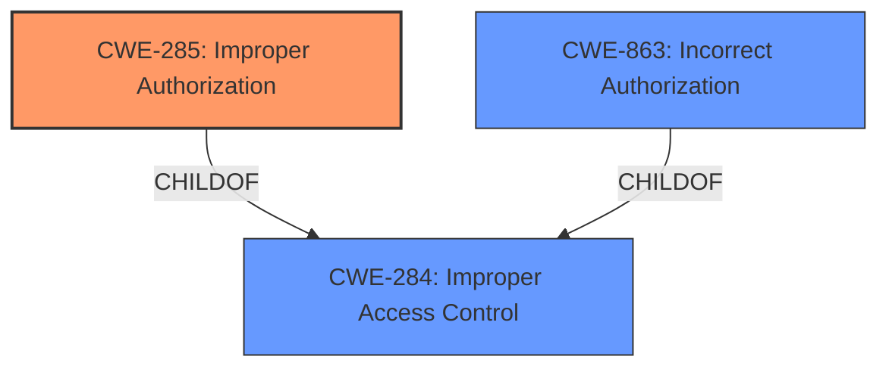

# Analysis Report for CVE-2022-33924

# Vulnerability Analysis Report: CVE-2022-33924

## Description


## Analysis (with Relationship Data)

# Summary
| CWE ID | CWE Name | Confidence | CWE Abstraction Level | CWE Vulnerability Mapping Label | CWE-Vulnerability Mapping Notes |
|---|---|---|---|---|---|
| CWE-285 | Improper Authorization | 0.8 | Class | Primary | Allowed-with-Review |
| CWE-863 | Incorrect Authorization | 0.6 | Class | Secondary | Allowed-with-Review |
| CWE-284 | Improper Access Control | 0.5 | Pillar | Secondary | Discouraged |

## Evidence and Confidence

*   **Confidence Score:** 0.8
*   **Evidence Strength:** HIGH

## Relationship Analysis
The primary CWE selected is CWE-285, Improper Authorization, which is a child of CWE-284, Improper Access Control. CWE-863, Incorrect Authorization, is also a child of CWE-284. The relationship between these CWEs helped narrow down the selection from the more general CWE-284 to the more specific CWE-285.



## Vulnerability Chain
The vulnerability chain starts with the **improper access control**, leading to an attacker being able to create rules despite lacking the necessary permissions. This results in the attacker potentially creating a schedule to run the rule.

## Summary of Analysis
The initial analysis focused on identifying the root cause of the vulnerability based on the description and key phrases. The description clearly states "**Improper Access control**" as the root cause. The **CVE Reference Links Content Summary** confirms this by stating "Root cause of vulnerability: **Improper Access control**".

The Retriever Results listed several candidate CWEs, with CWE-284 (Improper Access Control), CWE-285 (Improper Authorization), and CWE-863 (Incorrect Authorization) being the top candidates.

CWE-284 is a Pillar-level CWE, which is too high-level according to the mapping guidance. While it is the most obvious match, the guidance suggests using more specific descendants when available.
CWE-285 and CWE-863 are both Class-level CWEs and children of CWE-284. CWE-285 describes a scenario where the product does not perform or incorrectly performs an authorization check. CWE-863 describes a scenario where the product performs an authorization check, but it does not correctly perform the check. Since the vulnerability description states that the attacker with no access is able to create rules, this suggests that the authorization check is either missing or incorrectly implemented. Therefore, CWE-285 is the better fit.

Although the description states "**Improper Access control**" as the root cause, the more precise issue appears to be related to authorization, which is a specific type of access control.

The selection of CWE-285 is further supported by the fact that the attacker is "with no access to create rules," implying a failure in the authorization process.

I also considered CWE-732 (Incorrect Permission Assignment for Critical Resource), but it is less applicable here because the issue is not about incorrect permission assignments but rather about the lack of proper authorization checks.

The final decision is based on a combination of the vulnerability description, the Retriever Results, and the CWE specifications. CWE-285 provides the most accurate and specific representation of the vulnerability's root cause, while also adhering to the mapping guidance.

Relevant CWE Information:

# Enhanced Context (25 CWEs)

## CWE-99: Improper Control of Resource Identifiers ('Resource Injection')
**Abstraction Level**: Class
**Similarity Score**: 0.75
**Source**: dense

**Description**:
The product receives input from an upstream component, but it does not restrict or incorrectly restricts the input before it is used as an identifier for a resource that may be outside the intended sphere of control.
**Reasons for not using:** The vulnerability is not about controlling resource identifiers, but about access control.

## CWE-1220: Insufficient Granularity of Access Control
**Abstraction Level**: Base
**Similarity Score**: 0.74
**Source**: dense

**Description**:
The product implements access controls via a policy or other feature with the intention to disable or restrict accesses (reads and/or writes) to assets in a system from untrusted agents. However, implemented access controls lack required granularity, which renders the control policy too broad because it allows accesses from unauthorized agents to the security-sensitive assets.
**Reasons for not using:** While this could be a factor, the main issue is the lack of proper authorization checks, rather than the granularity of the access control.

## CWE-915: Improperly Controlled Modification of Dynamically-Determined Object Attributes
**Abstraction Level**: Base
**Similarity Score**: 0.74
**Source**: dense

**Description**:
The product receives input from an upstream component that specifies multiple attributes, properties, or fields that are to be initialized or updated in an object, but it does not properly control which attributes can be modified.
**Reasons for not using:** This is not about modifying object attributes.

## CWE-470: Use of Externally-Controlled Input to Select Classes or Code ('Unsafe Reflection')
**Abstraction Level**: Base
**Similarity Score**: 0.74
**Source**: dense

**Description**:
The product uses external input with reflection to select which classes or code to use, but it does not sufficiently prevent the input from selecting improper classes or code.
**Reasons for not using:** This is not related to code selection or reflection.

## CWE-691: Insufficient Control Flow Management
**Abstraction Level**: Pillar
**Similarity Score**: 0.73
**Source**: dense

**Description**:
The code does not sufficiently manage its control flow during execution, creating conditions in which the control flow can be modified in unexpected ways.
**Reasons for not using:** Too general.

## CWE-74: Improper Neutralization of Special Elements in Output Used by a Downstream Component ('Injection')
**Abstraction Level**: Class
**Similarity Score**: 0.73
**Source**: dense

**Description**:
The product constructs all or part of a command, data structure, or record using externally-influenced input from an upstream component, but it does not neutralize or incorrectly neutralizes special elements that could modify how it is parsed or interpreted when it is sent to a downstream component.
**Reasons for not using:** This is not about injection vulnerabilities.

## CWE-653: Improper Isolation or Compartmentalization
**Abstraction Level**: Class
**Similarity Score**: 0.72
**Source**: dense

**Description**:
The product does not properly compartmentalize or isolate functionality, processes, or resources that require different privilege levels, rights, or permissions.
**Reasons for not using:** The main problem is the improper authorization, not the isolation.

## CWE-807: Reliance on Untrusted Inputs in a Security Decision
**Abstraction Level**: Base
**Similarity Score**: 0.72
**Source**: dense

**Description**:
The product uses a protection mechanism that relies on the existence or values of an input, but the input can be modified by an untrusted actor in a way that bypasses the protection mechanism.
**Reasons for not using:** This is not directly related to reliance on untrusted inputs.

## CWE-664: Improper Control of a Resource Through its Lifetime
**Abstraction Level**: Pillar
**Similarity Score**: 0.72
**Source**: dense

**Description**:
The product does not maintain or incorrectly maintains control over a resource throughout its lifetime of creation, use, and release.
**Reasons for not using:** Too general.

## CWE-913: Improper Control of Dynamically-Managed Code Resources
**Abstraction Level**: Class
**Similarity Score**: 0.72
**Source**: dense

**Description**:
The product does not properly restrict reading from or writing to dynamically-managed code resources such as variables, objects, classes, attributes, functions, or executable instructions or statements.
**Reasons for not using:** This is not about dynamically-managed code resources.

## CWE-863: Incorrect Authorization
**Abstraction Level**: Class
**Similarity Score**: 7033.54
**Source**: sparse

**Description**:
The product performs an authorization check when an actor attempts to access a resource or perform an action, but it does not correctly perform the check.
**Reasons for considering but not using as primary:** While this is close, the description mentions "no access to create rules," which implies the authorization check might be missing rather than simply incorrect.

## CWE-285: Improper Authorization
**Abstraction Level**: Class
**Similarity Score**: 6919.89
**Source**: sparse

**Description**:
The product does not perform or incorrectly performs


## CWE Relationship Analysis

Current CWEs represent these abstraction levels: .


### Vulnerability Chain Analysis

**Chain starting from CWE-470:**
- 470 (Use of Externally-Controlled Input to Select Classes or Code ('Unsafe Reflection')) - ROOT


**Chain starting from CWE-913:**
- 913 (Improper Control of Dynamically-Managed Code Resources) - ROOT


### CWE Relationship Diagram

```mermaid
graph TD
    classDef primary fill:#f96,stroke:#333,stroke-width:2px
    classDef secondary fill:#69f,stroke:#333
    classDef tertiary fill:#9e9,stroke:#333
```


*Report generated on 2025-03-30 13:20:32*
