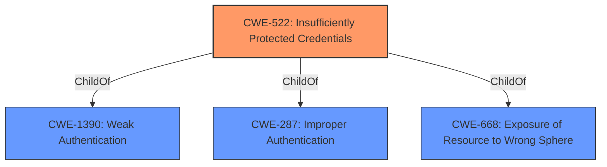

# Analysis for CVE-2022-33953

# Summary
| CWE ID | CWE Name | Confidence | CWE Abstraction Level | CWE Vulnerability Mapping Label | CWE-Vulnerability Mapping Notes |
|---|---|---|---|---|---|
| CWE-522 | Insufficiently Protected Credentials | 0.9 | Class | Allowed-with-Review | Primary CWE |

## Evidence and Confidence

*   **Confidence Score:** 0.9
*   **Evidence Strength:** HIGH

## Relationship Analysis
The primary CWE identified is CWE-522 (**CWE-522: Insufficiently Protected Credentials**). This is a Class-level CWE. It has hierarchical relationships with CWE-1390 (**CWE-1390: Weak Authentication**), CWE-287 (**CWE-287: Improper Authentication**), and CWE-668 (**CWE-668: Exposure of Resource to Wrong Sphere**). The analysis did not identify any chain relationships. The decision to select CWE-522 was influenced by the root cause provided in the vulnerability description, specifically "**insufficiently protected access tokens**". The abstraction level was kept at the Class level as the specifics of the protection mechanism were not defined in the description.

## Vulnerability Chain
The chain of events for this vulnerability description are:
1.  **Root Cause:** **Insufficiently protected access tokens** (CWE-522)
2.  **Impact:** User with physical access obtains sensitive information.

The vulnerability description indicates a direct link between the root cause and impact without intermediate steps.

## Summary of Analysis
The initial analysis focused on identifying the root cause of the vulnerability, which was stated as "**insufficiently protected access tokens**". The evidence for this is directly from the "Vulnerability Description Key Phrases" and "CVE Reference Links Content Summary".

The Retriever Results identified CWE-522 (**CWE-522: Insufficiently Protected Credentials**) as the top candidate. This CWE aligns directly with the vulnerability description's focus on **insufficiently protected access tokens**. The mapping guidance for CWE-522 suggests that it is a Class-level CWE and that examining its children might reveal a better fit. However, without more information, keeping the mapping at the Class level is appropriate.

The other CWEs considered were:

*   CWE-613 (**CWE-613: Insufficient Session Expiration**): While related to token management, it focuses on session expiration, which is not the primary issue described.
*   CWE-327 (**CWE-327: Use of a Broken or Risky Cryptographic Algorithm**): This could be a contributing factor, but the description does not specify the cryptographic algorithm or lack thereof.
*   CWE-614 (**CWE-614: Sensitive Cookie in HTTPS Session Without 'Secure' Attribute**): This is specific to cookies and HTTPS, which is not mentioned in the vulnerability description.
*   CWE-287 (**CWE-287: Improper Authentication**): While a consequence could be authentication bypass, it is not the core weakness.

The decision to select CWE-522 (**CWE-522: Insufficiently Protected Credentials**) is based on the direct match with the vulnerability description and the retriever results. The evidence is strong, and the confidence level is high. The mapping is at the optimal level of specificity given the provided information.

Relevant CWE Information:

# Enhanced Context (25 CWEs)
The following CWEs were identified as potentially relevant to this vulnerability:

## CWE-312: Cleartext Storage of Sensitive Information
**Abstraction Level**: Base
**Similarity Score**: 0.79
**Source**: dense

**Description**:
The product stores sensitive information in cleartext within a resource that might be accessible to another control sphere.

**Mapping Guidance**:
- Usage: Allowed
- Rationale: This CWE entry is at the Base level of abstraction, which is a preferred level of abstraction for mapping to the root causes of vulnerabilities.

## CWE-319: Cleartext Transmission of Sensitive Information
**Abstraction Level**: Base
**Similarity Score**: 0.77
**Source**: dense

**Description**:
The product transmits sensitive or security-critical data in cleartext in a communication channel that can be sniffed by unauthorized actors.

**Mapping Guidance**:
- Usage: Allowed
- Rationale: This CWE entry is at the Base level of abstraction, which is a preferred level of abstraction for mapping to the root causes of vulnerabilities.

## CWE-1391: Use of Weak Credentials
**Abstraction Level**: Class
**Similarity Score**: 0.75
**Source**: dense

**Description**:
The product uses weak credentials (such as a default key or hard-coded password) that can be calculated, derived, reused, or guessed by an attacker.

**Mapping Guidance**:
- Usage: Allowed-with-Review
- Rationale: This CWE entry is a Class and might have Base-level children that would be more appropriate

## CWE-538: Insertion of Sensitive Information into Externally-Accessible File or Directory
**Abstraction Level**: Base
**Similarity Score**: 0.75
**Source**: dense

**Description**:
The product places sensitive information into files or directories that are accessible to actors who are allowed to have access to the files, but not to the sensitive information.

**Mapping Guidance**:
- Usage: Allowed
- Rationale: This CWE entry is at the Base level of abstraction, which is a preferred level of abstraction for mapping to the root causes of vulnerabilities.

## CWE-311: Missing Encryption of Sensitive Data
**Abstraction Level**: Class
**Similarity Score**: 0.75
**Source**: dense

**Description**:
The product does not encrypt sensitive or critical information before storage or transmission.

**Mapping Guidance**:
- Usage: Discouraged
- Rationale: CWE-311 is high-level with more precise children available. It is a level-1 Class (i.e., a child of a Pillar).

## CWE-807: Reliance on Untrusted Inputs in a Security Decision
**Abstraction Level**: Base
**Similarity Score**: 0.75
**Source**: dense

**Description**:
The product uses a protection mechanism that relies on the existence or values of an input, but the input can be modified by an untrusted actor in a way that bypasses the protection mechanism.

**Mapping Guidance**:
- Usage: Allowed
- Rationale: This CWE entry is at the Base level of abstraction, which is a preferred level of abstraction for mapping to the root causes of vulnerabilities.

## CWE-212: Improper Removal of Sensitive Information Before Storage or Transfer
**Abstraction Level**: Base
**Similarity Score**: 0.74
**Source**: dense

**Description**:
The product stores, transfers, or shares a resource that contains sensitive information, but it does not properly remove that information before the product makes the resource available to unauthorized actors.

**Mapping Guidance**:
- Usage: Allowed
- Rationale: This CWE entry is at the Base level of abstraction, which is a preferred level of abstraction for mapping to the root causes of vulnerabilities.

## CWE-668: Exposure of Resource to Wrong Sphere
**Abstraction Level**: Class
**Similarity Score**: 0.74
**Source**: dense

**Description**:
The product exposes a resource to the wrong control sphere, providing unintended actors with inappropriate access to the resource.

**Mapping Guidance**:
- Usage: Discouraged
- Rationale: CWE-668 is high-level and is often misused as a catch-all when lower-level CWE IDs might be applicable. It is sometimes used for low-information vulnerability reports [REF-1287]. It is a level-1 Class (i.e., a child of a Pillar). It is not useful for trend analysis.

## CWE-345: Insufficient Verification of Data Authenticity
**Abstraction Level**: Class
**Similarity Score**: 0.74
**Source**: dense

**Description**:
The product does not sufficiently verify the origin or authenticity of data, in a way that causes it to accept invalid data.

**Mapping Guidance**:
- Usage: Discouraged
- Rationale: This CWE entry is a level-1 Class (i.e., a child of a Pillar). It might have lower-level children that would be more appropriate

## CWE-522: Insufficiently Protected Credentials
**Abstraction Level**: Class