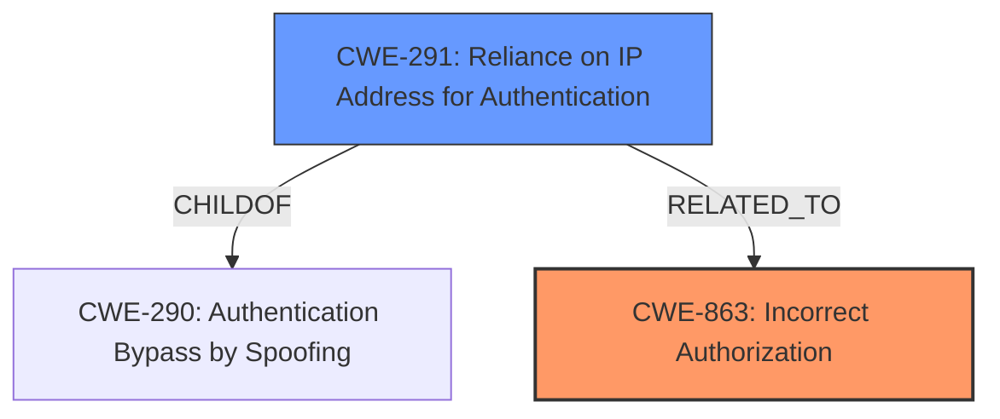

# Analysis Report for CVE-2022-33962

# Vulnerability Analysis Report: CVE-2022-33962

## Description


## Analysis (with Relationship Data)

# Summary
| CWE ID | CWE Name | Confidence | CWE Abstraction Level | CWE Vulnerability Mapping Label | CWE-Vulnerability Mapping Notes |
|---|---|---|---|---|---|
| CWE-863 | Incorrect Authorization | 0.8 | Class | Primary | Allowed-with-Review |
| CWE-291 | Reliance on IP Address for Authentication | 0.6 | Variant | Secondary | Allowed |

## Evidence and Confidence

*   **Confidence Score:** 0.7
*   **Evidence Strength:** MEDIUM

## Relationship Analysis
The primary CWE is CWE-863, which represents an **incorrect authorization**. CWE-291 is a variant of CWE-290 (Authentication Bypass by Spoofing) and is related because the vulnerability involves **bypassing access control restrictions** through reliance on IP addresses, which can be spoofed. The relationship between CWE-291 and CWE-863 exists because **incorrect authorization** can stem from reliance on an easily spoofed IP address.



## Vulnerability Chain
The vulnerability chain starts with the **weakness** in the iRules commands within BIG-IP that allows bypassing access control. This leads to **incorrect authorization** (CWE-863), potentially due to **reliance on IP address for authentication** (CWE-291) which can be spoofed to **bypass access control restrictions.**

## Summary of Analysis
The initial analysis pointed to **incorrect authorization** as the primary issue, supported by the vulnerability description stating the attacker can "**bypass access control restrictions**". This aligns with CWE-863, which describes scenarios where authorization checks are not correctly performed. The supporting evidence includes the "Vulnerability Description Key Phrases" noting the "**weakness:** **bypass access control restrictions**" and "**impact:** bypass the access control restrictions". The Retriever results also listed CWE-863. Further analysis considered the potential for **reliance on IP address for authentication** (CWE-291), as IP addresses can be spoofed to **bypass access control**.

The selection of CWE-863 and CWE-291 provides the optimal level of specificity. CWE-863 captures the **incorrect authorization** mechanism, while CWE-291 highlights the specific technique of **relying on IP addresses for authentication**, which contributes to the **bypass**.

Relevant CWE Information:

# Enhanced Context (25 CWEs)
The following CWEs were identified as potentially relevant to this vulnerability:

## CWE-405: Asymmetric Resource Consumption (Amplification)
**Abstraction Level**: Class
**Similarity Score**: 0.77
**Source**: dense
**Description**:
The product does not properly control situations in which an adversary can cause the product to consume or produce excessive resources without requiring the adversary to invest equivalent work or otherwise prove authorization, i.e., the adversary's influence is "asymmetric."
**Rationale for not selecting:** This CWE does not fit the vulnerability description, which is about bypassing access control, not resource consumption.

## CWE-1176: Inefficient CPU Computation
**Abstraction Level**: Class
**Similarity Score**: 0.75
**Source**: dense
**Description**:
The product performs CPU computations using
         algorithms that are not as efficient as they could be for the
         needs of the developer, i.e., the computations can be
         optimized further.
**Rationale for not selecting:** This CWE does not fit the vulnerability description, which is about bypassing access control, not CPU inefficiency.

## CWE-404: Improper Resource Shutdown or Release
**Abstraction Level**: Class
**Similarity Score**: 0.75
**Source**: dense
**Description**:
The product does not release or incorrectly releases a resource before it is made available for re-use.
**Rationale for not selecting:** This CWE does not fit the vulnerability description, which is about bypassing access control, not resource management.

## CWE-664: Improper Control of a Resource Through its Lifetime
**Abstraction Level**: Pillar
**Similarity Score**: 0.74
**Source**: dense
**Description**:
The product does not maintain or incorrectly maintains control over a resource throughout its lifetime of creation, use, and release.
**Rationale for not selecting:** This CWE is too general and doesn't accurately describe the **incorrect authorization** issue.

## CWE-226: Sensitive Information in Resource Not Removed Before Reuse
**Abstraction Level**: Base
**Similarity Score**: 0.74
**Source**: dense
**Description**:
The product releases a resource such as memory or a file so that it can be made available for reuse, but it does not clear or "zeroize" the information contained in the resource before the product performs a critical state transition or makes the resource available for reuse by other entities.
**Rationale for not selecting:** This CWE does not fit the vulnerability description, which is about bypassing access control, not about sensitive information leakage.

## CWE-653: Improper Isolation or Compartmentalization
**Abstraction Level**: Class
**Similarity Score**: 0.74
**Source**: dense
**Description**:
The product does not properly compartmentalize or isolate functionality, processes, or resources that require different privilege levels, rights, or permissions.
**Rationale for not selecting:** The description does not show an isolation or compartmentalization issue.

## CWE-799: Improper Control of Interaction Frequency
**Abstraction Level**: Class
**Similarity Score**: 0.74
**Source**: dense
**Description**:
The product does not properly limit the number or frequency of interactions that it has with an actor, such as the number of incoming requests.
**Rationale for not selecting:** This CWE does not fit the vulnerability description, which is about bypassing access control, not rate limiting.

## CWE-667: Improper Locking
**Abstraction Level**: Class
**Similarity Score**: 0.74
**Source**: dense
**Description**:
The product does not properly acquire or release a lock on a resource, leading to unexpected resource state changes and behaviors.
**Rationale for not selecting:** This CWE does not fit the vulnerability description, which is about bypassing access control, not locking mechanisms.

## CWE-407: Inefficient Algorithmic Complexity
**Abstraction Level**: Class
**Similarity Score**: 0.73
**Source**: dense
**Description**:
An algorithm in a product has an inefficient worst-case computational complexity that may be detrimental to system performance and can be triggered by an attacker, typically using crafted manipulations that ensure that the worst case is being reached.
**Rationale for not selecting:** This CWE does not fit the vulnerability description, which is about bypassing access control, not algorithm inefficiency.

## CWE-668: Exposure of Resource to Wrong Sphere
**Abstraction Level**: Class
**Similarity Score**: 0.73
**Source**: dense
**Description**:
The product exposes a resource to the wrong control sphere, providing unintended actors with inappropriate access to the resource.
**Rationale for not selecting:** This CWE is too general and doesn't specifically address the authorization **bypass** issue.

## CWE-119: Improper Restriction of Operations within the Bounds of a Memory Buffer
**Abstraction Level**: Class
**Similarity Score**: 5034.85
**Source**: sparse
**Description**:
The product performs operations on a memory buffer, but it reads from or writes to a memory location outside the buffer's intended boundary. This may result in read or write operations on unexpected memory locations that could be linked to other variables, data structures, or internal program data.
**Rationale for not selecting:** This CWE does not fit the vulnerability description, which is about bypassing access control, not a buffer overflow.

## CWE-770: Allocation of Resources Without Limits or Throttling
**Abstraction Level**: Base
**Similarity Score**: 5019.53
**Source**: sparse
**Description**:
The product allocates a reusable resource or group of resources on behalf of an actor without imposing any restrictions on the size or number of resources that can be allocated, in violation of the intended security policy for that actor.
**Rationale for not selecting:** This CWE does not fit the vulnerability description, which is about bypassing access control, not resource allocation.

## CWE-863: Incorrect Authorization
**Abstraction Level**: Class
**Similarity Score**: 5000.53
**Source**: sparse
**Description**:
The product performs an authorization check when an actor attempts to access a resource or perform an action, but it does not correctly perform the check.
**Rationale for selecting:** This is the primary CWE because it directly addresses the vulnerability: **bypassing access control restrictions**.

## CWE-639: Authorization Bypass Through User-Controlled Key
**Abstraction Level**: Base
**Similarity Score**: 4933.39
**Source


## CWE Relationship Analysis

Current CWEs represent these abstraction levels: .


### Vulnerability Chain Analysis

**Chain starting from CWE-226:**
- 226 (Sensitive Information in Resource Not Removed Before Reuse) - ROOT


**Chain starting from CWE-290:**
- 290 (Authentication Bypass by Spoofing) - ROOT


### CWE Relationship Diagram

```mermaid
graph TD
    classDef primary fill:#f96,stroke:#333,stroke-width:2px
    classDef secondary fill:#69f,stroke:#333
    classDef tertiary fill:#9e9,stroke:#333
```


*Report generated on 2025-03-31 06:57:59*
