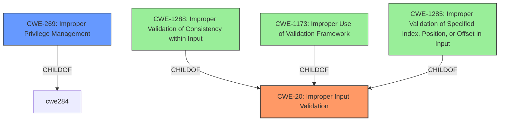

# Raw Analyzer Response for CVE-2022-33964

# Summary
| CWE ID | CWE Name | Confidence | CWE Abstraction Level | CWE Vulnerability Mapping Label | CWE-Vulnerability Mapping Notes |
|---|---|---|---|---|---|
| CWE-20 | Improper Input Validation | 0.9 | Class | Primary | Discouraged |
| CWE-269 | Improper Privilege Management | 0.6 | Class | Secondary | Discouraged |

## Evidence and Confidence

*   **Confidence Score:** 0.8
*   **Evidence Strength:** HIGH

## Relationship Analysis
The primary CWE is CWE-20, which is a class-level CWE. The analysis also considered CWE-269 as a potential secondary weakness due to the impact of privilege escalation, although the root cause is more directly related to input validation. The relationship between CWE-20 and its child CWEs (CWE-1288, CWE-1173, CWE-1285) was examined to determine if a more specific CWE could be assigned, but CWE-20 remains the most appropriate given the available information.

## Vulnerability Chain
The vulnerability chain starts with **improper input validation** (CWE-20), which leads to an escalation of privilege.

## Summary of Analysis
The vulnerability description states "**Improper input validation** in the Intel(R) SUR software before version 2.4.8902 may allow an unauthenticated user to potentially enable escalation of privilege via network access." The CVE Reference Links Content Summary confirms this, stating the root cause is "**Improper input validation**" and the impact is "Escalation of privilege."

Based on this evidence, the primary CWE is CWE-20 (**Improper Input Validation**). The description of CWE-20 states: "The product receives input or data, but it does not validate or incorrectly validates that the input has the properties that are required to process the data safely and correctly." This aligns directly with the vulnerability description.

CWE-269 (**Improper Privilege Management**) was considered as a secondary CWE, given that the impact is escalation of privilege, but the **root cause** is more directly related to input validation. The description of CWE-269 states: "The product does not properly assign, modify, track, or check privileges for an actor, creating an unintended sphere of control for that actor." While the end result is privilege escalation, the initial **weakness** is in the input validation, making CWE-20 the more appropriate primary classification.

The Retriever Results listed several other CWEs, including CWE-691 (**Insufficient Control Flow Management**), CWE-1288 (**Improper Validation of Consistency within Input**), CWE-287 (**Improper Authentication**), CWE-284 (**Improper Access Control**), CWE-269 (**Improper Privilege Management**), CWE-73 (**External Control of File Name or Path**), CWE-277 (**Insecure Inherited Permissions**), CWE-1173 (**Improper Use of Validation Framework**), and CWE-1285 (**Improper Validation of Specified Index, Position, or Offset in Input**). While some of these might be contributing factors, the core **weakness** remains **improper input validation**, making CWE-20 the most accurate primary classification.

The CWE mapping guidance for CWE-20 discourages its use in low-information vulnerability reports and suggests considering lower-level children. However, given the limited information available and the clear statement of **improper input validation** as the root cause, CWE-20 is the most appropriate choice, even if it is a class-level CWE. With more detailed information about the specific type of input and the validation error, a more specific CWE could be selected.