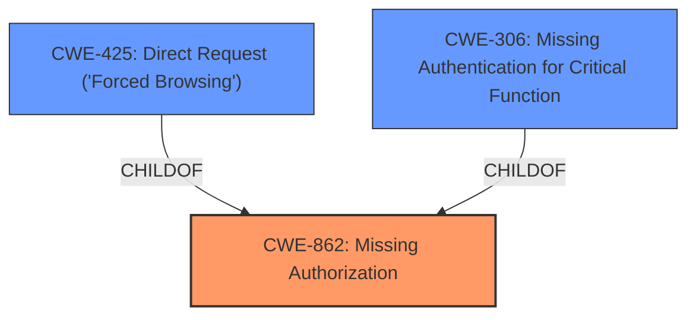

# Analysis for CVE-2022-33969

# Summary
| CWE ID | CWE Name | Confidence | CWE Abstraction Level | CWE Vulnerability Mapping Label | CWE-Vulnerability Mapping Notes |
|---|---|---|---|---|---|
| CWE-862 | Missing Authorization | 0.9 | Class | Primary | Allowed-with-Review |
| CWE-425 | Direct Request ('Forced Browsing') | 0.7 | Base | Secondary | Allowed |
| CWE-306 | Missing Authentication for Critical Function | 0.6 | Base | Secondary | Allowed |

## Evidence and Confidence

*   **Confidence Score:** 0.8
*   **Evidence Strength:** HIGH

## Relationship Analysis
The primary CWE is CWE-862 **Missing Authorization**, a class-level CWE. CWE-425 **Direct Request ('Forced Browsing')** is a child of CWE-862, representing a more specific case where authorization is not adequately enforced for restricted URLs. CWE-306 **Missing Authentication for Critical Function** is related as authentication often precedes authorization.

## Vulnerability Chain
The vulnerability chain starts with the **missing authorization** (**root cause**), leading to unprivileged users being able to perform actions they should not be able to, such as changing WordPress options.

## Summary of Analysis
The initial analysis and the retriever results suggest several potential CWEs, including CWE-352, CWE-284, CWE-862, CWE-306, and CWE-472. However, based on the provided evidence, the most accurate mapping is CWE-862 **Missing Authorization**, supplemented by CWE-425 and CWE-306.

The vulnerability description mentions "**WordPress Options Change**" and the CVE summary highlights "**lack of proper authorization, authentication, or nonce token checks in certain plugin functions**". This directly supports the selection of CWE-862, which describes a scenario where the product does not perform an authorization check.

The CVE summary also states, "This allows unprivileged users to execute higher-privileged actions." This aligns with the security implications of CWE-862, where the absence of authorization checks enables unauthorized access and modification of resources.

CWE-425 is included as a secondary CWE because it describes a scenario where authorization is not adequately enforced for all restricted URLs, scripts, or files, which could be a contributing factor to the vulnerability.

CWE-306 is a secondary CWE because the vulnerability stems from missing authentication which allows the bypass of the authorization checks.

CWE-284 **Improper Access Control** is a Pillar-level CWE and is too general. The vulnerability description and CVE summary provide sufficient details to map to more specific CWEs like CWE-862. Therefore, CWE-284 is not selected.

CWE-352 **Cross-Site Request Forgery (CSRF)** is a compound CWE that requires specific conditions to be met. While CSRF could be a potential attack vector, the primary issue is the **missing authorization** check, making CWE-862 a more accurate representation of the root cause. Therefore, CWE-352 is not selected.

CWE-472 **External Control of Assumed-Immutable Web Parameter** is not selected because the description does not specifically mention the modification of assumed-immutable web parameters. The vulnerability is more directly related to the **lack of authorization** checks.

The selected CWEs are at the optimal level of specificity because they accurately represent the root cause of the vulnerability, as described in the vulnerability description and CVE summary.

Relevant CWE Information:

# Enhanced Context (25 CWEs)
The following CWEs were identified as potentially relevant to this vulnerability:

## CWE-472: External Control of Assumed-Immutable Web Parameter
**Abstraction Level**: Base
**Similarity Score**: 0.78
**Source**: dense

**Description**:
The web application does not sufficiently verify inputs that are assumed to be immutable but are actually externally controllable, such as hidden form fields.

**Mapping Guidance**:
- Usage: Allowed
- Rationale: This CWE entry is at the Base level of abstraction, which is a preferred level of abstraction for mapping to the root causes of vulnerabilities.

## CWE-639: Authorization Bypass Through User-Controlled Key
**Abstraction Level**: Base
**Similarity Score**: 0.77
**Source**: dense

**Description**:
The system's authorization functionality does not prevent one user from gaining access to another user's data or record by modifying the key value identifying the data.

**Mapping Guidance**:
- Usage: Allowed
- Rationale: This CWE entry is at the Base level of abstraction, which is a preferred level of abstraction for mapping to the root causes of vulnerabilities.

## CWE-1289: Improper Validation of Unsafe Equivalence in Input
**Abstraction Level**: Base
**Similarity Score**: 0.77
**Source**: dense

**Description**:
The product receives an input value that is used as a resource identifier or other type of reference, but it does not validate or incorrectly validates that the input is equivalent to a potentially-unsafe value.

**Mapping Guidance**:
- Usage: Allowed
- Rationale: This CWE entry is at the Base level of abstraction, which is a preferred level of abstraction for mapping to the root causes of vulnerabilities.

## CWE-74: Improper Neutralization of Special Elements in Output Used by a Downstream Component ('Injection')
**Abstraction Level**: Class
**Similarity Score**: 0.76
**Source**: dense

**Description**:
The product constructs all or part of a command, data structure, or record using externally-influenced input from an upstream component, but it does not neutralize or incorrectly neutralizes special elements that could modify how it is parsed or interpreted when it is sent to a downstream component.

**Mapping Guidance**:
- Usage: Discouraged
- Rationale: CWE-74 is high-level and often misused when lower-level weaknesses are more appropriate.

## CWE-807: Reliance on Untrusted Inputs in a Security Decision
**Abstraction Level**: Base
**Similarity Score**: 0.76
**Source**: dense

**Description**:
The product uses a protection mechanism that relies on the existence or values of an input, but the input can be modified by an untrusted actor in a way that bypasses the protection mechanism.

**Mapping Guidance**:
- Usage: Allowed
- Rationale: This CWE entry is at the Base level of abstraction, which is a preferred level of abstraction for mapping to the root causes of vulnerabilities.

## CWE-184: Incomplete List of Disallowed Inputs
**Abstraction Level**: Base
**Similarity Score**: 0.76
**Source**: dense

**Description**:
The product implements a protection mechanism that relies on a list of inputs (or properties of inputs) that are not allowed by policy or otherwise require other action to neutralize before additional processing takes place, but the list is incomplete.

**Mapping Guidance**:
- Usage: Allowed
- Rationale: This CWE entry is at the Base level of abstraction, which is a preferred level of abstraction for mapping to the root causes of vulnerabilities.

## CWE-116: Improper Encoding or Escaping of Output
**Abstraction Level**: Class
**Similarity Score**: 0.76
**Source**: dense

**Description**:
The product prepares a structured message for communication with another component, but encoding or escaping of the data is either missing or done incorrectly. As a result, the intended structure of the message is not preserved.

**Mapping Guidance**:
- Usage: Allowed-with-Review
- Rationale: This CWE entry is a Class and might have Base-level children that would be more appropriate

## CWE-425: Direct Request ('Forced Browsing')
**Abstraction Level**: Base
**Similarity Score**: 0.76
**Source**: dense

**Description**:
The web application does not adequately enforce appropriate authorization on all restricted URLs, scripts, or files.

**Mapping Guidance**:
- Usage: Allowed
- Rationale: This CWE entry is at the Base level of abstraction, which is a preferred level of abstraction for mapping to the root causes of vulnerabilities.

## CWE-41: Improper Resolution of Path Equivalence
**Abstraction Level**: Base
**Similarity Score**: 0.76
**Source**: dense

**Description**:
The product is vulnerable to file system contents disclosure through path equivalence. Path equivalence involves the use of special characters in file and directory names. The associated manipulations are intended to generate multiple names for the same object.

**Mapping Guidance**:
- Usage: Allowed
- Rationale: This CWE entry is at the Base level of abstraction, which is a preferred level of abstraction