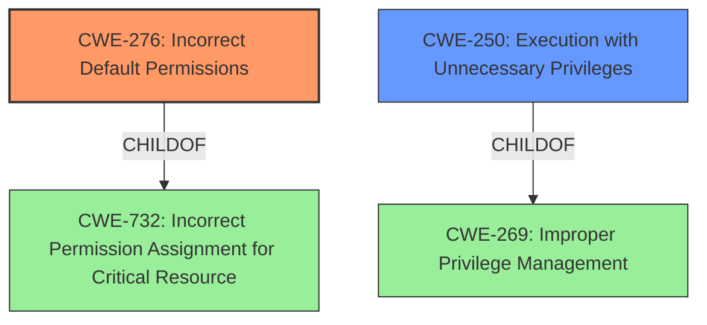

# Raw Analyzer Response for CVE-2022-34006

# Summary
| CWE ID | CWE Name | Confidence | CWE Abstraction Level | CWE Vulnerability Mapping Label | CWE-Vulnerability Mapping Notes |
|---|---|---|---|---|---|
| CWE-276 | Incorrect Default Permissions | 0.8 | Base | Allowed | Primary CWE |
| CWE-250 | Execution with Unnecessary Privileges | 0.7 | Base | Allowed | Secondary Candidate |

## Evidence and Confidence

*   **Confidence Score:** 0.75
*   **Evidence Strength:** MEDIUM

## Relationship Analysis
The primary CWE, CWE-276 **Incorrect Default Permissions**, is a child of CWE-732 **Incorrect Permission Assignment for Critical Resource**. The secondary CWE, CWE-250 **Execution with Unnecessary Privileges**, is a child of CWE-269 **Improper Privilege Management**. Selecting CWE-276 is more specific and accurately reflects the **incorrect default permissions** set during the installation of Microsoft SQL Express.

## Vulnerability Chain
The vulnerability chain starts with the **incorrect default permissions** (CWE-276) assigned to the SQL instance during installation, leading to **execution with unnecessary privileges** (CWE-250) because BUILTIN\Users were granted sysadmin privileges, allowing unprivileged users to execute commands as NT AUTHORITY\SYSTEM.

## Summary of Analysis
The initial assessment focused on identifying the root cause of the vulnerability, which is the **incorrect SQL Server configuration** during installation. The vulnerability description indicates that Microsoft SQL Express 2019 installs with an SQL instance running as SYSTEM with BUILTIN\Users as sysadmin, allowing unprivileged Windows users to execute commands locally as NT AUTHORITY\SYSTEM.

The Retriever Results highlighted several potential CWEs, including CWE-250, CWE-259, CWE-276, and CWE-269.

The final decision was to assign CWE-276 **Incorrect Default Permissions** as the primary CWE, as it most accurately describes the root cause of the vulnerability: the **incorrect configuration** of SQL Server during installation that grants excessive privileges to unprivileged users. The supporting evidence is the **weakness** described as **SQL Server configuration**.

CWE-250 **Execution with Unnecessary Privileges** was selected as a secondary CWE because the **incorrect permissions** lead to the SQL instance running with higher privileges than necessary.

CWE-276 is at the Base level of abstraction, which is a preferred level for mapping to the root causes of vulnerabilities.

Other CWEs Considered:

*   CWE-259 **Use of Hard-coded Password**: This CWE was considered but not selected because the vulnerability does not involve a hard-coded password.
*   CWE-269 **Improper Privilege Management**: This CWE was considered but not selected as it is a more general class, and CWE-276 provides a more specific description of the **incorrect permissions** being the root cause.
*   CWE-732 **Incorrect Permission Assignment for Critical Resource**: This CWE was considered, but it's a Class level CWE, making it less specific than CWE-276, which is a Base level CWE.

Relevant CWE Information:

# Enhanced Context (25 CWEs)
The following CWEs were identified as potentially relevant to this vulnerability:

## CWE-427: Uncontrolled Search Path Element
**Abstraction Level**: Base
**Similarity Score**: 0.76
**Source**: dense

**Description**:
The product uses a fixed or controlled search path to find resources, but one or more locations in that path can be under the control of unintended actors.

**Mapping Guidance**:
- Usage: Allowed
- Rationale: This CWE entry is at the Base level of abstraction, which is a preferred level of abstraction for mapping to the root causes of vulnerabilities.

## CWE-345: Insufficient Verification of Data Authenticity
**Abstraction Level**: Class
**Similarity Score**: 0.76
**Source**: dense

**Description**:
The product does not sufficiently verify the origin or authenticity of data, in a way that causes it to accept invalid data.

**Mapping Guidance**:
- Usage: Discouraged
- Rationale: This CWE entry is a level-1 Class (i.e., a child of a Pillar). It might have lower-level children that would be more appropriate

## CWE-184: Incomplete List of Disallowed Inputs
**Abstraction Level**: Base
**Similarity Score**: 0.76
**Source**: dense

**Description**:
The product implements a protection mechanism that relies on a list of inputs (or properties of inputs) that are not allowed by policy or otherwise require other action to neutralize before additional processing takes place, but the list is incomplete.

**Mapping Guidance**:
- Usage: Allowed
- Rationale: This CWE entry is at the Base level of abstraction, which is a preferred level of abstraction for mapping to the root causes of vulnerabilities.

## CWE-73: External Control of File Name or Path
**Abstraction Level**: Base
**Similarity Score**: 0.75
**Source**: dense

**Description**:
The product allows user input to control or influence paths or file names that are used in filesystem operations.

**Mapping Guidance**:
- Usage: Allowed
- Rationale: This CWE entry is at the Base level of abstraction, which is a preferred level of abstraction for mapping to the root causes of vulnerabilities.

## CWE-668: Exposure of Resource to Wrong Sphere
**Abstraction Level**: Class
**Similarity Score**: 0.75
**Source**: dense

**Description**:
The product exposes a resource to the wrong control sphere, providing unintended actors with inappropriate access to the resource.

**Mapping Guidance**:
- Usage: Discouraged
- Rationale: CWE-668 is high-level and is often misused as a catch-all when lower-level CWE IDs might be applicable. It is sometimes used for low-information vulnerability reports [REF-1287]. It is a level-1 Class (i.e., a child of a Pillar). It is not useful for trend analysis.

## CWE-807: Reliance on Untrusted Inputs in a Security Decision
**Abstraction Level**: Base
**Similarity Score**: 0.75
**Source**: dense

**Description**:
The product uses a protection mechanism that relies on the existence or values of an input, but the input can be modified by an untrusted actor in a way that bypasses the protection mechanism.

**Mapping Guidance**:
- Usage: Allowed
- Rationale: This CWE entry is at the Base level of abstraction, which is a preferred level of abstraction for mapping to the root causes of vulnerabilities.

## CWE-23: Relative Path Traversal
**Abstraction Level**: Base
**Similarity Score**: 0.75
**Source**: dense

**Description**:
The product uses external input to construct a pathname that should be within a restricted directory, but it does not properly neutralize sequences such as ".." that can resolve to a location that is outside of that directory.

**Mapping Guidance**:
- Usage: Allowed
- Rationale: This CWE entry is at the Base level of abstraction, which is a preferred level of abstraction for mapping to the root causes of vulnerabilities.

## CWE-41: Improper Resolution of Path Equivalence
**Abstraction Level**: Base
**Similarity Score**: 0.75
**Source**: dense

**Description**:
The product is vulnerable to file system contents disclosure through path equivalence. Path equivalence involves the use of special characters in file and directory names. The associated manipulations are intended to generate multiple names for the same object.

**Mapping Guidance**:
- Usage: Allowed
- Rationale: This CWE entry is at the Base level of abstraction, which is a preferred level of abstraction for mapping to the root causes of vulnerabilities.

## CWE-59: Improper Link Resolution Before File Access ('Link Following')
**Abstraction Level**: Base
**Similarity Score**: 0.75
**Source**: dense

**Description**:
The product attempts to access a file based on the filename, but it does not properly prevent that filename from identifying a link or shortcut that resolves to an unintended resource.

**Mapping Guidance**:
- Usage: Allowed
- Rationale: This CWE entry is at the Base level of abstraction, which is a preferred level of abstraction for mapping to the root causes of vulnerabilities.

## CWE-502: Deserialization of Untrusted Data
**Abstraction Level**: Base
**Similarity Score**: 0.75
**Source**: dense

**Description**:
The