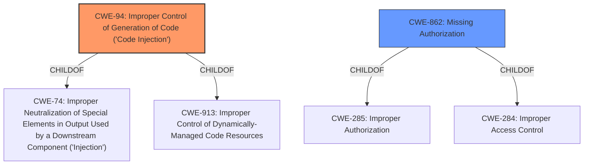

# Enhanced Analysis for CVE-2022-3401

# Summary
| CWE ID | CWE Name | Confidence | CWE Abstraction Level | CWE Vulnerability Mapping Label | CWE-Vulnerability Mapping Notes |
|---|---|---|---|---|---|
| CWE-94 | Improper Control of Generation of Code ('Code Injection') | 0.9 | Base | Allowed-with-Review | Primary CWE |
| CWE-862 | Missing Authorization | 0.7 | Class | Allowed-with-Review | Secondary CWE |

## Evidence and Confidence

*   **Confidence Score:** 0.8
*   **Evidence Strength:** HIGH

## Relationship Analysis
The primary CWE selected is CWE-94, which is a base-level CWE. It is a child of CWE-74 (Improper Neutralization of Special Elements in Output Used by a Downstream Component ('Injection')) and CWE-913 (Improper Control of Dynamically-Managed Code Resources). The secondary CWE is CWE-862 which is a class level CWE and a child of CWE-285 (Improper Authorization) and CWE-284 (Improper Access Control). There isn't a direct relationship shown between CWE-94 and CWE-862, however, the vulnerability description indicates that the two vulnerabilities occur together. The combination of these vulnerabilities enables remote code execution.



## Vulnerability Chain
The vulnerability chain begins with the **allowing site editors to include executable code blocks** (CWE-94) and the missing authorization (CWE-862). An attacker leverages the missing authorization to edit any page, post, or template and injects a code execution block, leading to remote code execution.

## Summary of Analysis
The initial assessment correctly identifies the two key weaknesses contributing to the vulnerability: the **allowing site editors to include executable code blocks** (CWE-94) and the missing authorization (CWE-862). The final conclusion emphasizes the importance of addressing both vulnerabilities to prevent remote code execution.

The selection of CWE-94 is based on the fact that the Bricks theme **allows site editors to include executable code blocks**. The "CVE Reference Links Content Summary" section states "The Bricks theme for WordPress **allows site editors to include executable code blocks** in website content."

The selection of CWE-862 is supported by the vulnerability description, "...combined with the missing authorization vulnerability (CVE-2022-3400), makes it possible for authenticated attackers with minimal permissions, such as a subscriber, can edit any page, post, or template...". The "CVE Reference Links Content Summary" section mentions "Missing authorization checks on the `bricks_save_post` AJAX action (CVE-2022-3400), allowing unauthorized users to edit site content."

CWE-79 (Improper Neutralization of Input During Web Page Generation ('Cross-site Scripting')) was considered but not selected. While the vulnerability involves injecting code, the primary issue is the ability to inject executable code blocks due to **allowing site editors to include executable code blocks** and the missing authorization, rather than a failure to neutralize input during web page generation. CWE-79 is more about injecting script into a web page, rather than injecting code blocks.
CWE-352 (Cross-Site Request Forgery (CSRF)) was also considered but not selected. CSRF involves tricking a user into submitting a request without their consent. While CSRF could potentially be used in conjunction with this vulnerability, it is not a direct cause or requirement for the exploit.
CWE-306 (Missing Authentication for Critical Function) was considered but not selected as the missing authorization is a more precise description of the vulnerability than missing authentication.
CWE-863 (Incorrect Authorization) was considered but not selected as the missing authorization is a more precise description of the vulnerability than incorrect authorization.
CWE-96 (Improper Neutralization of Directives in Statically Saved Code ('Static Code Injection')) was also considered but not selected because the code is not being injected into statically saved code.


## CWE Relationship Analysis

Current CWEs represent these abstraction levels: .


### Vulnerability Chain Analysis

**Chain starting from CWE-862:**
- 862 (Missing Authorization) - ROOT


**Chain starting from CWE-96:**
- 96 (Improper Neutralization of Directives in Statically Saved Code ('Static Code Injection')) - ROOT


### CWE Relationship Diagram

```mermaid
graph TD
    classDef primary fill:#f96,stroke:#333,stroke-width:2px
    classDef secondary fill:#69f,stroke:#333
    classDef tertiary fill:#9e9,stroke:#333
```