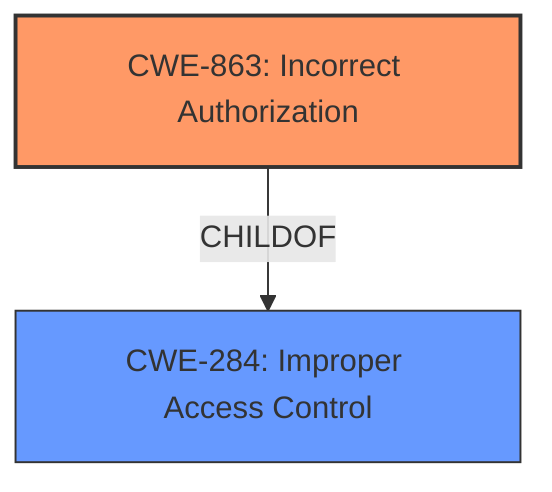

# Raw Analyzer Response for CVE-2022-34102

# Summary

| CWE ID | CWE Name | Confidence | CWE Abstraction Level | CWE Vulnerability Mapping Label | CWE-Vulnerability Mapping Notes |
|---|---|---|---|---|---|
| CWE-863 | Incorrect Authorization | 0.9 | Class | Primary | Allowed-with-Review |
| CWE-284 | Improper Access Control | 0.6 | Pillar | Secondary | Discouraged |

## Evidence and Confidence

*   **Confidence Score:** 0.9
*   **Evidence Strength:** HIGH

## Relationship Analysis
The primary CWE, CWE-863 **Incorrect Authorization**, is a child of CWE-284 **Improper Access Control**. This indicates a hierarchical relationship where CWE-863 provides a more specific characterization of the **access control** issue. CWE-284 is a high-level Pillar, making it less specific and therefore a secondary consideration. The selection of CWE-863 is further reinforced by its Allowed-with-Review mapping guidance, prompting a review of its children for a potentially better fit. The evidence supports the authorization being incorrectly performed, not just a general lack of access control.

## Vulnerability Chain
The vulnerability chain starts with the **insufficient access control**, leading to the ability to pause the uninstallation and gain a SYSTEM level command prompt.
- **Root Cause:** **Insufficient Access Control** (CWE-863)
- **Weakness:** The ability to pause the uninstallation process.
- **Impact:** Gain a SYSTEM level command prompt.

## Summary of Analysis
Initially, the description points to **insufficient access control**. The key phrase "insufficient access control" directly supports the identification of an access control-related CWE. The provided evidence states: "Insufficient access control vulnerability was discovered... in which a user can pause the uninstallation of an executable to gain a SYSTEM level command prompt."

The Retriever Results list CWE-284 **Improper Access Control** and CWE-863 **Incorrect Authorization**.
CWE-284 is a high-level Pillar, which is discouraged for mapping. CWE-863 is a Class and a child of CWE-284. Given the evidence that a user can gain a SYSTEM level command prompt, the **authorization** check is being performed incorrectly. Thus, CWE-863 **Incorrect Authorization** is chosen as the primary CWE.

The vulnerability description and the CVE Reference Links Content Summary both explicitly mention the **insufficient access control** as the root cause, further solidifying the selection of CWE-863.

Relevant CWE Information:

# Enhanced Context (25 CWEs)

## CWE-73: External Control of File Name or Path
**Abstraction Level**: Base
**Similarity Score**: 0.75
**Source**: dense

**Description**:
The product allows user input to control or influence paths or file names that are used in filesystem operations.
**Not Used:** This vulnerability is not about file path manipulation.

## CWE-59: Improper Link Resolution Before File Access ('Link Following')
**Abstraction Level**: Base
**Similarity Score**: 0.75
**Source**: dense

**Description**:
The product attempts to access a file based on the filename, but it does not properly prevent that filename from identifying a link or shortcut that resolves to an unintended resource.
**Not Used:** This vulnerability is not about link following.

## CWE-74: Improper Neutralization of Special Elements in Output Used by a Downstream Component ('Injection')
**Abstraction Level**: Class
**Similarity Score**: 0.75
**Source**: dense

**Description**:
The product constructs all or part of a command, data structure, or record using externally-influenced input from an upstream component, but it does not neutralize or incorrectly neutralizes special elements that could modify how it is parsed or interpreted when it is sent to a downstream component.
**Not Used:** This vulnerability is not about injection.

## CWE-184: Incomplete List of Disallowed Inputs
**Abstraction Level**: Base
**Similarity Score**: 0.75
**Source**: dense

**Description**:
The product implements a protection mechanism that relies on a list of inputs (or properties of inputs) that are not allowed by policy or otherwise require other action to neutralize before additional processing takes place, but the list is incomplete.
**Not Used:** This vulnerability is not about an incomplete list of disallowed inputs.

## CWE-691: Insufficient Control Flow Management
**Abstraction Level**: Pillar
**Similarity Score**: 0.75
**Source**: dense

**Description**:
The code does not sufficiently manage its control flow during execution, creating conditions in which the control flow can be modified in unexpected ways.
**Not Used:** This CWE is too general and does not accurately reflect the root cause.

## CWE-653: Improper Isolation or Compartmentalization
**Abstraction Level**: Class
**Similarity Score**: 0.74
**Source**: dense

**Description**:
The product does not properly compartmentalize or isolate functionality, processes, or resources that require different privilege levels, rights, or permissions.
**Not Used:** This vulnerability is not about isolation or compartmentalization.

## CWE-274: Improper Handling of Insufficient Privileges
**Abstraction Level**: Base
**Similarity Score**: 0.74
**Source**: dense

**Description**:
The product does not handle or incorrectly handles when it has insufficient privileges to perform an operation, leading to resultant weaknesses.
**Not Used:** This vulnerability is about incorrect authorization not handling of insufficient privileges.

## CWE-1220: Insufficient Granularity of Access Control
**Abstraction Level**: Base
**Similarity Score**: 0.74
**Source**: dense

**Description**:
The product implements access controls via a policy or other feature with the intention to disable or restrict accesses (reads and/or writes) to assets in a system from untrusted agents. However, implemented access controls lack required granularity, which renders the control policy too broad because it allows accesses from unauthorized agents to the security-sensitive assets.
**Not Used:** This vulnerability is not specifically about the granularity of access control.

## CWE-41: Improper Resolution of Path Equivalence
**Abstraction Level**: Base
**Similarity Score**: 0.74
**Source**: dense

**Description**:
The product is vulnerable to file system contents disclosure through path equivalence. Path equivalence involves the use of special characters in file and directory names. The associated manipulations are intended to generate multiple names for the same object.
**Not Used:** This vulnerability is not about path equivalence.

## CWE-280: Improper Handling of Insufficient Permissions or Privileges
**Abstraction Level**: Base
**Similarity Score**: 0.74
**Source**: dense

**Description**:
The product does not handle or incorrectly handles when it has insufficient privileges to access resources or functionality as specified by their permissions. This may cause it to follow unexpected code paths that may leave the product in an invalid state.
**Not Used:** This vulnerability is about incorrect authorization not about handling of insufficient permissions.

## CWE-863: Incorrect Authorization
**Abstraction Level**: Class
**Similarity Score**: 6032.10
**Source**: sparse

**Description**:
The product performs an authorization check when an actor attempts to access a resource or perform an action, but it does not correctly perform the check.
**Used:** This is the primary CWE because the vulnerability involves an incorrect authorization check that allows a user to gain a SYSTEM level command prompt.

## CWE-285: Improper Authorization
**Abstraction Level**: Class
**Similarity Score**: 5971.76
**Source**: sparse

**Description**:
The product does not perform or incorrectly performs an authorization check when an actor attempts to access a resource or perform an action.
**Not Used:** CWE-863 is more specific.

## CWE-59: Improper Link Resolution Before File Access ('Link Following')
**Abstraction Level**: Base
**Similarity Score**: 5926.78
**Source**: sparse

**Description**:
The product attempts to access a file based on the filename, but it does not properly prevent that filename from identifying a link or shortcut that resolves to an unintended resource.
**Not Used:** This vulnerability is not about link following.

## CWE-732: Incorrect Permission Assignment for Critical Resource
**Abstraction Level**: Class
**Similarity Score**: 5832.15
**Source**: sparse

**Description**:
The product specifies permissions for a security-critical resource in a way that allows that resource to be read or modified by unintended actors.
**Not Used:** This vulnerability is not about incorrect permission assignment.

## CWE-639: Authorization Bypass Through User-Controlled Key
**Abstraction Level**: Base
**Similarity Score**: 5818.64
**Source**: sparse

**Description**:
The system's authorization functionality does not prevent one user from gaining access to another user's data or record by modifying the key value