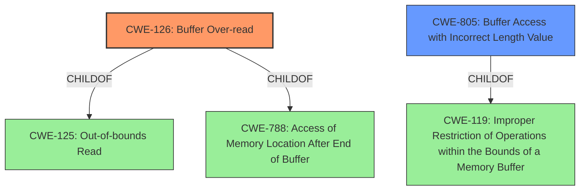

# Analysis for CVE-2022-34145

# Summary
| CWE ID | CWE Name | Confidence | CWE Abstraction Level | CWE Vulnerability Mapping Label | CWE-Vulnerability Mapping Notes |
|---|---|---|---|---|---|
| CWE-126 | Buffer Over-read | 0.9 | Variant | Allowed | Primary CWE |
| CWE-805 | Buffer Access with Incorrect Length Value | 0.7 | Base | Allowed | Secondary Candidate |

## Evidence and Confidence

*   **Confidence Score:** 0.8
*   **Evidence Strength:** MEDIUM

## Relationship Analysis
The primary relationship that influenced the decision was the ChildOf relationship between CWE-126 and CWE-125 (Out-of-bounds Read), suggesting that CWE-126 is a more specific type of out-of-bounds read. Additionally, CWE-126 is also a ChildOf CWE-788 (Access of Memory Location After End of Buffer). The relationship between CWE-805 and CWE-119 (Improper Restriction of Operations within the Bounds of a Memory Buffer) indicates that CWE-805 is related to improper buffer operation restrictions which can lead to over-reads.

## Vulnerability Chain
The vulnerability chain involves a **buffer over-read** leading to a denial of service. The root cause is likely related to how the WLAN host parses frame information.

## Summary of Analysis
The primary assessment is based on the vulnerability description which states "Transient DOS due to **buffer over-read** in WLAN Host while parsing frame information".

The term "**buffer over-read**" directly corresponds to CWE-126 (Buffer Over-read). The description of CWE-126, "The product reads from a buffer using buffer access mechanisms such as indexes or pointers that reference memory locations after the targeted buffer," aligns with the provided vulnerability.

The retriever results also support this, listing CWE-126 as the top combined result with a score of 0.191.

The relationships highlight how CWE-126 is a specific type of out-of-bounds read, making it a more accurate classification than its parent CWE-125.

CWE-805 (Buffer Access with Incorrect Length Value) was considered as a secondary CWE because the **buffer over-read** could be caused by an incorrect length value, which is described in CWE-805 as "The product uses a sequential operation to read or write a buffer, but it uses an incorrect length value that causes it to access memory that is outside of the bounds of the buffer."

Other CWEs considered but not used:
* CWE-190 (Integer Overflow or Wraparound): While integer overflows can lead to buffer overflows, there is no direct evidence of an integer overflow in the vulnerability description.
* CWE-909 (Missing Initialization of Resource): There is no evidence suggesting missing resource initialization.
* CWE-1284 (Improper Validation of Specified Quantity in Input): While improper input validation of quantity might lead to **buffer over-read**, there is no direct evidence.
* CWE-122 (Heap-based Buffer Overflow): Though possible, there is no explicit mention of a heap-based buffer, making CWE-126 a better fit.

The selection of CWE-126 is at the optimal level of specificity because it directly describes the **buffer over-read** condition leading to denial of service.

Relevant CWE Information:
- CWE-126: Buffer Over-read
- CWE-805: Buffer Access with Incorrect Length Value