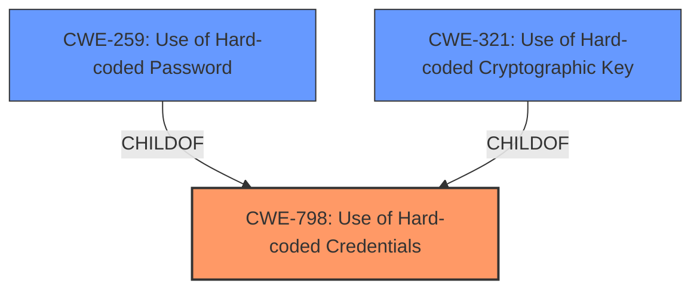

# Raw Analyzer Response for CVE-2022-34151

# Summary
| CWE ID | CWE Name | Confidence | CWE Abstraction Level | CWE Vulnerability Mapping Label | CWE-Vulnerability Mapping Notes |
|---|---|---|---|---|---|
| CWE-798 | Use of Hard-coded Credentials | 1.0 | Base | Allowed | Primary CWE |
| CWE-259 | Use of Hard-coded Password | 0.75 | Variant | Allowed | Secondary Candidate |
| CWE-321 | Use of Hard-coded Cryptographic Key | 0.75 | Variant | Allowed | Secondary Candidate |

## Evidence and Confidence

*   **Confidence Score:** 1.0
*   **Evidence Strength:** HIGH

## Relationship Analysis
The primary CWE is CWE-798, which is a Base level CWE. CWE-259 and CWE-321 are both variants of CWE-798. The vulnerability description and CVE Reference Links Content Summary clearly point to the **use of hard-coded credentials** as the root cause. Choosing CWE-798 provides a good balance between specificity and broad applicability, covering both hard-coded passwords and cryptographic keys. The selection of CWE-798 is supported by its Base level abstraction and the "Allowed" usage per MITRE guidance. CWE-259 and CWE-321 provide more specific details of the credentials, but are not clearly specified in the description.

## Vulnerability Chain
The chain of events is as follows:
1.  **Root Cause:** The product contains **hard-coded credentials** (CWE-798).
2.  **Impact:** A remote attacker can obtain the credentials by analyzing the affected product.
3.  **Impact:** The attacker can then use these credentials to access the controller without proper authorization.

## Summary of Analysis
The initial assessment strongly suggests CWE-798 as the primary weakness due to the explicit mention of "**use of hard-coded credentials**" in both the vulnerability description and the CVE reference summary. This is further supported by the high similarity scores in the retriever results. The evidence from the "CVE Reference Links Content Summary" section, which states "The vulnerability stems from the **use of hard-coded credentials (CWE-798)** within the communication functions" confirms this. The relationship graph and the retriever results, while providing additional candidates like CWE-259 and CWE-321, ultimately reinforce the selection of CWE-798 as the optimal choice. The selection of CWE-798 is at the optimal level of specificity because it accurately captures the generic weakness of using hardcoded credentials, regardless of the exact nature of those credentials (password, key, etc.).

Relevant CWE Information:
-   **CWE-798: Use of Hard-coded Credentials**
    -   The vulnerability description clearly states "**Use of hard-coded credentials** vulnerability exists..."
    -   The CVE reference link summary says: "The vulnerability stems from the **use of hard-coded credentials (CWE-798)** within the communication functions..."
    -   This aligns perfectly with the CWE description: "The product contains hard-coded credentials, such as a password or cryptographic key."
    -   The security implication is that an attacker can bypass authentication and gain unauthorized access to the system.
    -   MITRE mapping guidance allows its usage.
-   **CWE-259: Use of Hard-coded Password** and **CWE-321: Use of Hard-coded Cryptographic Key**
    -   These are more specific variants of CWE-798. Since the description does not specify if the hardcoded credential is a Password or a Cryptographic Key, they can't be clearly specified.

Other CWEs Considered but Not Used:
- CWE-294: Authentication Bypass by Capture-replay: This was considered due to its high ranking in the retriever results. However, the vulnerability description doesn't mention anything about replaying captured traffic. The root cause is the presence of hard-coded credentials, not the method of exploiting them.
- CWE-522: Insufficiently Protected Credentials: This CWE is more about how credentials are transmitted or stored, rather than the credentials themselves being hard-coded. While related, it's not the primary issue in this case.
- CWE-912: Hidden Functionality: This CWE is about undocumented or hidden features. While the use of hard-coded credentials could be considered a form of hidden functionality, the main issue is the insecure coding practice of embedding credentials directly in the code.