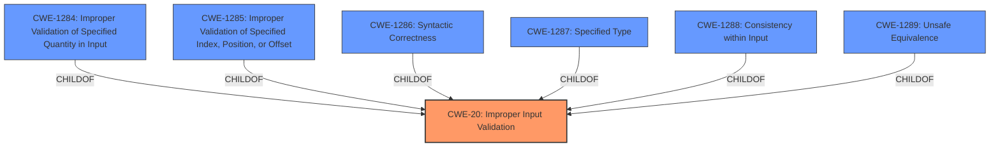

# Raw Analyzer Response for CVE-2022-34152

# Summary
| CWE ID  | CWE Name                                                              | Confidence | CWE Abstraction Level | CWE Vulnerability Mapping Label | CWE-Vulnerability Mapping Notes |
| :-------- | :-------------------------------------------------------------------- | :--------- | :---------------------- | :------------------------------ | :-------------------------------- |
| CWE-20   | Improper Input Validation                                             | 0.9        | Class                   | Primary                         | Discouraged                       |

## Evidence and Confidence

*   **Confidence Score:** 0.9
*   **Evidence Strength:** HIGH

## Relationship Analysis
The primary relationship influencing the CWE selection is the parent-child relationship between CWE-20 **Improper Input Validation** and its children. While more specific children exist, the evidence does not provide sufficient detail to confidently select one of them. The analysis also considered potential chain relationships, but the evidence focuses primarily on the **improper input validation** itself. The chosen CWE is at the Class level, providing a balance between specificity and generality given the available information.

## Vulnerability Chain
The vulnerability chain consists of the following sequence:
1.  **Root Cause:** **Improper Input Validation** (CWE-20) in the BIOS firmware.
2.  **Impact:** Escalation of privilege by a privileged user.

## Summary of Analysis
The initial assessment focused on identifying the root cause of the vulnerability based on the provided information. The vulnerability description and CVE reference clearly point to **improper input validation** as the primary weakness.

The analysis considered the retriever results, particularly CWE-20 **Improper Input Validation**, CWE-1288 **Improper Validation of Consistency within Input**, CWE-1289 **Improper Validation of Unsafe Equivalence in Input**, and other related CWEs.

Despite the availability of more specific CWEs, the evidence does not provide sufficient detail to determine the exact nature of the **improper input validation**. Therefore, CWE-20 **Improper Input Validation** was selected as the most appropriate CWE.

The selection of CWE-20 **Improper Input Validation** is based on the following evidence:

*   The vulnerability description states: "**Improper input validation** in BIOS firmware".
*   The CVE reference summary states: "**Root cause of vulnerability:** **Improper input validation** in BIOS firmware" and "The BIOS firmware does not properly validate input."

These statements clearly indicate that the root cause of the vulnerability is related to **improper input validation**.

The MITRE mapping guidance for CWE-20 **Improper Input Validation** discourages its use when lower-level CWEs are available, but the provided information does not allow for a more specific classification.

Relevant CWE Information:

# Enhanced Context (25 CWEs)

## CWE-20: Improper Input Validation
**Abstraction:** Class
**Status:** Stable

### Description
The product receives input or data, but it does
        not validate or incorrectly validates that the input has the
        properties that are required to process the data safely and
        correctly.

### Extended Description
(omitted for brevity)

### Alternative Terms
None

### Relationships
ChildOf -> CWE-707
PeerOf -> CWE-345
CanPrecede -> CWE-22
CanPrecede -> CWE-41
CanPrecede -> CWE-74
CanPrecede -> CWE-119
CanPrecede -> CWE-770

### Mapping Guidance
**Usage:** Discouraged
**Rationale:** CWE-20 is commonly misused in low-information vulnerability reports when lower-level CWEs could be used instead, or when more details about the vulnerability are available [REF-1287]. It is not useful for trend analysis. It is also a level-1 Class (i.e., a child of a Pillar).
**Comments:** Consider lower-level children such as Improper Use of Validation Framework (CWE-1173) or improper validation involving specific types or properties of input such as Specified Quantity (CWE-1284); Specified Index, Position, or Offset (CWE-1285); Syntactic Correctness (CWE-1286); Specified Type (CWE-1287); Consistency within Input (CWE-1288); or Unsafe Equivalence (CWE-1289).
**Reasons:**
- Frequent Misuse
**Suggested Alternatives:**
- CWE-1284: Specified Quantity
- CWE-1285: Specified Index, Position, or Offset
- CWE-1286: Syntactic Correctness
- CWE-1287: Specified Type
- CWE-1288: Consistency within Input
- CWE-1289: Unsafe Equivalence
- CWE-116: Improper Encoding or Escaping of Output

### Observed Examples
(omitted for brevity)