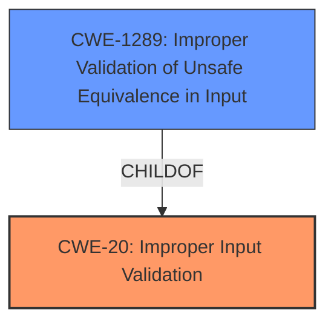

# Enhanced Analysis for CVE-2022-34164

# Summary
| CWE ID | CWE Name | Confidence | CWE Abstraction Level | CWE Vulnerability Mapping Label | CWE-Vulnerability Mapping Notes |
|---|---|---|---|---|---|
| CWE-20 | Improper Input Validation | 0.9 | Class | Primary | Discouraged |
| CWE-1289 | Improper Validation of Unsafe Equivalence in Input | 0.7 | Base | Secondary | Allowed |

## Evidence and Confidence

*   **Confidence Score:** 0.9
*   **Evidence Strength:** HIGH

## Relationship Analysis
The primary CWE selected is CWE-20 (Improper Input Validation), which is a class-level CWE. While it's discouraged for direct mapping, it serves as a general indicator of the vulnerability's nature. CWE-1289 (Improper Validation of Unsafe Equivalence in Input), a base-level CWE and child of CWE-20, was also considered because the vulnerability involves a local user impersonating another, suggesting that the input validation failure leads to unsafe equivalence.



## Vulnerability Chain
The vulnerability chain starts with **improper input validation** (CWE-20), which leads to the ability for a local user to **impersonate another legitimate user**. The complete chain is:

1.  **Improper Input Validation** (CWE-20): The system fails to adequately validate user inputs.
2.  User Impersonation: As a result of the **improper input validation**, a local user can assume the identity of another user.

## Summary of Analysis
Initially, the vulnerability description clearly points to **improper input validation** as the root cause, aligning with CWE-20 (Improper Input Validation). The vulnerability description key phrases explicitly mention this **rootcause**. The CVE reference links content summary further supports this by stating, "The vulnerability stems from **improper input validation** within IBM CICS TX Advanced and Standard."

The retriever results also list CWE-20 as the top candidate, further reinforcing this selection. However, CWE-20 is a class-level CWE and is discouraged for direct mapping. Therefore, lower-level CWEs were explored.

CWE-1289 (Improper Validation of Unsafe Equivalence in Input) was considered a strong candidate because the impact of the vulnerability is user impersonation. The description of CWE-1289 states, "The product receives an input value that is used as a resource identifier or other type of reference, but it does not validate or incorrectly validates that the input is equivalent to a potentially-unsafe value."

Ultimately, CWE-20 was chosen as the primary weakness because it is the direct **rootcause** mentioned in the vulnerability description, while CWE-1289 was added as a secondary weakness due to the impact. This provides a more comprehensive representation of the vulnerability.

Relevant CWE Information:

# Enhanced Context (25 CWEs)
The following CWEs were identified as potentially relevant to this vulnerability:

## CWE-1289: Improper Validation of Unsafe Equivalence in Input
**Abstraction Level**: Base
**Similarity Score**: 0.78
**Source**: dense

**Description**:
The product receives an input value that is used as a resource identifier or other type of reference, but it does not validate or incorrectly validates that the input is equivalent to a potentially-unsafe value.

**Mapping Guidance**:
- Usage: Allowed
- Rationale: This CWE entry is at the Base level of abstraction, which is a preferred level of abstraction for mapping to the root causes of vulnerabilities.
## CWE-20: Improper Input Validation
**Abstraction:** Class
**Status:** Stable

### Description
The product receives input or data, but it does
        not validate or incorrectly validates that the input has the
        properties that are required to process the data safely and
        correctly.

### Mapping Guidance
**Usage:** Discouraged
**Rationale:** CWE-20 is commonly misused in low-information vulnerability reports when lower-level CWEs could be used instead, or when more details about the vulnerability are available [REF-1287]. It is not useful for trend analysis. It is also a level-1 Class (i.e., a child of a Pillar).

### Summary of Analysis
# Summary
| CWE ID | CWE Name | Confidence | CWE Abstraction Level | CWE Vulnerability Mapping Label | CWE-Vulnerability Mapping Notes |
|---|---|---|---|---|---|
| CWE-20 | Improper Input Validation | 0.9 | Class | Primary | Discouraged |
| CWE-1289 | Improper Validation of Unsafe Equivalence in Input | 0.7 | Base | Secondary | Allowed |

## Evidence and Confidence

*   **Confidence Score:** 0.9
*   **Evidence Strength:** HIGH

## Relationship Analysis
The primary CWE selected is CWE-20 (Improper Input Validation), which is a class-level CWE. While it's discouraged for direct mapping, it serves as a general indicator of the vulnerability's nature. CWE-1289 (Improper Validation of Unsafe Equivalence in Input), a base-level CWE and child of CWE-20, was also considered because the vulnerability involves a local user impersonating another, suggesting that the input validation failure leads to unsafe equivalence.


## Vulnerability Chain
The vulnerability chain starts with **improper input validation** (CWE-20), which leads to the ability for a local user to **impersonate another legitimate user**. The complete chain is:

1.  **Improper Input Validation** (CWE-20): The system fails to adequately validate user inputs.
2.  User Impersonation: As a result of the **improper input validation**, a local user can assume the identity of another user.

## Summary of Analysis
Initially, the vulnerability description clearly points to **improper input validation** as the root cause, aligning with CWE-20 (Improper Input Validation). The vulnerability description key phrases explicitly mention this **rootcause**. The CVE reference links content summary further supports this by stating, "The vulnerability stems from **improper input validation** within IBM CICS TX Advanced and Standard."

The retriever results also list CWE-20 as the top candidate, further reinforcing this selection. However, CWE-20 is a class-level CWE and is discouraged for direct mapping. Therefore, lower-level CWEs were explored.

CWE-1289 (Improper Validation of Unsafe Equivalence in Input) was considered a strong candidate because the impact of the vulnerability is user impersonation. The description of CWE-1289 states, "The product receives an input value that is used as a resource identifier or other type of reference, but it does not validate or incorrectly validates that the input is equivalent to a potentially-unsafe value."

Ultimately, CWE-20 was chosen as the primary weakness because it is the direct **rootcause** mentioned in the vulnerability description, while CWE-1289 was added as a secondary weakness due to the impact. This provides a more comprehensive representation of the vulnerability.


## CWE Relationship Analysis

Current CWEs represent these abstraction levels: .


### Vulnerability Chain Analysis

**Chain starting from CWE-1289:**
- 1289 (Improper Validation of Unsafe Equivalence in Input) - ROOT


**Chain starting from CWE-20:**
- 20 (Improper Input Validation) - ROOT


### CWE Relationship Diagram

```mermaid
graph TD
    classDef primary fill:#f96,stroke:#333,stroke-width:2px
    classDef secondary fill:#69f,stroke:#333
    classDef tertiary fill:#9e9,stroke:#333
```