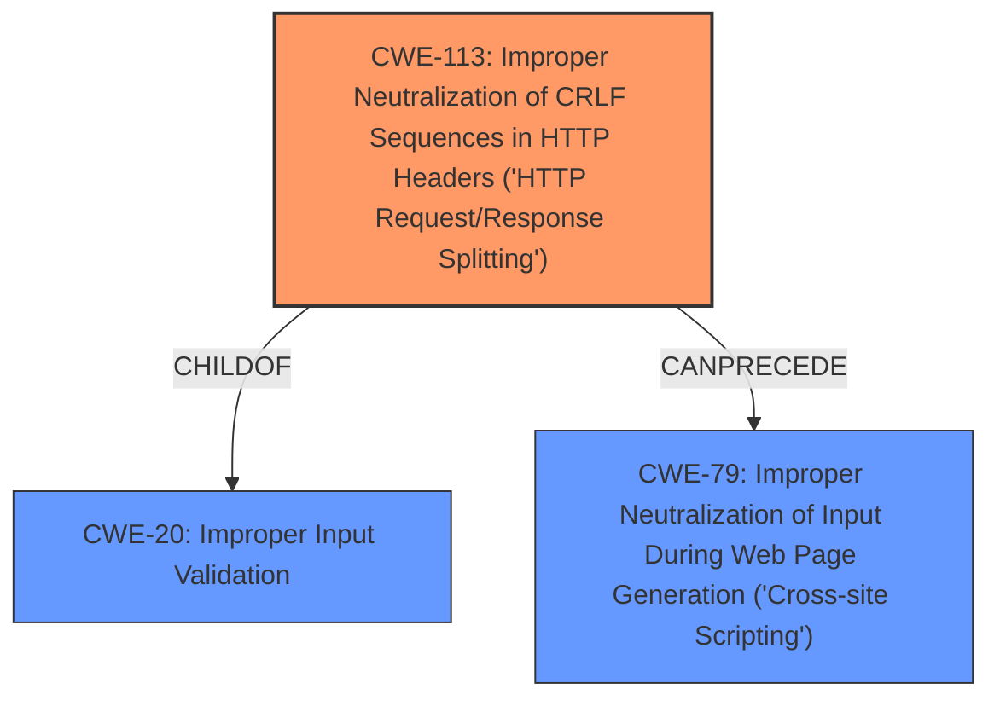

# Analysis Report for CVE-2022-34165

# Vulnerability Analysis Report: CVE-2022-34165

## Description


## Analysis (with Relationship Data)

# Summary
| CWE ID | CWE Name | Confidence | CWE Abstraction Level | CWE Vulnerability Mapping Label | CWE-Vulnerability Mapping Notes |
|---|---|---|---|---|---|
| **CWE-113** | **Improper Neutralization of CRLF Sequences in HTTP Headers ('HTTP Request/Response Splitting')** | 0.9 | Variant | Primary | Allowed |
| CWE-20 | Improper Input Validation | 0.6 | Class | Secondary | Discouraged |
| CWE-79 | Improper Neutralization of Input During Web Page Generation ('Cross-site Scripting') | 0.6 | Base | Secondary | Allowed |

## Evidence and Confidence

*   **Confidence Score:** 0.8
*   **Evidence Strength:** HIGH

## Relationship Analysis
The primary CWE, CWE-113, is a variant-level weakness that deals specifically with the improper neutralization of CRLF sequences in HTTP headers, which aligns directly with the vulnerability description. This CWE can lead to Cross-Site Scripting (CWE-79). CWE-20, Improper Input Validation, is a class-level weakness and a parent of CWE-113, but is less specific and therefore considered a secondary mapping.



## Vulnerability Chain
The vulnerability chain starts with **improper validation** of HTTP headers, leading to **HTTP header injection** (CWE-113). This can then lead to cache poisoning and cross-site scripting (CWE-79).

## Summary of Analysis
The initial analysis identified **improper validation** as the root cause, leading to **HTTP header injection**. The retriever results highlighted CWE-113, CWE-20, and CWE-79 as potential candidates.

The evidence provided states: "IBM WebSphere Application Server 7.0, 8.0, 8.5, and 9.0 and IBM WebSphere Application Server Liberty 17.0.0.3 through 22.0.0.9 are vulnerable to **HTTP header injection**, caused by **improper validation**. This could allow an attacker to conduct various attacks against the vulnerable system, including cache poisoning and cross-site scripting. IBM X-Force ID 229429."

The selection of CWE-113 as the primary CWE is based on its precise match to the vulnerability description concerning **HTTP header injection** due to **improper validation**. While CWE-20 (Improper Input Validation) is a broader class encompassing various validation issues, CWE-113 specifically addresses the CRLF injection in HTTP headers, making it the more specific and appropriate choice. CWE-79 is a potential impact, but not the root cause. The mapping guidance for CWE-113 allows its usage and is at the variant level of abstraction.

Other CWEs considered but not used:

*   **CWE-74: Improper Neutralization of Special Elements in Output Used by a Downstream Component ('Injection')**: This is a class-level CWE that is too broad.
*   **CWE-90: Improper Neutralization of Special Elements used in an LDAP Query ('LDAP Injection')**: This is specific to LDAP, not HTTP.
*   **CWE-611: Improper Restriction of XML External Entity Reference**: This is specific to XML, not HTTP.
*   **CWE-1004: Sensitive Cookie Without 'HttpOnly' Flag**: This is related to cookie security, not header injection.
*   **CWE-78: Improper Neutralization of Special Elements used in an OS Command ('OS Command Injection')**: This is specific to OS commands, not HTTP.
*   **CWE-319: Cleartext Transmission of Sensitive Information**: This is related to cleartext transmission, not header injection.
*   **CWE-116: Improper Encoding or Escaping of Output**: While related to output handling, CWE-113 is more specific to HTTP header injection.
*   **CWE-79: Improper Neutralization of Input During Web Page Generation ('Cross-site Scripting')**: While XSS is a possible consequence, the direct weakness is the header injection.


## CWE Relationship Analysis

Current CWEs represent these abstraction levels: .


### Vulnerability Chain Analysis

**Chain starting from CWE-319:**
- 319 (Cleartext Transmission of Sensitive Information) - ROOT


**Chain starting from CWE-20:**
- 20 (Improper Input Validation) - ROOT


### CWE Relationship Diagram

```mermaid
graph TD
    classDef primary fill:#f96,stroke:#333,stroke-width:2px
    classDef secondary fill:#69f,stroke:#333
    classDef tertiary fill:#9e9,stroke:#333
```


*Report generated on 2025-03-30 21:55:22*
