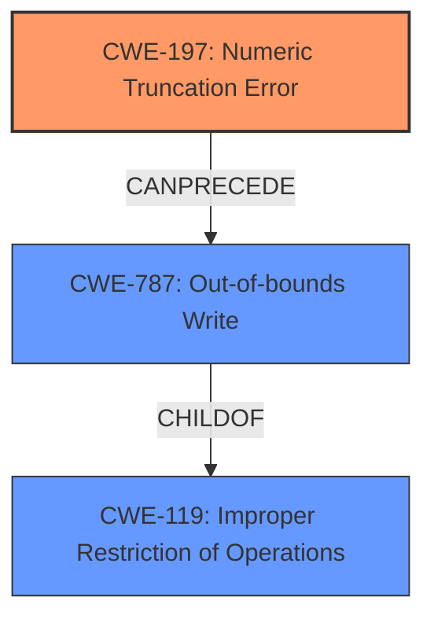

# Analysis for CVE-2022-34169

# Summary
| CWE ID | CWE Name | Confidence | CWE Abstraction Level | CWE Vulnerability Mapping Label | CWE-Vulnerability Mapping Notes |
|---|---|---|---|---|---|
| CWE-197 | Numeric Truncation Error | 0.9 | Base | Allowed | Primary CWE |
| CWE-787 | Out-of-bounds Write | 0.7 | Base | Allowed | Secondary CWE |

## Evidence and Confidence

*   **Confidence Score:** 0.8
*   **Evidence Strength:** HIGH

## Relationship Analysis
The primary CWE is CWE-197 (**Numeric Truncation Error**) because the vulnerability description and CVE reference summary explicitly mention **integer truncation** as the root cause. CWE-197 is a Base level CWE, which is the preferred level of abstraction. CWE-787 (**Out-of-bounds Write**) is related because the **integer truncation** leads to an out-of-bounds write, as stated in the CVE reference summary. CWE-787 is a child of CWE-119 (**Improper Restriction of Operations within the Bounds of a Memory Buffer**).

## Vulnerability Chain
The vulnerability chain starts with an **integer truncation** (CWE-197), which then leads to an out-of-bounds write (CWE-787). The final impact is the ability to corrupt Java class files and execute arbitrary Java bytecode.

## Summary of Analysis
The initial analysis focused on the **integer truncation** mentioned in the vulnerability description, which led to the selection of CWE-197 as the primary CWE. The CVE reference links content summary confirmed the **integer truncation** and also stated that the core issue is an out-of-bounds write caused by the **integer truncation**, leading to the inclusion of CWE-787 as a secondary CWE.

The primary CWE is CWE-197 (**Numeric Truncation Error**) because the vulnerability description and CVE reference summary explicitly mention **integer truncation** as the root cause.

The vulnerability description states: "The Apache Xalan Java XSLT library is vulnerable to an **integer truncation** issue when processing malicious XSLT stylesheets."

The CVE Reference Links Content Summary states:
"Root Cause:
- Integer truncation issue within the Apache Xalan Java XSLT library when processing specially crafted XSLT stylesheets. This vulnerability stems from the usage of an affected version of Apache Commons BCEL library.

Weaknesses/Vulnerabilities:
- The core issue is an out-of-bounds write caused by an integer truncation."

CWE-197 is at the optimal level of specificity because it directly addresses the root cause of the vulnerability, which is the **integer truncation**.

# Relevant CWE Information:

## CWE-197: Numeric Truncation Error
**Abstraction:** Base
**Status:** Incomplete

### Description
Truncation errors occur when a primitive is cast to a primitive of a smaller size and data is lost in the conversion.

**Technical Explanation:**
The vulnerability description indicates that an **integer truncation** error occurs when processing malicious XSLT stylesheets. This aligns with the CWE-197 description, where a primitive is cast to a smaller primitive, resulting in data loss.

**Security Implications:**
The truncation error leads to corrupted Java class files and the execution of arbitrary Java bytecode, indicating a severe security risk.

**Relationship:**
CWE-197 is a Base level CWE.

**Mapping Guidance Analysis:**
The MITRE mapping guidance allows the usage of CWE-197, as it is at the Base level of abstraction.

## CWE-787: Out-of-bounds Write
**Abstraction:** Base
**Status:** Stable

### Description
The product writes data past the end, or before the beginning, of the intended buffer.

**Technical Explanation:**
The CVE reference summary states that "The core issue is an out-of-bounds write caused by an integer truncation."

**Security Implications:**
Out-of-bounds writes can lead to memory corruption, arbitrary code execution, and other severe security consequences.

**Relationship:**
CWE-787 is a child of CWE-119 (**Improper Restriction of Operations within the Bounds of a Memory Buffer**).

**Mapping Guidance Analysis:**
The MITRE mapping guidance allows the usage of CWE-787, as it is at the Base level of abstraction.

## Other CWEs Considered But Not Used:

*   CWE-190 (**Integer Overflow or Wraparound**): While related to integer issues, the vulnerability description specifically mentions **truncation**, not overflow or wraparound.
*   CWE-129 (**Improper Validation of Array Index**): The vulnerability does not explicitly mention array index validation issues.
*   CWE-120 (**Buffer Copy without Checking Size of Input ('Classic Buffer Overflow')**): While the vulnerability leads to arbitrary bytecode execution, the root cause is the **integer truncation** and subsequent out-of-bounds write, not a buffer copy without size checking.