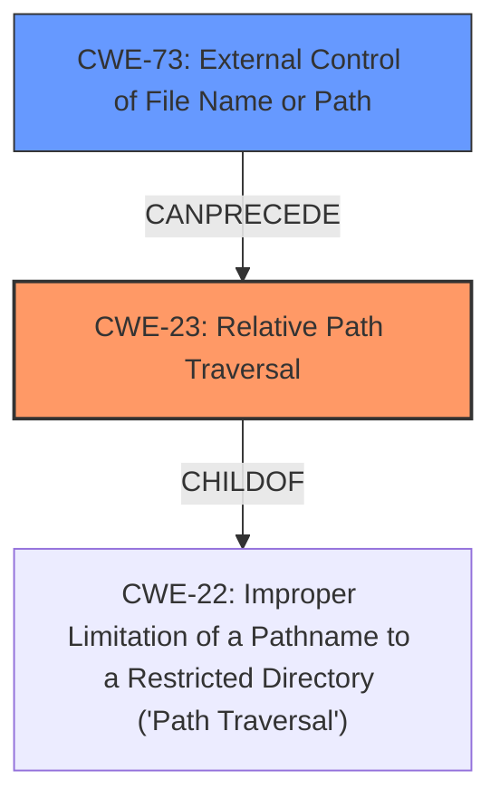

# Analysis Report for CVE-2022-34179

# Vulnerability Analysis Report: CVE-2022-34179

## Description


## Analysis (with Relationship Data)

# Summary
| CWE ID | CWE Name | Confidence | CWE Abstraction Level | CWE Vulnerability Mapping Label | CWE-Vulnerability Mapping Notes |
|---|---|---|---|---|---|
| CWE-23 | Relative Path Traversal | 1.0 | Base | Primary | Allowed |
| CWE-73 | External Control of File Name or Path | 0.7 | Base | Secondary | Allowed |

## Evidence and Confidence

*   **Confidence Score:** 0.9
*   **Evidence Strength:** HIGH

## Relationship Analysis
The primary weakness identified is CWE-23 **Relative Path Traversal**. This is a child of CWE-22 **Improper Limitation of a Pathname to a Restricted Directory ('Path Traversal')**. CWE-73 **External Control of File Name or Path** can precede CWE-23, indicating a potential vulnerability chain where external control over the file path leads to path traversal.


## Vulnerability Chain
The vulnerability chain starts with external control of a file name or path (CWE-73), which then leads to a relative path traversal (CWE-23), ultimately allowing unauthorized access to files on the Jenkins controller file system.

## Summary of Analysis
The initial analysis identified CWE-23 as the primary weakness, supported by the vulnerability description and CVE details. The vulnerability description states the weakness is a **relative path traversal** vulnerability. The CVE summary indicates that the `style` query parameter is not validated, leading to a relative path traversal. This is strong evidence for CWE-23.

The relationship analysis confirms that CWE-23 is a specific type of path traversal, making it a suitable choice. CWE-73 is included as a secondary weakness because the vulnerability involves external control over the `style` parameter, which influences the file path.

The selection of CWE-23 is at the optimal level of specificity because it directly describes the **relative path traversal** vulnerability.

Relevant CWE Information:

# Enhanced Context (25 CWEs)
The following CWEs were identified as potentially relevant to this vulnerability:

## CWE-23: Relative Path Traversal
**Abstraction Level**: Base
**Similarity Score**: 0.80
**Source**: dense

**Description**:
The product uses external input to construct a pathname that should be within a restricted directory, but it does not properly neutralize sequences such as ".." that can resolve to a location that is outside of that directory.

**Mapping Guidance**:
- Usage: Allowed
- Rationale: This CWE entry is at the Base level of abstraction, which is a preferred level of abstraction for mapping to the root causes of vulnerabilities.

## CWE-73: External Control of File Name or Path
**Abstraction Level**: Base
**Similarity Score**: 0.79
**Source**: dense

**Description**:
The product allows user input to control or influence paths or file names that are used in filesystem operations.

**Mapping Guidance**:
- Usage: Allowed
- Rationale: This CWE entry is at the Base level of abstraction, which is a preferred level of abstraction for mapping to the root causes of vulnerabilities.

### Detailed Analysis of Selected CWEs:

*   **CWE-23: Relative Path Traversal**
    *   **Match:** The vulnerability description explicitly mentions a **relative path traversal** vulnerability. The CVE reference links content summary confirms that the **lack of validation** of the `style` parameter allows attackers to specify paths to other SVG images, indicating a path traversal.
    *   **Security Implications:** Attackers can bypass access controls and access sensitive files on the Jenkins controller file system.
    *   **Relationship:** CWE-23 is a child of CWE-22 **Improper Limitation of a Pathname to a Restricted Directory ('Path Traversal')**, providing a more specific classification.
    *   **Mapping Guidance:** The usage is ALLOWED, and the rationale states that it is at the Base level of abstraction, which is a preferred level.
    *   **Confidence:** 1.0
*   **CWE-73: External Control of File Name or Path**
    *   **Match:** The `style` query parameter is user-controlled input that directly influences the file path. The CVE description states that the plugin allows specifying a `style` query parameter without restricting possible values, which is then used to select an SVG image style.
    *   **Security Implications:** External control over the file path allows attackers to manipulate the file system operations.
    *   **Relationship:** CWE-73 can precede CWE-23, indicating that external control over the file path is a prerequisite for the path traversal vulnerability.
    *   **Mapping Guidance:** The usage is ALLOWED, and the rationale states that it is at the Base level of abstraction, which is a preferred level.
    *   **Confidence:** 0.7

### CWEs Considered but Not Used:

*   **CWE-22: Improper Limitation of a Pathname to a Restricted Directory ('Path Traversal')**: Considered but not selected as the primary CWE because CWE-23 **Relative Path Traversal** is a more specific child that better describes the vulnerability.
*   **CWE-862: Missing Authorization**: While the vulnerability allows attackers without Overall/Read permission to access files, the root cause is the path traversal vulnerability, not a missing authorization check.
*   **CWE-59: Improper Link Resolution Before File Access ('Link Following')**: Not applicable because the vulnerability involves path traversal, not link following.
*   **CWE-41: Improper Resolution of Path Equivalence**: Not applicable because the vulnerability involves path traversal, not path equivalence.
*   **CWE-434: Unrestricted Upload of File with Dangerous Type**: Not applicable because the vulnerability involves path traversal, not file upload.
*   **CWE-522: Insufficiently Protected Credentials**: Not applicable because the vulnerability involves path traversal, not credential protection.
*   **CWE-863: Incorrect Authorization**: Not applicable because the root cause is path traversal, not an authorization check failure.


## CWE Relationship Analysis

Current CWEs represent these abstraction levels: .


### Vulnerability Chain Analysis

**Chain starting from CWE-862:**
- 862 (Missing Authorization) - ROOT


**Chain starting from CWE-434:**
- 434 (Unrestricted Upload of File with Dangerous Type) - ROOT


### CWE Relationship Diagram

```mermaid
graph TD
    classDef primary fill:#f96,stroke:#333,stroke-width:2px
    classDef secondary fill:#69f,stroke:#333
    classDef tertiary fill:#9e9,stroke:#333
```


*Report generated on 2025-03-31 11:40:20*
