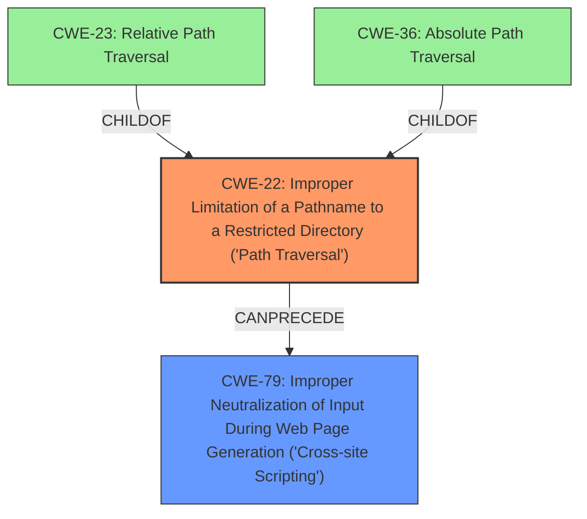

# Enhanced Analysis for CVE-2022-34254

# Summary
| CWE ID | CWE Name | Confidence | CWE Abstraction Level | CWE Vulnerability Mapping Label | CWE-Vulnerability Mapping Notes |
|---|---|---|---|---|---|
| CWE-22 | Improper Limitation of a Pathname to a Restricted Directory ('Path Traversal') | 1.0 | Base | Allowed | Primary CWE |
| CWE-79 | Improper Neutralization of Input During Web Page Generation ('Cross-site Scripting') | 0.75 | Base | Allowed | Secondary CWE |

## Evidence and Confidence

*   **Confidence Score:** 0.9
*   **Evidence Strength:** HIGH

## Relationship Analysis
The primary CWE is CWE-22, which represents the **improper limitation of a pathname to a restricted directory**. This is a base-level CWE that directly reflects the **root cause** described in the vulnerability.
CWE-22 has child CWEs of CWE-23 (Relative Path Traversal) and CWE-36 (Absolute Path Traversal). The description does not specify whether relative or absolute path traversal is used, so the parent CWE-22 is most appropriate.
CWE-79 (Improper Neutralization of Input During Web Page Generation ('Cross-site Scripting')) is included because the impact of the path traversal is Stored XSS. XSS occurs due to **improper neutralization** of input, and **CWE-79** addresses this directly.



## Vulnerability Chain
The vulnerability chain starts with **Improper Limitation of a Pathname to a Restricted Directory (Path Traversal) (CWE-22)**, which allows a low privileged attacker to read local files. Then this leads to the ability to inject malicious scripts into the vulnerable endpoint, resulting in Stored XSS (CWE-79).

## Summary of Analysis
The analysis is primarily based on the provided vulnerability description and CVE reference summary, which clearly states that the **root cause** is **Improper Limitation of a Pathname to a Restricted Directory (Path Traversal)**.
The evidence for **CWE-22** is strong as the vulnerability description explicitly mentions "Improper Limitation of a Pathname to a Restricted Directory (Path Traversal)" as the **root cause**:
"Adobe Commerce versions 2.4.3-p2 (and earlier), 2.3.7-p3 (and earlier) and 2.4.4 (and earlier) are affected by an **Improper Limitation of a Pathname to a Restricted Directory (Path Traversal)** vulnerability..."

The evidence for the secondary weakness, **CWE-79**, comes from the vulnerability description, which states the impact is to "inject malicious scripts into the vulnerable endpoint...to perform Stored XSS."

**CWE-22** is chosen because it is the direct **root cause** mentioned in the description.
**CWE-79** is included to represent the impact of the vulnerability.

Other CWEs Considered and Rejected:

*   CWE-23 (Relative Path Traversal) and CWE-36 (Absolute Path Traversal): While these are children of CWE-22, the description does not specify which type of path traversal is used, making CWE-22 a more appropriate and general classification.
*   CWE-73 (External Control of File Name or Path): This CWE is similar to CWE-22, but CWE-22 is more specific to the **improper limitation** aspect.
*   CWE-434 (Unrestricted Upload of File with Dangerous Type): This CWE is not applicable because the vulnerability involves path traversal, not the upload of files.
*   CWE-20 (Improper Input Validation): While **improper input validation** might be a contributing factor, the core issue is the **improper limitation of the pathname**, making CWE-22 more directly relevant.
*   CWE-285 (Improper Authorization) and CWE-732 (Incorrect Permission Assignment for Critical Resource): These CWEs relate to authorization issues, which are not explicitly mentioned in the vulnerability description.


## CWE Relationship Analysis

Current CWEs represent these abstraction levels: .


### Vulnerability Chain Analysis

**Chain starting from CWE-434:**
- 434 (Unrestricted Upload of File with Dangerous Type) - ROOT


**Chain starting from CWE-36:**
- 36 (Absolute Path Traversal) - ROOT


### CWE Relationship Diagram

```mermaid
graph TD
    classDef primary fill:#f96,stroke:#333,stroke-width:2px
    classDef secondary fill:#69f,stroke:#333
    classDef tertiary fill:#9e9,stroke:#333
```