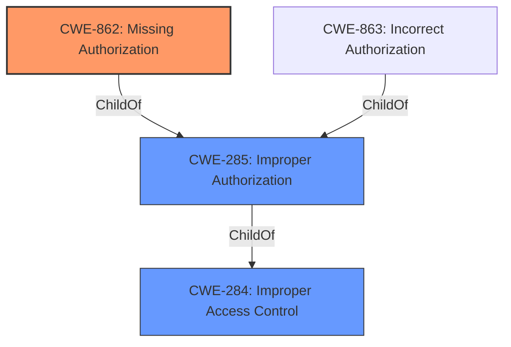

# Analysis Report for CVE-2022-34259

# Vulnerability Analysis Report: CVE-2022-34259

## Description


## Analysis (with Relationship Data)

# Summary
| CWE ID  | CWE Name  | Confidence | CWE Abstraction Level | CWE Vulnerability Mapping Label | CWE-Vulnerability Mapping Notes |
|-----------------|--------------------------------|-------------------|---------------------------|-----------------------------------|-----------------------------------|
| CWE-862 | Missing Authorization | 0.9 | Class |  Primary | Allowed-with-Review |
| CWE-285 | Improper Authorization | 0.7 | Class | Secondary | Discouraged |
| CWE-284 | Improper Access Control | 0.6 | Pillar | Secondary | Discouraged |

## Evidence and Confidence

*   **Confidence Score:** 0.9
*   **Evidence Strength:** HIGH

## Relationship Analysis
The primary relationship influencing the CWE selection is the hierarchical structure. CWE-284 (Improper Access Control) is a high-level pillar, while CWE-862 (Missing Authorization) and CWE-863 (Incorrect Authorization) are child classes of CWE-285 (Improper Authorization) which in turn is a child of CWE-284. The relationship between CWE-862 and CWE-863 is peer-like, representing different ways authorization can fail (missing vs. incorrect). Given the description focuses on access control, authorization-specific CWEs are more appropriate than the general CWE-284. Since the description states the access control is not properly performed, then the best selection is CWE-862.



## Vulnerability Chain
The vulnerability chain starts with **Improper Access Control**, leading to a security feature bypass. The root cause is the **missing authorization** check when an actor attempts to access a resource or perform an action.

## Summary of Analysis
The initial assessment, based on the vulnerability description and key phrases, pointed towards an access control issue. The description explicitly mentions "**Improper Access Control**" as the root cause. The "CVE Reference Links Content Summary" reinforces this by stating: "**Root cause of vulnerability:** Improper Access Control" and "**Weaknesses/vulnerabilities present:** The vulnerability is due to improper access control, leading to a security feature bypass."

The retriever results suggested CWE-285 (Improper Authorization), CWE-284 (Improper Access Control), and CWE-863 (Incorrect Authorization) as potential candidates. However, the hierarchical relationships clarify that CWE-284 is a high-level pillar, and CWE-863 and CWE-862 are more specific classes. Given the description, CWE-862 (Missing Authorization) best describes the vulnerability because the product does not perform the authorization check.

The MITRE mapping guidance advises against using high-level CWEs like CWE-284 when lower-level options exist. CWE-862 and CWE-863 are more specific and therefore preferable. CWE-862 is the best fit because it addresses **missing** authorization, not **incorrect** authorization.

The selected CWEs are at the optimal level of specificity because they accurately reflect the root cause (missing authorization) and the broader context (improper access control). The evidence from the vulnerability description and the relationship analysis support this decision.

Relevant CWE Information:

# Enhanced Context (25 CWEs)
The following CWEs were identified as potentially relevant to this vulnerability:

## CWE-1419: Incorrect Initialization of Resource
**Abstraction Level**: Class
**Similarity Score**: 0.74
**Source**: dense

**Description**:
The product attempts to initialize a resource but does not correctly do so, which might leave the resource in an unexpected, incorrect, or insecure state when it is accessed.

**Mapping Guidance**:
- Usage: Allowed-with-Review
- Rationale: This CWE entry is a Class and might have Base-level children that would be more appropriate

*This CWE does not fit the description because the vulnerability is not due to incorrect initialization of a resource.*

## CWE-226: Sensitive Information in Resource Not Removed Before Reuse
**Abstraction Level**: Base
**Similarity Score**: 0.74
**Source**: dense

**Description**:
The product releases a resource such as memory or a file so that it can be made available for reuse, but it does not clear or "zeroize" the information contained in the resource before the product performs a critical state transition or makes the resource available for reuse by other entities.

**Mapping Guidance**:
- Usage: Allowed
- Rationale: This CWE entry is at the Base level of abstraction, which is a preferred level of abstraction for mapping to the root causes of vulnerabilities.

*This CWE does not fit the description because the vulnerability is not related to sensitive information not being removed before reuse.*

## CWE-664: Improper Control of a Resource Through its Lifetime
**Abstraction Level**: Pillar
**Similarity Score**: 0.73
**Source**: dense

**Description**:
The product does not maintain or incorrectly maintains control over a resource throughout its lifetime of creation, use, and release.

**Mapping Guidance**:
- Usage: Discouraged
- Rationale: This CWE entry is high-level when lower-level children are available.

*This CWE is too generic and doesn't accurately describe the vulnerability.*

## CWE-665: Improper Initialization
**Abstraction Level**: Class
**Similarity Score**: 0.73
**Source**: dense

**Description**:
The product does not initialize or incorrectly initializes a resource, which might leave the resource in an unexpected state when it is accessed or used.

**Mapping Guidance**:
- Usage: Discouraged
- Rationale: This CWE entry is a level-1 Class (i.e., a child of a Pillar). It might have lower-level children that would be more appropriate

*This CWE does not fit the description because the vulnerability is not due to improper initialization.*

## CWE-404: Improper Resource Shutdown or Release
**Abstraction Level**: Class
**Similarity Score**: 0.73
**Source**: dense

**Description**:
The product does not release or incorrectly releases a resource before it is made available for re-use.

**Mapping Guidance**:
- Usage: Allowed-with-Review
- Rationale: This CWE entry is a Class and might have Base-level children that would be more appropriate

*This CWE does not fit the description because the vulnerability is not related to improper resource shutdown or release.*

## CWE-274: Improper Handling of Insufficient Privileges
**Abstraction Level**: Base
**Similarity Score**: 0.72
**Source**: dense

**Description**:
The product does not handle or incorrectly handles when it has insufficient privileges to perform an operation, leading to resultant weaknesses.

**Mapping Guidance**:
- Usage: Discouraged
- Rationale: This CWE entry could be deprecated in a future version of CWE.

*This CWE does not fit the description because the vulnerability is not related to improper handling of insufficient privileges.*

## CWE-653: Improper Isolation or Compartmentalization
**Abstraction Level**: Class
**Similarity Score**: 0.72
**Source**: dense

**Description**:
The product does not properly compartmentalize or isolate functionality, processes, or resources that require different privilege levels, rights, or permissions.

**Mapping Guidance**:
- Usage: Allowed
- Rationale: This CWE entry is at the Base level of abstraction, which is a preferred level of abstraction for mapping to the root causes of vulnerabilities.

*This CWE does not fit the description because the vulnerability is not related to improper isolation or compartmentalization.*

## CWE-657: Violation of Secure Design Principles
**Abstraction Level**: Class
**Similarity Score**: 0.72
**Source**: dense

**Description**:
The product violates well-established principles for secure design.

**Mapping Guidance**:
- Usage: Discouraged
- Rationale: This CWE entry is a level-1 Class (i.e., a child of a Pillar). It might have lower-level children that would be more appropriate

*This CWE is too generic and doesn't accurately describe the vulnerability.*

## CWE-1289: Improper Validation of Unsafe Equivalence in Input
**Abstraction Level**: Base
**Similarity Score**: 0.72
**Source**: dense

**Description**:
The product receives an input value that is used as a resource identifier or other type of reference, but it does not validate or incorrectly validates that the input is equivalent to a potentially-unsafe value.

**Mapping Guidance**:
- Usage: Allowed
- Rationale: This CWE entry is at the Base level of abstraction, which is a preferred level of abstraction for mapping to the root causes of


## CWE Relationship Analysis

Current CWEs represent these abstraction levels: .


### Vulnerability Chain Analysis

**Chain starting from CWE-862:**
- 862 (Missing Authorization) - ROOT


**Chain starting from CWE-226:**
- 226 (Sensitive Information in Resource Not Removed Before Reuse) - ROOT


### CWE Relationship Diagram

```mermaid
graph TD
    classDef primary fill:#f96,stroke:#333,stroke-width:2px
    classDef secondary fill:#69f,stroke:#333
    classDef tertiary fill:#9e9,stroke:#333
```


*Report generated on 2025-03-31 08:45:17*
