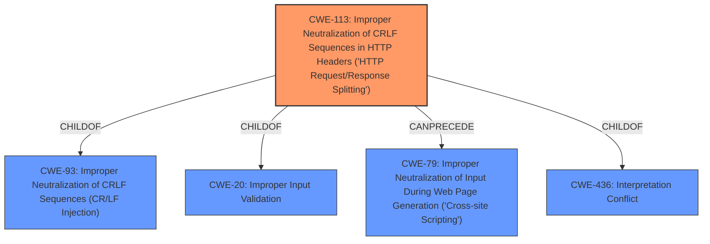

# Enhanced Analysis for CVE-2022-34306

# Summary
| CWE ID | CWE Name | Confidence | CWE Abstraction Level | CWE Vulnerability Mapping Label | CWE-Vulnerability Mapping Notes |
|---|---|---|---|---|---|
| CWE-113 | Improper Neutralization of CRLF Sequences in HTTP Headers ('HTTP Request/Response Splitting') | 0.9 | Variant | Allowed | Primary CWE |
| CWE-79 | Improper Neutralization of Input During Web Page Generation ('Cross-site Scripting') | 0.7 | Base | Allowed | Secondary Candidate |
| CWE-444 | Inconsistent Interpretation of HTTP Requests ('HTTP Request/Response Smuggling') | 0.6 | Base | Allowed | Secondary Candidate |
| CWE-116 | Improper Encoding or Escaping of Output | 0.5 | Class | Allowed-with-Review | Secondary Candidate |
| CWE-20 | Improper Input Validation | 0.4 | Class | Discouraged | Secondary Candidate |

## Evidence and Confidence

*   **Confidence Score:** 0.9
*   **Evidence Strength:** HIGH

## Relationship Analysis
The primary CWE is CWE-113, which is a variant of CWE-93 and a child of CWE-20. It can precede CWE-79. This shows a potential chain where improper input validation (CWE-20) leads to HTTP Request/Response Splitting (CWE-113), which can then lead to Cross-Site Scripting (CWE-79).



## Vulnerability Chain
The chain of root cause and weaknesses is as follows:
1.  **Root Cause:** Improper Input Validation
2.  **Weakness:** HTTP Header Injection (CWE-113)
3.  **Impact:** Cross-Site Scripting (CWE-79), Cache Poisoning, Session Hijacking

## Summary of Analysis
The initial assessment, based on the vulnerability description and the provided CWE information, points to CWE-113 as the most appropriate primary CWE. The vulnerability stems from **improper input validation** of HOST headers, leading to **HTTP header injection**. This allows attackers to perform actions like Cross-Site Scripting (XSS), Cache Poisoning, and Session Hijacking.

The evidence from the "CVE Reference Links Content Summary" strongly supports this: "The application does not properly sanitize or validate input that is used to construct HTTP headers. This can lead to the injection of malicious code or control characters into the HTTP headers."

CWE-113 (Improper Neutralization of CRLF Sequences in HTTP Headers) is a Variant-level CWE that directly addresses the **weakness** of **HTTP header injection** due to **improper neutralization**.

CWE-79 (Improper Neutralization of Input During Web Page Generation ('Cross-site Scripting')) is a secondary CWE because XSS is one of the potential impacts of the **HTTP header injection**. It's a consequence, not the root cause, and the description clearly states "This could allow an attacker to conduct various attacks against the vulnerable system, including cross-site scripting..." This indicates that the **HTTP header injection** is the primary issue, and XSS is one possible outcome.

CWE-444 (Inconsistent Interpretation of HTTP Requests ('HTTP Request/Response Smuggling')) is a potential secondary CWE since **HTTP header injection** could lead to request smuggling, where intermediaries interpret the request differently.

CWE-116 (Improper Encoding or Escaping of Output) was considered because it is listed as the Primary CWE Match for similar **Vulnerability Descriptions**. However, CWE-113 is more specific to **HTTP header injection**, making it a better fit.

CWE-20 (Improper Input Validation) is a Class-level CWE and is too general. While **improper input validation** is the root cause, CWE-113 more precisely describes the resulting vulnerability.

The selected CWEs are at the optimal level of specificity. CWE-113 is a Variant-level CWE, providing a specific description of the vulnerability. The relationships show how the **improper input validation** can lead to the **HTTP header injection**, which then leads to potential exploits like XSS.

Relevant CWE Information:

# Enhanced Context (25 CWEs)
The following CWEs were identified as potentially relevant to this vulnerability:

## CWE-1240: Use of a Cryptographic Primitive with a Risky Implementation
**Abstraction Level**: Base
**Similarity Score**: 0.80
**Source**: dense

**Description**:
To fulfill the need for a cryptographic primitive, the product implements a cryptographic algorithm using a non-standard, unproven, or disallowed/non-compliant cryptographic implementation.

**Mapping Guidance**:
- Usage: Allowed
- Rationale: This CWE entry is at the Base level of abstraction, which is a preferred level of abstraction for mapping to the root causes of vulnerabilities.


## CWE-327: Use of a Broken or Risky Cryptographic Algorithm
**Abstraction Level**: Class
**Similarity Score**: 0.75
**Source**: dense

**Description**:
The product uses a broken or risky cryptographic algorithm or protocol.

**Mapping Guidance**:
- Usage: Allowed-with-Review
- Rationale: This CWE entry is a Class and might have Base-level children that would be more appropriate


## CWE-807: Reliance on Untrusted Inputs in a Security Decision
**Abstraction Level**: Base
**Similarity Score**: 0.75
**Source**: dense

**Description**:
The product uses a protection mechanism that relies on the existence or values of an input, but the input can be modified by an untrusted actor in a way that bypasses the protection mechanism.

**Mapping Guidance**:
- Usage: Allowed
- Rationale: This CWE entry is at the Base level of abstraction, which is a preferred level of abstraction for mapping to the root causes of vulnerabilities.


## CWE-1289: Improper Validation of Unsafe Equivalence in Input
**Abstraction Level**: Base
**Similarity Score**: 0.75
**Source**: dense

**Description**:
The product receives an input value that is used as a resource identifier or other type of reference, but it does not validate or incorrectly validates that the input is equivalent to a potentially-unsafe value.

**Mapping Guidance**:
- Usage: Allowed
- Rationale: This CWE entry is at the Base level of abstraction, which is a preferred level of abstraction for mapping to the root causes of vulnerabilities.


## CWE-328: Use of Weak Hash
**Abstraction Level**: Base
**Similarity Score**: 0.75
**Source**: dense

**Description**:
The product uses an algorithm that produces a digest (output value) that does not meet security expectations for a hash function that allows an adversary to reasonably determine the original input (preimage attack), find another input that can produce the same hash (2nd preimage attack), or find multiple inputs that evaluate to the same hash (birthday attack).

**Mapping Guidance**:
- Usage: Allowed
- Rationale: This CWE entry is at the Base level of abstraction, which is a preferred level of abstraction for mapping to the root causes of vulnerabilities.


## CWE-330: Use of Insufficiently Random Values
**Abstraction Level**: Class
**Similarity Score**: 0.74
**Source**: dense

**Description**:
The product uses insufficiently random numbers or values in a security context that depends on unpredictable numbers.

**Mapping Guidance**:
- Usage: Discouraged
- Rationale: This CWE entry is a level-1 Class (i.e., a child of a Pillar). It might have lower-level children that would be more appropriate


## CWE-1391: Use of Weak Credentials
**Abstraction Level**: Class
**Similarity Score**: 0.74
**Source**: dense

**Description**:
The product uses weak credentials (such as a default key or hard-coded password) that can be calculated, derived, reused, or guessed by an attacker.

**Mapping Guidance**:
- Usage: Allowed-with-Review
- Rationale: This CWE entry is a Class and might have Base-level children that would be more appropriate


## CWE-757: Selection of Less-


## CWE Relationship Analysis

Current CWEs represent these abstraction levels: .


### Vulnerability Chain Analysis

**Chain starting from CWE-436:**
- 436 (Interpretation Conflict) - ROOT


**Chain starting from CWE-327:**
- 327 (Use of a Broken or Risky Cryptographic Algorithm) - ROOT


### CWE Relationship Diagram

```mermaid
graph TD
    classDef primary fill:#f96,stroke:#333,stroke-width:2px
    classDef secondary fill:#69f,stroke:#333
    classDef tertiary fill:#9e9,stroke:#333
```