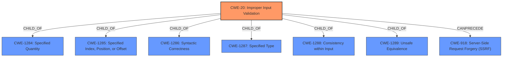

# Enhanced Analysis for CVE-2022-34350

# Summary
| CWE ID | CWE Name | Confidence | CWE Abstraction Level | CWE Vulnerability Mapping Label | CWE-Vulnerability Mapping Notes |
|---|---|---|---|---|---|
| CWE-20 | Improper Input Validation | 0.9 | Class | Primary | Allowed-with-Review |
| CWE-918 | Server-Side Request Forgery (SSRF) | 0.7 | Base | Secondary | Allowed |

## Evidence and Confidence

*   **Confidence Score:** 0.8
*   **Evidence Strength:** MEDIUM

## Relationship Analysis
The primary CWE is CWE-20, which is a class-level CWE. While usually discouraged, the evidence points to a general **improper validation** issue. A more specific CWE could not be identified based on the evidence. CWE-20 has child relationships with more specific input validation errors (CWE-1284, CWE-1285, CWE-1286, CWE-1287, CWE-1288, CWE-1289) but none of these can be confirmed with the current evidence. It can also precede CWE-22, CWE-41, CWE-74, CWE-119, and CWE-770 which can lead to other injection based attacks.



## Vulnerability Chain
The vulnerability chain starts with **improper validation of user-supplied input** (CWE-20). This leads to the application performing server-side DNS lookups or HTTP requests to arbitrary domain names, which is a Server-Side Request Forgery (SSRF) (CWE-918).

## Summary of Analysis
The initial analysis identified **improper validation of user-supplied input** as the root cause, leading to potential server-side requests to arbitrary domain names.

The final conclusion is:
- CWE-20 Improper Input Validation, due to the **improper validation of user-supplied input** which is the root cause.
- CWE-918 Server-Side Request Forgery (SSRF), as the impact of the **improper validation** leads to server-side requests to arbitrary domain names.

The assessment is primarily based on the vulnerability description which states "IBM API Connect...is vulnerable to External Service Interaction attack, caused by **improper validation of user-supplied input**. A remote attacker could exploit this vulnerability to induce the application to perform server-side DNS lookups or HTTP requests to arbitrary domain names."

CWE-20 is at the optimal level of specificity given the available evidence. While CWE-20 is a Class-level CWE, the vulnerability description lacks the specific details to narrow it down to a Base or Variant level CWE. CWE-918 is included as it is the direct result of the **improper validation** leading to the SSRF.

Relevant CWE Information:

# Enhanced Context (25 CWEs)
The following CWEs were identified as potentially relevant to this vulnerability:

## CWE-74: Improper Neutralization of Special Elements in Output Used by a Downstream Component ('Injection')
**Abstraction Level**: Class
**Similarity Score**: 0.77
**Source**: dense

**Description**:
The product constructs all or part of a command, data structure, or record using externally-influenced input from an upstream component, but it does not neutralize or incorrectly neutralizes special elements that could modify how it is parsed or interpreted when it is sent to a downstream component.

**Mapping Guidance**:
- Usage: Discouraged
- Rationale: CWE-74 is high-level and often misused when lower-level weaknesses are more appropriate.
- _Not Selected_: While injection is possible, the root cause is **improper input validation**, making CWE-20 a better fit.

## CWE-80: Improper Neutralization of Script-Related HTML Tags in a Web Page (Basic XSS)
**Abstraction Level**: Variant
**Similarity Score**: 0.75
**Source**: dense

**Description**:
The product receives input from an upstream component, but it does not neutralize or incorrectly neutralizes special characters such as "<", ">", and "&" that could be interpreted as web-scripting elements when they are sent to a downstream component that processes web pages.

**Mapping Guidance**:
- Usage: Allowed
- Rationale: This CWE entry is at the Variant level of abstraction, which is a preferred level of abstraction for mapping to the root causes of vulnerabilities.
- _Not Selected_: This is specific to XSS, which is not indicated in the description.

## CWE-1289: Improper Validation of Unsafe Equivalence in Input
**Abstraction Level**: Base
**Similarity Score**: 0.75
**Source**: dense

**Description**:
The product receives an input value that is used as a resource identifier or other type of reference, but it does not validate or incorrectly validates that the input is equivalent to a potentially-unsafe value.

**Mapping Guidance**:
- Usage: Allowed
- Rationale: This CWE entry is at the Base level of abstraction, which is a preferred level of abstraction for mapping to the root causes of vulnerabilities.
- _Not Selected_: This is a specific type of **improper validation** which cannot be confirmed with the given evidence.

## CWE-184: Incomplete List of Disallowed Inputs
**Abstraction Level**: Base
**Similarity Score**: 0.75
**Source**: dense

**Description**:
The product implements a protection mechanism that relies on a list of inputs (or properties of inputs) that are not allowed by policy or otherwise require other action to neutralize before additional processing takes place, but the list is incomplete.

**Mapping Guidance**:
- Usage: Allowed
- Rationale: This CWE entry is at the Base level of abstraction, which is a preferred level of abstraction for mapping to the root causes of vulnerabilities.
- _Not Selected_: This is a specific type of **improper validation** which cannot be confirmed with the given evidence.

## CWE-807: Reliance on Untrusted Inputs in a Security Decision
**Abstraction Level**: Base
**Similarity Score**: 0.75
**Source**: dense

**Description**:
The product uses a protection mechanism that relies on the existence or values of an input, but the input can be modified by an untrusted actor in a way that bypasses the protection mechanism.

**Mapping Guidance**:
- Usage: Allowed
- Rationale: This CWE entry is at the Base level of abstraction, which is a preferred level of abstraction for mapping to the root causes of vulnerabilities.
- _Not Selected_: This is a specific type of **improper validation** which cannot be confirmed with the given evidence.

## CWE-113: Improper Neutralization of CRLF Sequences in HTTP Headers ('HTTP Request/Response Splitting')
**Abstraction Level**: Variant
**Similarity Score**: 0.74
**Source**: dense

**Description**:
The product receives data from an HTTP agent/component (e.g., web server, proxy, browser, etc.), but it does not neutralize or incorrectly neutralizes CR and LF characters before the data is included in outgoing HTTP headers.

**Mapping Guidance**:
- Usage: Allowed
- Rationale: This CWE entry is at the Variant level of abstraction, which is a preferred level of abstraction for mapping to the root causes of vulnerabilities.
- _Not Selected_: This is specific to HTTP Request/Response Splitting, which is not indicated in the description.

## CWE-99: Improper Control of Resource Identifiers ('Resource Injection')
**Abstraction Level**: Class
**Similarity Score**: 0.74
**Source**: dense

**Description**:


## CWE Relationship Analysis

Current CWEs represent these abstraction levels: .


### Vulnerability Chain Analysis

**Chain starting from CWE-80:**
- 80 (Improper Neutralization of Script-Related HTML Tags in a Web Page (Basic XSS)) - ROOT


**Chain starting from CWE-918:**
- 918 (Server-Side Request Forgery (SSRF)) - ROOT


### CWE Relationship Diagram

```mermaid
graph TD
    classDef primary fill:#f96,stroke:#333,stroke-width:2px
    classDef secondary fill:#69f,stroke:#333
    classDef tertiary fill:#9e9,stroke:#333
```