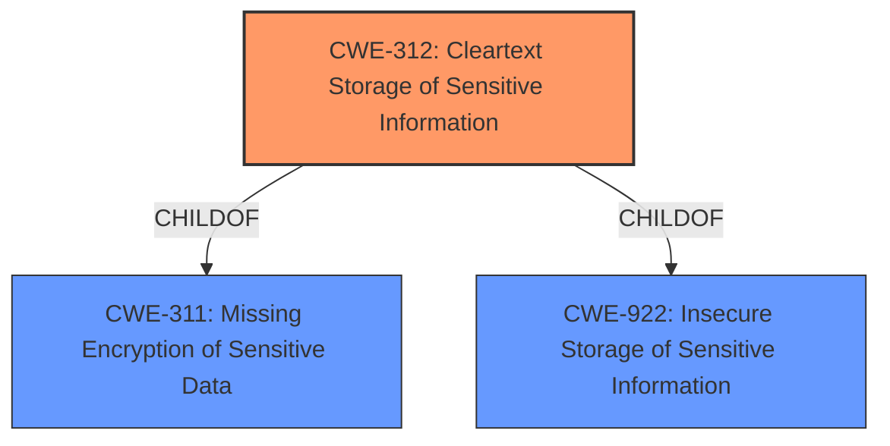

# Analysis Report for CVE-2022-34354

# Vulnerability Analysis Report: CVE-2022-34354

## Description


## Analysis (with Relationship Data)

# Summary
| CWE ID | CWE Name | Confidence | CWE Abstraction Level | CWE Vulnerability Mapping Label | CWE-Vulnerability Mapping Notes |
|---|---|---|---|---|---|
| CWE-312 | Cleartext Storage of Sensitive Information | 0.9 | Base | Allowed | Primary CWE: The vulnerability involves **encrypted storage of client data stored locally** which can be read by another user. This means the "encryption" is not providing adequate protection, effectively storing the data in a way that is accessible as cleartext. |

## Evidence and Confidence

*   **Confidence Score:** 0.9
*   **Evidence Strength:** HIGH

## Relationship Analysis
The primary CWE is CWE-312 (Cleartext Storage of Sensitive Information). This is a base-level CWE which accurately reflects that the encrypted data is being stored in a way that it can be accessed as cleartext.



## Vulnerability Chain
The vulnerability chain starts with the **weakness** that **encrypted storage of client data stored locally** is implemented in such a way that the data can be read by another user on the system. This leads directly to the impact of exposing client data.
  - **Root Cause:** Inadequate protection of client data.
  - **Weakness:** Data is stored in a way that another user on the system can read it.
  - **Impact:** Unauthorized access to sensitive client data.

## Summary of Analysis
The initial analysis focused on the fact that the client data, while nominally encrypted, was still accessible. This indicates that the encryption was either broken, poorly implemented, or the key management was flawed, effectively leading to cleartext storage.

The vulnerability description states that "encrypted storage of client data to be stored locally which can be read by another user on the system." The CVE Reference Links Content Summary mentions "Sensitive data exposure due to insecure local storage of encrypted client data." This directly supports CWE-312: Cleartext Storage of Sensitive Information. Although the data is "encrypted", the fact that it can be read by another user means the encryption is ineffective, resulting in the same outcome as storing the data in cleartext.

The Retriever Results also list CWE-312: Cleartext Storage of Sensitive Information, and CWE-922 Insecure Storage of Sensitive Information as the Top Combined Results.

I considered CWE-922 Insecure Storage of Sensitive Information because it is related. However, the more specific issue is that the encrypted data is accessible. Therefore, CWE-312 is the more precise choice as the data can be read as if it were cleartext.

Relevant CWE Information:
* CWE-312: Cleartext Storage of Sensitive Information: The product stores sensitive information in cleartext within a resource that might be accessible to another control sphere.
* CWE-922: Insecure Storage of Sensitive Information: The product stores sensitive information without properly limiting read or write access by unauthorized actors.
* CWE-311: Missing Encryption of Sensitive Data: The product does not encrypt sensitive or critical information before storage or transmission.


## CWE Relationship Analysis

Current CWEs represent these abstraction levels: .


### Vulnerability Chain Analysis

**Chain starting from CWE-922:**
- 922 (Insecure Storage of Sensitive Information) - ROOT


**Chain starting from CWE-311:**
- 311 (Missing Encryption of Sensitive Data) - ROOT


### CWE Relationship Diagram

```mermaid
graph TD
    classDef primary fill:#f96,stroke:#333,stroke-width:2px
    classDef secondary fill:#69f,stroke:#333
    classDef tertiary fill:#9e9,stroke:#333
```


*Report generated on 2025-03-30 18:21:48*
