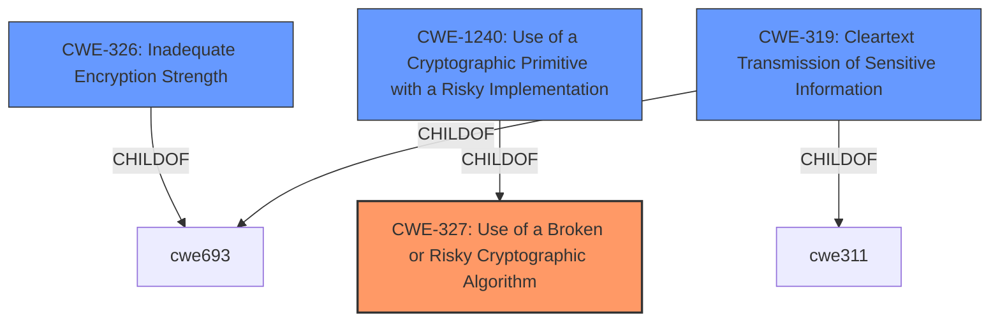

# Analysis Report for CVE-2022-34361

# Vulnerability Analysis Report: CVE-2022-34361

## Description


## Analysis (with Relationship Data)

# Summary
| CWE ID | CWE Name | Confidence | CWE Abstraction Level | CWE Vulnerability Mapping Label | CWE-Vulnerability Mapping Notes |
|---|---|---|---|---|---|
| CWE-327 | Use of a Broken or Risky Cryptographic Algorithm | 1.0 | Class | Primary | Allowed-with-Review |
| CWE-326 | Inadequate Encryption Strength | 0.7 | Class | Secondary | Allowed-with-Review |
| CWE-1240 | Use of a Cryptographic Primitive with a Risky Implementation | 0.6 | Base | Secondary | Allowed |
| CWE-319 | Cleartext Transmission of Sensitive Information | 0.4 | Base | Secondary | Allowed |

## Evidence and Confidence

*   **Confidence Score:** 0.8
*   **Evidence Strength:** MEDIUM

## Relationship Analysis
The primary CWE selected is CWE-327, "Use of a Broken or Risky Cryptographic Algorithm", which is a Class-level CWE. The vulnerability description explicitly mentions the use of **weaker than expected cryptographic algorithms**. CWE-327 is related to other CWEs such as CWE-326 "Inadequate Encryption Strength" and CWE-1240 "Use of a Cryptographic Primitive with a Risky Implementation". CWE-1240 is a child of CWE-327.


## Vulnerability Chain
The vulnerability chain starts with the **use of weak cryptographic algorithms (CWE-327)**, which leads to the potential to **decrypt highly sensitive information**.

## Summary of Analysis
The initial assessment focused on identifying the root cause of the vulnerability. The description explicitly states the use of **weaker than expected cryptographic algorithms**, leading to the selection of CWE-327. The retriever results also listed CWE-327 as the top candidate.

The following is the evidence used:
*   Vulnerability Description Key Phrases: "**rootcause:** **weak cryptographic algorithms**"
*   CVE Reference Links Content Summary: "'root_cause': 'A java vulnerability and an exposure of weak TLS ciphers affect IBM Sterling Secure Proxy.'"

CWE-327 is a Class, and the mapping guidance suggests examining its children for a better fit. CWE-1240 "Use of a Cryptographic Primitive with a Risky Implementation" is a child of CWE-327 and is also a good fit, but the description doesn't give enough information to say if the algorithms are non-standard/unproven implementations. CWE-326 "Inadequate Encryption Strength" is also considered because **weak algorithms** can be considered those that have **inadequate strength**.

CWE-319 "Cleartext Transmission of Sensitive Information" was also considered as a possible weakness due to the fact the weak algorithms could result in the sensitive information being exposed, but the vulnerability doesn't state that information is being transmitted in clear text. It could be a consequence of the weak algorithms, but its not explicitly stated.

The final decision is to classify the vulnerability as CWE-327, with CWE-326, CWE-1240, and CWE-319 as secondary candidates. This is because the description does not provide enough information to select a more specific child of CWE-327 with high confidence.

Relevant CWE Information:
*   **CWE-327: Use of a Broken or Risky Cryptographic Algorithm**
    *   **How the details match the CWE's characteristics:** The vulnerability description states the use of **weaker than expected cryptographic algorithms**, which directly aligns with CWE-327's description: "The product uses a broken or risky cryptographic algorithm or protocol."
    *   **The security implications and potential impact:** The use of weak algorithms can lead to the decryption of sensitive information, as stated in the vulnerability description.
    *   **Any parent-child relationships or chain patterns that influenced your mapping:** CWE-327 is a Class, and its children were considered.
    *   **Whether the weakness is primary or secondary in the vulnerability:** Primary.
    *   **How the official MITRE mapping guidance influenced your decision:** The mapping guidance suggests examining children of CWE-327 for a better fit, but no child CWE was a more precise fit based on the available information.
*   **CWE-326: Inadequate Encryption Strength**
    *   **How the details match the CWE's characteristics:** **Weak algorithms** are often those that don't have enough encryption strength.
    *   **The security implications and potential impact:** The security implication is that it could be subjected to brute force attacks.
    *   **Any parent-child relationships or chain patterns that influenced your mapping:** ChildOf -> CWE-693
    *   **Whether the weakness is primary or secondary in the vulnerability:** Secondary.
    *   **How the official MITRE mapping guidance influenced your decision:** The mapping guidance suggests examining children of CWE-326 for a better fit, but no child CWE was a more precise fit based on the available information.
*   **CWE-1240: Use of a Cryptographic Primitive with a Risky Implementation**
    *   **How the details match the CWE's characteristics:** It could be that the algorithms are a risky implementation.
    *   **The security implications and potential impact:** Could expose information, modify data, or spoof users.
    *   **Any parent-child relationships or chain patterns that influenced your mapping:** ChildOf -> CWE-327
    *   **Whether the weakness is primary or secondary in the vulnerability:** Secondary.
    *   **How the official MITRE mapping guidance influenced your decision:** The mapping guidance suggests this is a base level.
*   **CWE-319: Cleartext Transmission of Sensitive Information**
    *   **How the details match the CWE's characteristics:** It could be that the weak cryptographic algorithm is not encrypting the information resulting in cleartext transmission.
    *   **The security implications and potential impact:** The security implication is that sensitive information is being transmitted unencrypted.
    *   **Any parent-child relationships or chain patterns that influenced your mapping:** ChildOf -> CWE-311
    *   **Whether the weakness is primary or secondary in the vulnerability:** Secondary.
    *   **How the official MITRE mapping guidance influenced your decision:** The mapping guidance suggests this is a base level.

CWEs considered but not used:
*   CWE-311: Missing Encryption of Sensitive Data - This is a higher-level CWE, and CWE-319 is a more specific child that better fits the description if the data was being transmitted.
*   CWE-1391: Use of Weak Credentials - This CWE is not applicable because the vulnerability is not related to credentials.
*   CWE-203 and CWE-208: Observable Discrepancy/Timing Discrepancy - These CWEs are not applicable because the vulnerability is not related to timing or observable discrepancies.
*   CWE-916: Use of Password Hash With Insufficient Computational Effort - This CWE is not applicable because the vulnerability is not related to password hashing.
*   CWE-338: Use of Cryptographically Weak Pseudo-Random Number Generator (PRNG) - This CWE is not applicable because the vulnerability is not explicitly related to PRNGs.


## CWE Relationship Analysis

Current CWEs represent these abstraction levels: .


### Vulnerability Chain Analysis

**Chain starting from CWE-916:**
- 916 (Use of Password Hash With Insufficient Computational Effort) - ROOT


**Chain starting from CWE-208:**
- 208 (Observable Timing Discrepancy) - ROOT


### CWE Relationship Diagram

```mermaid
graph TD
    classDef primary fill:#f96,stroke:#333,stroke-width:2px
    classDef secondary fill:#69f,stroke:#333
    classDef tertiary fill:#9e9,stroke:#333
```


*Report generated on 2025-03-30 13:41:53*
