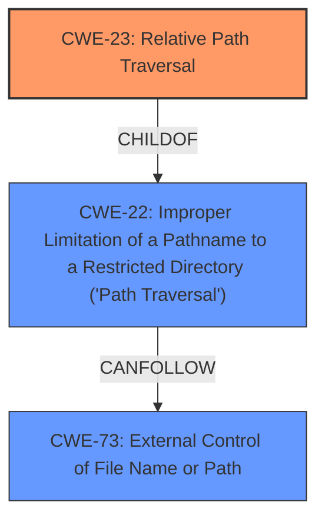

# Analysis for CVE-2022-34378

# Summary
| CWE ID | CWE Name | Confidence | CWE Abstraction Level | CWE Vulnerability Mapping Label | CWE-Vulnerability Mapping Notes |
|---|---|---|---|---|---|
| CWE-23 | Relative Path Traversal | 1.0 | Base | Primary | Allowed |

## Evidence and Confidence

*   **Confidence Score:** 1.0
*   **Evidence Strength:** HIGH

## Relationship Analysis
The primary relationship that influenced the selection was the ChildOf relationship between CWE-23 and CWE-22. While CWE-22 is a broader category encompassing both relative and absolute path traversal, the vulnerability description explicitly mentions "**relative path traversal**", making CWE-23 a more specific and accurate representation of the weakness. The other CWEs considered were related to file access control, but the core issue revolves around the improper handling of relative paths, placing it squarely within the scope of CWE-23.

## Vulnerability Chain
The vulnerability chain begins with the **improper handling of relative paths** (CWE-23). This allows a low-privileged local attacker to potentially access files or directories outside the intended scope, ultimately leading to a **denial of service**.

## Summary of Analysis
The initial analysis identified CWE-23 as the most relevant CWE based on the explicit mention of "**relative path traversal**" in the vulnerability description. The Retriever results also listed CWE-23 and CWE-22 as top candidates.

The selection of CWE-23 is heavily based on the evidence: "Dell PowerScale OneFS, versions 9.0.0 up to and including 9.1.0.20, 9.2.1.13, 9.3.0.6, and 9.4.0.3, contain a **relative path traversal** vulnerability." The CVE Reference Links Content Summary also confirms this root cause. The relationship graph solidifies this choice, showing the direct link between the specific weakness (CWE-23) and the more general path traversal issue (CWE-22).

CWE-23 is at the optimal level of specificity because the description explicitly states that it is a **relative path traversal** vulnerability. While CWE-22 (Improper Limitation of a Pathname to a Restricted Directory ('Path Traversal')) is a parent CWE and also relevant, CWE-23 provides a more precise classification.

Relevant CWE Information:

# Enhanced Context (25 CWEs)
The following CWEs were identified as potentially relevant to this vulnerability:

## CWE-23: Relative Path Traversal
The product uses external input to construct a pathname that should be within a restricted directory, but it does not properly neutralize sequences such as ".." that can resolve to a location that is outside of that directory.

**Explanation:**

The vulnerability description explicitly states a "**relative path traversal**" vulnerability, aligning perfectly with CWE-23's definition. This allows an attacker to access files/directories outside the intended scope.

*   How the vulnerability's details match the CWE's characteristics: The vulnerability description mentions "**relative path traversal**" which is the core characteristic of CWE-23.
*   The security implications and potential impact: An attacker can access sensitive files/directories, leading to information disclosure, or in this case, denial of service.
*   Any parent-child relationships or chain patterns that influenced your mapping: CWE-23 is a child of CWE-22, which is a more general form of path traversal.
*   Whether the weakness is primary or secondary in the vulnerability: CWE-23 is the primary weakness.
*   How the official MITRE mapping guidance influenced your decision: The mapping guidance for CWE-23 states that it is at the Base level of abstraction, which is a preferred level for mapping root causes. The guidance also suggests reading the name and description to ensure an appropriate fit, which it is in this case.

## CWE-22: Improper Limitation of a Pathname to a Restricted Directory ('Path Traversal')
The product uses external input to construct a pathname that is intended to identify a file or directory that is located underneath a restricted parent directory, but the product does not properly neutralize special elements within the pathname that can cause the pathname to resolve to a location that is outside of the restricted directory.

**Explanation:**

CWE-22 is the parent of CWE-23. It represents a broader category of path traversal vulnerabilities. While applicable, it is not as specific as CWE-23.

*   How the vulnerability's details match the CWE's characteristics: This CWE is a broader description of path traversal and the **relative path traversal** is a form of this vulnerability.
*   The security implications and potential impact: An attacker can access files/directories outside the intended scope, leading to information disclosure, or in this case, denial of service.
*   Any parent-child relationships or chain patterns that influenced your mapping: CWE-22 is a parent of CWE-23.
*   Whether the weakness is primary or secondary in the vulnerability: Considered but not selected as the primary vulnerability.
*   How the official MITRE mapping guidance influenced your decision: The mapping guidance for CWE-22 states that it is at the Base level of abstraction.

## CWE-59: Improper Link Resolution Before File Access ('Link Following')
The product attempts to access a file based on the filename, but it does not properly prevent that filename from identifying a link or shortcut that resolves to an unintended resource.

**Explanation:**

CWE-59 involves exploiting links or shortcuts. This doesn't align with the explicit "**relative path traversal**" nature of the vulnerability.

*   How the vulnerability's details match the CWE's characteristics: This CWE is about improper link resolution, not path traversal directly.
*   The security implications and potential impact: An attacker can cause the program to access unintended resources.
*   Any parent-child relationships or chain patterns that influenced your mapping: Not applicable in this case.
*   Whether the weakness is primary or secondary in the vulnerability: Considered but not selected as this is not a link following issue.
*   How the official MITRE mapping guidance influenced your decision: The mapping guidance for CWE-59 states that it is at the Base level of abstraction.

## CWE-73: External Control of File Name or Path
The product allows user input to control or influence paths or file names that are used in filesystem operations.

**Explanation:**

While external control of file paths can contribute to path traversal, it is not the core weakness in this case. The vulnerability is specifically about improper handling of relative paths.

*   How the vulnerability's details match the CWE's characteristics: This CWE describes external control of file names or paths, which can be a factor in path traversal but not the main weakness.
*   The security implications and potential impact: An attacker can influence file system operations.
*   Any parent-child relationships or chain patterns that influenced your mapping: CWE-73 can precede CWE-22, but the description doesn't imply external control, just a **relative path traversal**.
*   Whether the weakness is primary or secondary in the vulnerability: Considered but not selected because the description indicates more of an improper handling of paths.
*   How the official MITRE mapping guidance influenced your decision: The mapping guidance for CWE-73 states that it is at the Base level of abstraction.