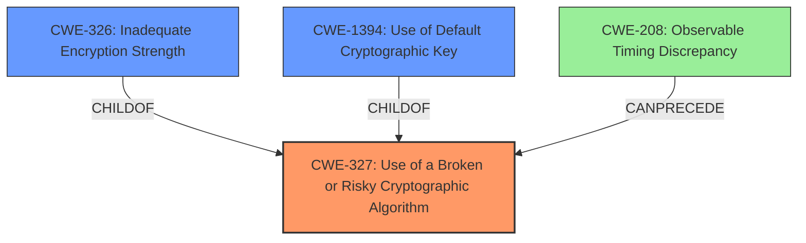

# Raw Analyzer Response for CVE-2022-34385

# Summary
| CWE ID    | CWE Name                                                                | Confidence | CWE Abstraction Level | CWE Vulnerability Mapping Label | CWE-Vulnerability Mapping Notes |
| :-------- | :---------------------------------------------------------------------- | :--------- | :---------------------- | :------------------------------ | :------------------------------ |
| CWE-327   | Use of a Broken or Risky Cryptographic Algorithm                      | 0.85       | Class                   | Primary                         | Allowed-with-Review             |
| CWE-1394  | Use of Default Cryptographic Key                                      | 0.75       | Base                    | Secondary                       | Allowed                         |
| CWE-326   | Inadequate Encryption Strength                                          | 0.70       | Class                   | Secondary                       | Allowed-with-Review             |

## Evidence and Confidence

*   **Confidence Score:** 0.80
*   **Evidence Strength:** HIGH

## Relationship Analysis
The primary relationship influencing the decision is the hierarchical structure within the CWE framework, particularly the ChildOf relationship between CWE-327 (Use of a Broken or Risky Cryptographic Algorithm) and its potential children like CWE-326 (Inadequate Encryption Strength) and CWE-1394 (Use of Default Cryptographic Key). Additionally, the CanPrecede relationship of CWE-208 (Observable Timing Discrepancy) to CWE-327 suggests potential related vulnerabilities. The abstraction levels were also considered, favoring more specific classifications when supported by evidence.

## Vulnerability Chain
The vulnerability chain starts with a **cryptographic weakness**. This weakness could manifest as the use of a broken algorithm (CWE-327), a default key (CWE-1394), or inadequate encryption strength (CWE-326). The final impact is the exposure of sensitive information to unauthorized actors.

## Summary of Analysis
Initially, the primary focus was on identifying the **cryptographic weakness** as the root cause. The description explicitly mentions this weakness, which aligns well with CWE-327 (Use of a Broken or Risky Cryptographic Algorithm). The retriever results also listed CWE-327, CWE-326 (Inadequate Encryption Strength) and CWE-1394 (Use of Default Cryptographic Key) as potential candidates.

The analysis considered whether the weakness was more specifically related to the use of default keys (CWE-1394) or inadequate encryption strength (CWE-326). While the description doesn't explicitly state the key is a default key or that the encryption strength is inadequate, these are plausible manifestations of a cryptographic weakness, making them secondary considerations.

The final decision is based on the evidence provided in the vulnerability description and CVE reference, which points to a general **cryptographic weakness**.

Relevant excerpts:

*   "SupportAssist for Home PCs (version 3.11.4 and prior) and SupportAssist for Business PCs (version 3.2.0 and prior) contain **cryptographic weakness** vulnerability."
*   "The root cause is a "**cryptographic weakness** vulnerability" present in Dell SupportAssist for Home PCs and Business PCs."

CWE-327 is chosen as the primary CWE because it directly addresses the root cause as a **cryptographic weakness**. The associated risk is exposure of sensitive information

CWE-327 is at the Class level of abstraction. While a more specific Base or Variant CWE would be preferred, the provided evidence doesn't allow for a more precise classification. CWE-327 is still the most accurate representation of the vulnerability based on the available information.

Relevant CWE Information:

# Enhanced Context (25 CWEs)

## CWE-327: Use of a Broken or Risky Cryptographic Algorithm
**CWE-327** is the primary CWE because the vulnerability is a **cryptographic weakness** This aligns directly with the description of CWE-327: "The product uses a broken or risky cryptographic algorithm or protocol." The impact, as stated in the vulnerability description, is that an authenticated non-admin user could obtain sensitive information. The CWE's description also states "Insecure cryptography can be exploited to expose sensitive information, modify data in unexpected ways, spoof identities of other users or devices, or other impacts."

The Mapping Guidance for CWE-327 suggests:
**Usage:** Allowed-with-Review
**Rationale:** This CWE entry is a Class and might have Base-level children that would be more appropriate

Because the **cryptographic weakness** could be the use of a default key or inadequate encryption strength, I am also adding CWE-1394 and CWE-326 as secondary CWEs, but keeping CWE-327 as the primary since the provided information doesn't allow for a more specific classification.

## CWE-1394: Use of Default Cryptographic Key
**CWE-1394** is a secondary CWE because the **cryptographic weakness** could be because "The product uses a default cryptographic key for potentially critical functionality."

The Mapping Guidance for CWE-1394 suggests:
**Usage:** Allowed
**Rationale:** This CWE entry is at the Base level of abstraction, which is a preferred level of abstraction for mapping to the root causes of vulnerabilities.

## CWE-326: Inadequate Encryption Strength
**CWE-326** is a secondary CWE because the **cryptographic weakness** could be because "The product stores or transmits sensitive data using an encryption scheme that is theoretically sound, but is not strong enough for the level of protection required."

The Mapping Guidance for CWE-326 suggests:
**Usage:** Allowed-with-Review
**Rationale:** This CWE entry is a Class and might have Base-level children that would be more appropriate

## Other CWEs Considered:
CWE-200 (Exposure of Sensitive Information to an Unauthorized Actor) was considered but not selected as the primary CWE. While the vulnerability does lead to information exposure, CWE-200 is a general consequence rather than the root cause. The root cause is the **cryptographic weakness**.

CWE-321 (Use of Hard-coded Cryptographic Key) was also considered, but the description does not explicitly mention a hard-coded key. Therefore, CWE-321 is not selected.