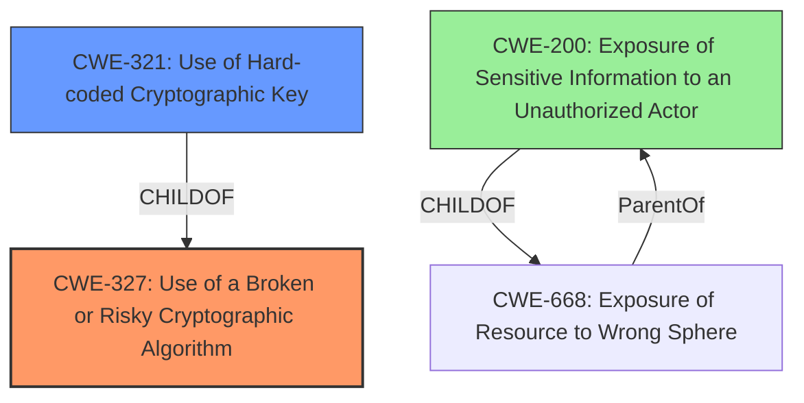

# Analysis Report for CVE-2022-34386

# Vulnerability Analysis Report: CVE-2022-34386

## Description


## Analysis (with Relationship Data)

# Summary
| CWE ID | CWE Name | Confidence | CWE Abstraction Level | CWE Vulnerability Mapping Label | CWE-Vulnerability Mapping Notes |
|---|---|---|---|---|---|
| CWE-327 | Use of a Broken or Risky Cryptographic Algorithm | 0.8 | Class | Allowed-with-Review | Examine children of this entry to see if there is a better fit |
| CWE-321 | Use of Hard-coded Cryptographic Key | 0.6 | Variant | Allowed | Carefully read both the name and description to ensure that this mapping is an appropriate fit. Do not try to 'force' a mapping to a lower-level Base/Variant simply to comply with this preferred level of abstraction. |
| CWE-200 | Exposure of Sensitive Information to an Unauthorized Actor | 0.4 | Class | Discouraged | If an error or mistake causes information to be disclosed, then use the CWE ID for that error. Consider starting with improper authorization (CWE-285), insecure permissions (CWE-732), improper authentication (CWE-287), etc. Also consider children such as Insertion of Sensitive Information Into Sent Data (CWE-201), Observable Discrepancy (CWE-203), Insertion of Sensitive Information into Externally-Accessible File or Directory (CWE-538), or others. |

## Evidence and Confidence

*   **Confidence Score:** 0.7
*   **Evidence Strength:** MEDIUM

## Relationship Analysis
The primary relationship influencing the CWE selection is the parent-child relationship. CWE-327 (Class) is a parent of CWE-321 (Variant). I considered CWE-321 as a more specific candidate, but evidence is lacking. CWE-200 is a high level class related to information exposure.



## Vulnerability Chain
The vulnerability chain starts with a **cryptographic weakness** that leads to an exposure of sensitive information.
  - **Root Cause:** **Cryptographic Weakness** (CWE-327)
  - **Impact:** Exposure of sensitive information (CWE-200)

## Summary of Analysis
Initially, the analysis focused on identifying the most accurate CWE to represent the **cryptographic weakness**. The vulnerability description and CVE details clearly point to a problem in the cryptographic implementation within Dell SupportAssist.

The primary CWE chosen is CWE-327, "Use of a Broken or Risky Cryptographic Algorithm." This selection is based on the explicit mention of "**cryptographic weakness**" as the root cause in both the vulnerability description and the CVE Reference Links Content Summary. CWE-327 directly addresses the use of flawed cryptographic methods. The usage is "Allowed-with-Review" because the description mentions to examine children of this entry to see if there is a better fit.

CWE-321, "Use of Hard-coded Cryptographic Key", was considered because the description mentions "obtain sensitive information", and hardcoded keys are a common cryptographic weakness. The abstraction level is Variant, which is preferred. However, there's no direct evidence of a hard-coded key being the specific issue. Therefore, CWE-327 is a better initial fit given the information available.

CWE-200, "Exposure of Sensitive Information to an Unauthorized Actor," was also considered because the vulnerability leads to the potential exposure of sensitive information. However, CWE-200 is a high-level class that is discouraged to use when a root cause can be determined. In this case, the root cause is the **cryptographic weakness**, so CWE-327 is more appropriate.

The final decision emphasizes the root cause and selects the most specific CWE possible based on available evidence. CWE-327 is at the optimal level of specificity because it directly describes the **cryptographic weakness** without needing further assumptions about the specific type of cryptographic failure.

Relevant CWE Information:
- **Vulnerability Description Key Phrases**: **rootcause:** **cryptographic weakness**
- **CVE Reference Links Content Summary**: **Root Cause of Vulnerability:** The vulnerability is due to a **cryptographic weakness** in Dell SupportAssist for Home PCs and Business PCs. **Weaknesses/Vulnerabilities Present:** Cryptographic weakness.


## CWE Relationship Analysis

Current CWEs represent these abstraction levels: .


### Vulnerability Chain Analysis

**Chain starting from CWE-201:**
- 201 (Insertion of Sensitive Information Into Sent Data) - ROOT


**Chain starting from CWE-200:**
- 200 (Exposure of Sensitive Information to an Unauthorized Actor) - ROOT


### CWE Relationship Diagram

```mermaid
graph TD
    classDef primary fill:#f96,stroke:#333,stroke-width:2px
    classDef secondary fill:#69f,stroke:#333
    classDef tertiary fill:#9e9,stroke:#333
```


*Report generated on 2025-03-31 04:52:18*
