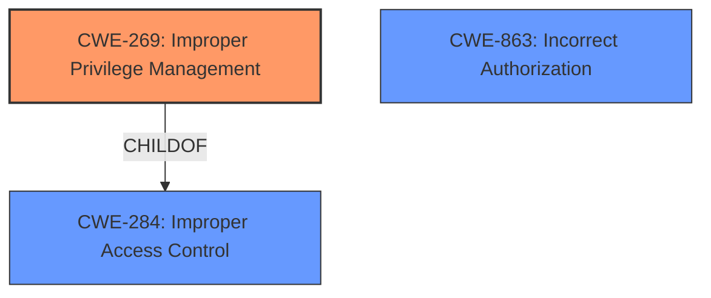

# Enhanced Analysis for CVE-2022-34387

# Summary
| CWE ID | CWE Name | Confidence | CWE Abstraction Level | CWE Vulnerability Mapping Label | CWE-Vulnerability Mapping Notes |
|---|---|---|---|---|---|
| CWE-269 | Improper Privilege Management | 0.7 | Class | Discouraged | Primary CWE. The vulnerability is a privilege escalation, indicating a problem with how privileges are managed. |
| CWE-863 | Incorrect Authorization | 0.5 | Class | Allowed-with-Review | Secondary CWE. The vulnerability leads to privilege escalation, which indicates that authorization checks are not correctly implemented. |
| CWE-284 | Improper Access Control | 0.3 | Pillar | Discouraged | Secondary CWE. The vulnerability is a privilege escalation which is a form of access control issue. |

## Evidence and Confidence

*   **Confidence Score:** 0.7
*   **Evidence Strength:** MEDIUM

## Relationship Analysis
The analysis of CWE relationships was crucial in determining the appropriate classification:

*   CWE-269 (Improper Privilege Management) is a Class-level CWE that serves as a parent to CWE-250 (Execution with Unnecessary Privileges) and is a child of CWE-284 (Improper Access Control).
*   CWE-284 (Improper Access Control) is a high-level Pillar CWE, with CWE-269 (Improper Privilege Management) as one of its children. CWE-284 is discouraged for use in favor of more specific CWEs.
*   CWE-863 (Incorrect Authorization) is a Class-level CWE that could potentially be a more specific match than CWE-269 if the authorization process is the root cause.



## Vulnerability Chain
The vulnerability chain for the Dell SupportAssist privilege escalation is as follows:

1.  **Root Cause:** Improper Privilege Management (**CWE-269**) or Incorrect Authorization (**CWE-863**). The system does not properly manage or check privileges, potentially due to incorrect authorization mechanisms.
2.  **Weakness:** Privilege Escalation. An authenticated local user can elevate their privileges due to the root cause.
3.  **Impact:** Gaining total control of the system. The attacker can perform actions with elevated privileges, leading to full system compromise.

## Summary of Analysis
The initial assessment focused on identifying the root cause of the privilege escalation vulnerability in Dell SupportAssist.

Based on the provided evidence, the primary weakness is **Improper Privilege Management**, as stated in the vulnerability description: "Dell SupportAssist...contain a **privilege escalation** vulnerability." This indicates that the software does not properly manage user privileges, allowing an attacker to elevate their privileges.

While the description clearly indicates a **privilege escalation** vulnerability, the evidence doesn't provide specific details on *how* the **privilege escalation** is achieved. This lack of detail makes it challenging to pinpoint the exact root cause. The description only mentions that "A local authenticated malicious user could potentially exploit this vulnerability to elevate privileges and gain total control of the system."

Given the limited information, the decision was made to classify this vulnerability as **CWE-269: Improper Privilege Management**. While CWE-269 is discouraged for use, it serves as a starting point given that the vulnerability is indeed a privilege escalation. The key is that there is no explicit evidence to confirm the specific mechanism or underlying cause, so a more specific CWE cannot be assigned with confidence.

Other CWEs like CWE-863 (Incorrect Authorization) are also relevant, as authorization issues often lead to privilege escalation. However, without specific details on the authorization process, it's difficult to confirm this. Similarly, CWE-284 (Improper Access Control) is a high-level classification that encompasses privilege management and authorization, but it is too broad to be the primary CWE.

The selection of CWE-269 is the optimal level of specificity given the available evidence. Although it is a Class-level CWE, it aligns directly with the described **privilege escalation** vulnerability and lack of detail on the root cause. It is important to periodically revisit this classification as more information becomes available to potentially refine the mapping to a more specific CWE.

Relevant CWE Information:

# Enhanced Context (25 CWEs)
The following CWEs were identified as potentially relevant to this vulnerability:

## CWE-1289: Improper Validation of Unsafe Equivalence in Input
**Abstraction Level**: Base
**Similarity Score**: 0.79
**Source**: dense

**Description**:
The product receives an input value that is used as a resource identifier or other type of reference, but it does not validate or incorrectly validates that the input is equivalent to a potentially-unsafe value.

**Mapping Guidance**:
- Usage: Allowed
- Rationale: This CWE entry is at the Base level of abstraction, which is a preferred level of abstraction for mapping to the root causes of vulnerabilities.

## CWE-807: Reliance on Untrusted Inputs in a Security Decision
**Abstraction Level**: Base
**Similarity Score**: 0.78
**Source**: dense

**Description**:
The product uses a protection mechanism that relies on the existence or values of an input, but the input can be modified by an untrusted actor in a way that bypasses the protection mechanism.

**Mapping Guidance**:
- Usage: Allowed
- Rationale: This CWE entry is at the Base level of abstraction, which is a preferred level of abstraction for mapping to the root causes of vulnerabilities.

## CWE-274: Improper Handling of Insufficient Privileges
**Abstraction Level**: Base
**Similarity Score**: 0.77
**Source**: dense

**Description**:
The product does not handle or incorrectly handles when it has insufficient privileges to perform an operation, leading to resultant weaknesses.

**Mapping Guidance**:
- Usage: Discouraged
- Rationale: This CWE entry could be deprecated in a future version of CWE.

## CWE-653: Improper Isolation or Compartmentalization
**Abstraction Level**: Class
**Similarity Score**: 0.76
**Source**: dense

**Description**:
The product does not properly compartmentalize or isolate functionality, processes, or resources that require different privilege levels, rights, or permissions.

**Mapping Guidance**:
- Usage: Allowed
- Rationale: This CWE entry is at the Base level of abstraction, which is a preferred level of abstraction for mapping to the root causes of vulnerabilities.

## CWE-183: Permissive List of Allowed Inputs
**Abstraction Level**: Base
**Similarity Score**: 0.76
**Source**: dense

**Description**:
The product implements a protection mechanism that relies on a list of inputs (or properties of inputs) that are explicitly allowed by policy because the inputs are assumed to be safe, but the list is too permissive - that is, it allows an input that is unsafe, leading to resultant weaknesses.

**Mapping Guidance**:
- Usage: Allowed
- Rationale: This CWE entry is at the Base level of abstraction, which is a preferred level of abstraction for mapping to the root causes of vulnerabilities.

## CWE-184: Incomplete List of Disallowed Inputs
**Abstraction Level**: Base
**Similarity Score**: 0.76
**Source**: dense

**Description**:
The product implements a protection mechanism that relies on a list of inputs (or properties of inputs) that are not allowed by policy or otherwise require other action to neutralize before additional processing takes place, but the list is incomplete.

**Mapping Guidance**:
- Usage: Allowed
- Rationale: This CWE entry is at the Base level of abstraction, which is a preferred level of abstraction for mapping to the root causes of vulnerabilities.

## CWE-280: Improper Handling of Insufficient Permissions or Privileges 
**Abstraction Level**: Base
**Similarity Score**: 0.76
**Source**: dense

**Description**:
The product does not handle or incorrectly handles when it has insufficient privileges to access resources or functionality as specified by their permissions. This may cause it to follow unexpected code paths that may leave the product in an invalid state.

**Mapping Guidance**:
- Usage: Allowed
- Rationale: This CWE entry is at the Base level of abstraction, which is a preferred level of abstraction for mapping to the root causes of vulnerabilities.

## CWE-472: External Control of Assumed-Immutable Web Parameter
**Abstraction Level**: Base
**Similarity Score**: 0.76
**Source**: dense

**Description**:
The web application does not sufficiently verify inputs that are assumed to be immutable but are actually externally controllable, such as hidden form fields.

**Mapping Guidance**:
- Usage: Allowed
- Rationale: This CWE entry is at the Base level of abstraction, which is a preferred level of abstraction for mapping to the root causes of vulnerabilities.

## CWE-1391: Use of Weak


## CWE Relationship Analysis

Current CWEs represent these abstraction levels: .


### Vulnerability Chain Analysis

**Chain starting from CWE-472:**
- 472 (External Control of Assumed-Immutable Web Parameter) - ROOT


**Chain starting from CWE-280:**
- 280 (Improper Handling of Insufficient Permissions or Privileges ) - ROOT


### CWE Relationship Diagram

```mermaid
graph TD
    classDef primary fill:#f96,stroke:#333,stroke-width:2px
    classDef secondary fill:#69f,stroke:#333
    classDef tertiary fill:#9e9,stroke:#333
```