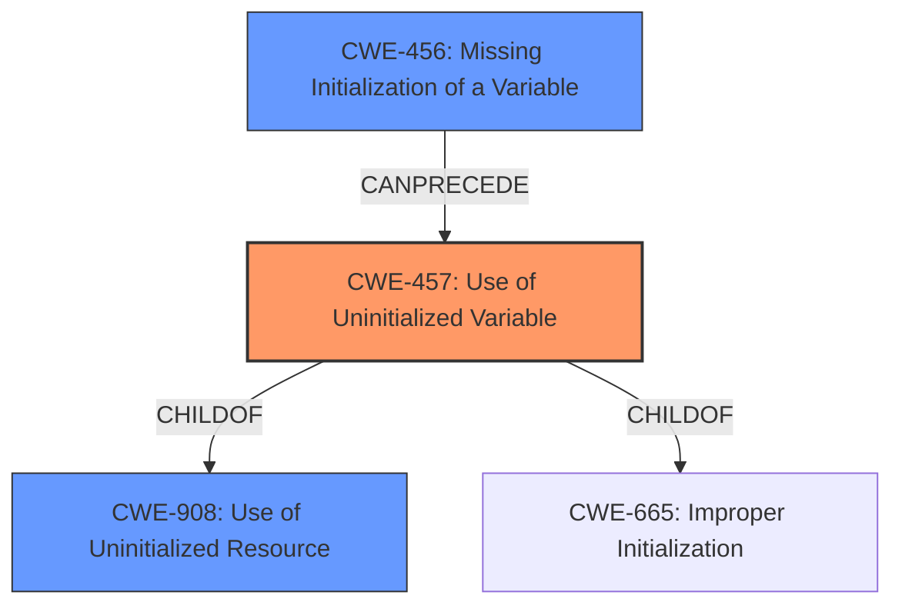

# Enhanced Analysis for CVE-2022-34390

# Summary
| CWE ID | CWE Name | Confidence | CWE Abstraction Level | CWE Vulnerability Mapping Label | CWE-Vulnerability Mapping Notes |
|---|---|---|---|---|---|
| CWE-457 | Use of Uninitialized Variable | 1.0 | Variant | Allowed | Primary CWE |
| CWE-908 | Use of Uninitialized Resource | 0.7 | Base | Allowed | Secondary Candidate |
| CWE-456 | Missing Initialization of a Variable | 0.6 | Variant | Allowed | Secondary Candidate |

## Evidence and Confidence

*   **Confidence Score:** 0.9
*   **Evidence Strength:** HIGH

## Relationship Analysis
The primary weakness is **CWE-457: Use of Uninitialized Variable**, which is a Variant of both **CWE-908: Use of Uninitialized Resource** (Base) and **CWE-665: Improper Initialization** (Class). The retriever results also suggest **CWE-456: Missing Initialization of a Variable** which can lead to **CWE-457**. Given the specific description focuses on the *use* of the uninitialized variable, **CWE-457** is the most accurate.



## Vulnerability Chain
The vulnerability chain starts with the **missing initialization** of a variable (potentially **CWE-456**), leading to the **use of the uninitialized variable** (**CWE-457**), which enables arbitrary code execution in SMRAM.

## Summary of Analysis
The analysis is based on the provided vulnerability description and CVE reference. The description clearly states a "**use of uninitialized variable** vulnerability." The CVE reference links confirm the root cause is "**use of an uninitialized variable**." This aligns directly with **CWE-457: Use of Uninitialized Variable**.

The graph relationships highlight that **CWE-457** is a variant, which is the preferred level of abstraction. **CWE-908: Use of Uninitialized Resource** and **CWE-456: Missing Initialization of a Variable** were also considered, however, **CWE-457** best describes the specific vulnerability.

Relevant CWE Information:

# Enhanced Context (25 CWEs)

## CWE-457: Use of Uninitialized Variable
**Abstraction:** Variant

### Description
The code uses a variable that has not been initialized, leading to unpredictable or unintended results.

### Extended Description
In some languages such as C and C++, stack variables are not initialized by default. They generally contain junk data with the contents of stack memory before the function was invoked. An attacker can sometimes control or read these contents. In other languages or conditions, a variable that is not explicitly initialized can be given a default value that has security implications, depending on the logic of the program. The presence of an uninitialized variable can sometimes indicate a typographic error in the code.

## CWE-908: Use of Uninitialized Resource
**Abstraction:** Base

### Description
The product uses or accesses a resource that has not been initialized.

### Extended Description
When a resource has not been properly initialized, the product may behave unexpectedly. This may lead to a crash or invalid memory access, but the consequences vary depending on the type of resource and how it is used within the product.

## CWE-456: Missing Initialization of a Variable
**Abstraction:** Variant

### Description
The product does not initialize critical variables, which causes the execution environment to use unexpected values.

**CWE-119: Improper Restriction of Operations within the Bounds of a Memory Buffer** and **CWE-20: Improper Input Validation** were considered but are too general given the specific root cause identified. **CWE-787 Out-of-bounds Write** could be a potential outcome of using the uninitialized variable, but the root cause is the uninitialized variable.


## CWE Relationship Analysis

Current CWEs represent these abstraction levels: .


### Vulnerability Chain Analysis

**Chain starting from CWE-908:**
- 908 (Use of Uninitialized Resource) - ROOT


**Chain starting from CWE-457:**
- 457 (Use of Uninitialized Variable) - ROOT


### CWE Relationship Diagram

```mermaid
graph TD
    classDef primary fill:#f96,stroke:#333,stroke-width:2px
    classDef secondary fill:#69f,stroke:#333
    classDef tertiary fill:#9e9,stroke:#333
```