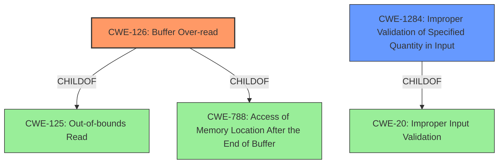

# Analysis Report for CVE-2022-34399

# Vulnerability Analysis Report: CVE-2022-34399

## Description


## Analysis (with Relationship Data)

# Summary
| CWE ID    | CWE Name                                                                    | Confidence | CWE Abstraction Level | CWE Vulnerability Mapping Label | CWE-Vulnerability Mapping Notes |
| --------- | --------------------------------------------------------------------------- | ---------- | ----------------------- | --------------------------------- | ------------------------------- |
| CWE-126   | Buffer Over-read                                                            | 0.9        | Variant                 | Primary                           | Allowed                       |
| CWE-1284 | Improper Validation of Specified Quantity in Input                            | 0.7        | Base                    | Secondary                         | Allowed                       |

## Evidence and Confidence

*   **Confidence Score:** 0.8
*   **Evidence Strength:** HIGH

## Relationship Analysis
The primary CWE is CWE-126 (Buffer Over-read), which is a variant of CWE-125 (Out-of-bounds Read) and CWE-788. The secondary CWE is CWE-1284 (Improper Validation of Specified Quantity in Input) and is a child of CWE-20.



## Vulnerability Chain
The vulnerability chain starts with **Improper Validation of the quantity in the input (CWE-1284)**, which leads to a **Buffer Over-read (CWE-126)**, resulting in the leakage of SMRAM.

## Summary of Analysis
The vulnerability in Dell Alienware m17 R5 BIOS is caused by a **buffer access vulnerability** where the system does not properly validate the size of the input, leading to an out-of-bounds read. The vulnerability description states that a malicious user with admin privileges can send input larger than expected to **leak certain sections of SMRAM**.

The "CVE Reference Links Content Summary" confirms that the root cause is a **buffer access vulnerability** due to insufficient input validation. The impact is information disclosure.

The primary CWE is CWE-126 (Buffer Over-read), which accurately captures the out-of-bounds read condition caused by sending an input larger than expected. The description of CWE-126 states: "The product reads from a buffer using buffer access mechanisms such as indexes or pointers that reference memory locations after the targeted buffer." This perfectly matches the vulnerability where the BIOS reads beyond the intended buffer, leading to information leakage.

CWE-1284 (Improper Validation of Specified Quantity in Input) is a secondary CWE because the vulnerability is triggered by sending input larger than expected and the BIOS **does not validate or incorrectly validates that the quantity has the required properties**.

CWE-119 (Improper Restriction of Operations within the Bounds of a Memory Buffer) was considered, but it is too high-level and discouraged by MITRE when more specific CWEs are available. Both CWE-126 and CWE-1284 offer more specific classifications.

CWE-805 (Buffer Access with Incorrect Length Value) was considered. The vulnerability occurs when the input is larger than expected. This can lead to the program reading past the end of a buffer. However, CWE-126 is more precise and accurately describes the **buffer over-read** condition.

CWE-125 (Out-of-bounds Read) is a parent of CWE-126, but CWE-126 (Buffer Over-read) is a more specific variant.

Based on the vulnerability description and the supporting evidence, CWE-126 and CWE-1284 are the most appropriate CWEs for this vulnerability.


## CWE Relationship Analysis

Current CWEs represent these abstraction levels: .


### Vulnerability Chain Analysis

**Chain starting from CWE-805:**
- 805 (Buffer Access with Incorrect Length Value) - ROOT


**Chain starting from CWE-20:**
- 20 (Improper Input Validation) - ROOT


### CWE Relationship Diagram

```mermaid
graph TD
    classDef primary fill:#f96,stroke:#333,stroke-width:2px
    classDef secondary fill:#69f,stroke:#333
    classDef tertiary fill:#9e9,stroke:#333
```


*Report generated on 2025-03-31 10:56:34*
