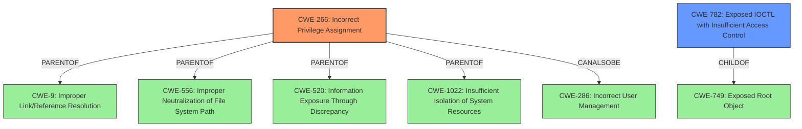

# Analysis Report for CVE-2022-34405

# Vulnerability Analysis Report: CVE-2022-34405

## Description


## Analysis (with Relationship Data)

# Summary
| CWE ID | CWE Name | Confidence | CWE Abstraction Level | CWE Vulnerability Mapping Label | CWE-Vulnerability Mapping Notes |
|---|---|---|---|---|---|
| CWE-266 | Incorrect Privilege Assignment | 0.8 | Base | Primary | Allowed |
| CWE-782 | Exposed IOCTL with Insufficient Access Control | 0.6 | Variant | Secondary Candidate | Allowed |

## Evidence and Confidence

*   **Confidence Score:** 0.7
*   **Evidence Strength:** MEDIUM

## Relationship Analysis
The primary CWE is CWE-266 (Incorrect Privilege Assignment), a base-level weakness. This CWE is a parent of several other CWEs related to privilege management. The secondary candidate CWE-782 (Exposed IOCTL with Insufficient Access Control) is a variant-level weakness. The vulnerability involves **improper access control**, which suggests a problem with privilege management or authorization. Given the details provided, the most appropriate CWE is one that reflects the incorrect assignment of privileges that lead to the vulnerability.



## Vulnerability Chain
The vulnerability chain starts with **improper access control** (root cause) leading to potential privilege escalation (impact). A local authenticated user can exploit this by attaching to a process started by an administrator. This allows the attacker to elevate privileges.

## Summary of Analysis
The initial assessment pointed towards a problem with access control, leading to the consideration of CWE-284 (Improper Access Control), CWE-285 (Improper Authorization), and CWE-269 (Improper Privilege Management). However, based on the detailed description and the ability of an authenticated user to elevate privileges by attaching to a process, a more specific classification is needed. The vulnerability lies in how privileges are assigned or managed, making CWE-266 (Incorrect Privilege Assignment) a more accurate fit.

The "Vulnerability Description Key Phrases" section highlights "**improper access control**" as the **rootcause**, confirming that access control is at the heart of the issue. The "CVE Reference Links Content Summary" further reinforces this by stating "**Improper access control** in the Realtek audio driver."

The choice of CWE-266 is further justified by its description: "The product specifies permissions for a security-critical resource in a way that allows that resource to be read or modified by unintended actors." This aligns with the vulnerability where a local user can gain elevated privileges due to how the Realtek audio driver manages access.

CWE-782 (Exposed IOCTL with Insufficient Access Control) was also considered, as it involves exposed functionality without proper access control. It is possible that the **improper access control** manifests through an IOCTL, but the provided information doesn't explicitly confirm this. Therefore, it is marked as a secondary candidate.

CWE-266 is chosen as the primary CWE because it directly addresses the **incorrect privilege assignment** issue, providing a more specific classification than the higher-level CWEs like CWE-284 or CWE-285. It is at the base level of abstraction, which is the preferred level.

Relevant CWE Information:

# Enhanced Context (25 CWEs)

## CWE-266: Incorrect Privilege Assignment
**Abstraction Level**: Base
**Similarity Score**: 3.64
**Source**: graph

**Description**:
CWE-266: Incorrect Privilege Assignment

**Mapping Guidance**:
- Usage: Allowed
- Rationale: This CWE entry is at the Base level of abstraction, which is a preferred level of abstraction for mapping to the root causes of vulnerabilities.

**Relationships**:
- PARENTOF -> CWE-9
- PARENTOF -> CWE-556
- PARENTOF -> CWE-520
- PARENTOF -> CWE-1022
- CANALSOBE -> CWE-286


## CWE Relationship Analysis

Current CWEs represent these abstraction levels: .


### Vulnerability Chain Analysis

**Chain starting from CWE-520:**
- 520 (.NET Misconfiguration: Use of Impersonation) - ROOT


**Chain starting from CWE-556:**
- 556 (ASP.NET Misconfiguration: Use of Identity Impersonation) - ROOT


### CWE Relationship Diagram

```mermaid
graph TD
    classDef primary fill:#f96,stroke:#333,stroke-width:2px
    classDef secondary fill:#69f,stroke:#333
    classDef tertiary fill:#9e9,stroke:#333
```


*Report generated on 2025-03-31 02:01:53*
