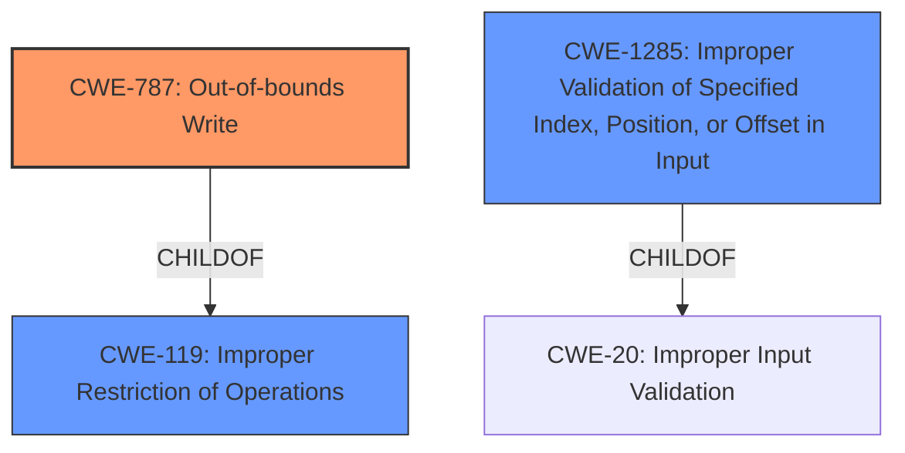

# Analysis for CVE-2022-34413

# Summary
| CWE ID | CWE Name | Confidence | CWE Abstraction Level | CWE Vulnerability Mapping Label | CWE-Vulnerability Mapping Notes |
|---|---|---|---|---|---|
| CWE-787 | Out-of-bounds Write | 0.8 | Base | Allowed | Primary CWE |
| CWE-119 | Improper Restriction of Operations within the Bounds of a Memory Buffer | 0.6 | Class | Discouraged | Secondary Candidate |
| CWE-1285 | Improper Validation of Specified Index, Position, or Offset in Input | 0.5 | Base | Allowed | Secondary Candidate |

## Evidence and Confidence

*   **Confidence Score:** 0.8
*   **Evidence Strength:** HIGH

## Relationship Analysis
The primary relationship that impacted the decision was the parent-child relationship between CWE-119 (Improper Restriction of Operations within the Bounds of a Memory Buffer) and CWE-787 (Out-of-bounds Write). CWE-787 is a child of CWE-119, making it a more specific classification when an out-of-bounds write occurs. Also, CWE-1285 (Improper Validation of Specified Index, Position, or Offset in Input) has a parent child relationship with CWE-20 (Improper Input Validation).

## Vulnerability Chain
The vulnerability chain starts with the **Improper SMM communication buffer verification**, leading to a potential out-of-bounds write (CWE-787). This can then result in arbitrary code execution or denial of service.
  - **Root Cause:** **Improper SMM communication buffer verification**
  - **Weakness:** Out-of-bounds Write (CWE-787)
  - **Impact:** Arbitrary code execution or denial of service

## Summary of Analysis
The initial assessment, based on the provided information, identified the **Improper SMM communication buffer verification** as the root cause. This leads to the conclusion that the primary weakness is an out-of-bounds write (CWE-787) due to the buffer not being properly verified.

The vulnerability description states: "Dell PowerEdge BIOS and Dell Precision BIOS contain an **Improper SMM communication buffer verification** vulnerability. A local malicious user with high Privileges may potentially exploit this vulnerability to perform arbitrary code execution or cause denial of service."

The Retriever Results and similar CVE descriptions also pointed towards CWE-119 (Improper Restriction of Operations within the Bounds of a Memory Buffer). However, the more specific CWE-787 (Out-of-bounds Write), a child of CWE-119, is more fitting given the root cause.

CWE-1285 (Improper Validation of Specified Index, Position, or Offset in Input) was also considered, as the **improper verification** could be related to how the buffer index/offset is validated. However, based on the description, the **improper verification** leads to an out-of-bounds write, making CWE-787 a better fit.

The selection of CWE-787 is at the optimal level of specificity because it directly describes the **root cause** of the vulnerability: an out-of-bounds write due to **improper buffer verification**. This is more precise than the broader CWE-119.

Relevant CWE Information:

# Enhanced Context (25 CWEs)

## CWE-1289: Improper Validation of Unsafe Equivalence in Input
**Abstraction Level**: Base
**Similarity Score**: 0.79
**Source**: dense

**Description**:
The product receives an input value that is used as a resource identifier or other type of reference, but it does not validate or incorrectly validates that the input is equivalent to a potentially-unsafe value.
**Rationale for not selecting**: This CWE is not selected because the vulnerability is due to **improper verification of the SMM communication buffer**, and not related to the equivalence of the input.

## CWE-131: Incorrect Calculation of Buffer Size
**Abstraction Level**: Base
**Similarity Score**: 0.77
**Source**: dense

**Description**:
The product does not correctly calculate the size to be used when allocating a buffer, which could lead to a buffer overflow.
**Rationale for not selecting**: This CWE is not selected because the vulnerability is due to **improper verification of the SMM communication buffer**, and not related to an incorrect calculation of the buffer size.

## CWE-807: Reliance on Untrusted Inputs in a Security Decision
**Abstraction Level**: Base
**Similarity Score**: 0.77
**Source**: dense

**Description**:
The product uses a protection mechanism that relies on the existence or values of an input, but the input can be modified by an untrusted actor in a way that bypasses the protection mechanism.
**Rationale for not selecting**: This CWE is not selected because the vulnerability is due to **improper verification of the SMM communication buffer**, and not related to the reliance on untrusted inputs in a security decision.

## CWE-703: Improper Check or Handling of Exceptional Conditions
**Abstraction Level**: Pillar
**Similarity Score**: 0.76
**Source**: dense

**Description**:
The product does not properly anticipate or handle exceptional conditions that rarely occur during normal operation of the product.
**Rationale for not selecting**: This CWE is too high-level and does not accurately reflect the root cause of the vulnerability.

## CWE-252: Unchecked Return Value
**Abstraction Level**: Base
**Similarity Score**: 0.76
**Source**: dense

**Description**:
The product does not check the return value from a method or function, which can prevent it from detecting unexpected states and conditions.
**Rationale for not selecting**: This CWE is not selected because the vulnerability is due to **improper verification of the SMM communication buffer**, and not related to unchecked return value.

## CWE-303: Incorrect Implementation of Authentication Algorithm
**Abstraction Level**: Base
**Similarity Score**: 0.76
**Source**: dense

**Description**:
The requirements for the product dictate the use of an established authentication algorithm, but the implementation of the algorithm is incorrect.
**Rationale for not selecting**: This CWE is not related to the **Improper SMM communication buffer verification** vulnerability.

## CWE-667: Improper Locking
**Abstraction Level**: Class
**Similarity Score**: 0.76
**Source**: dense

**Description**:
The product does not properly acquire or release a lock on a resource, leading to unexpected resource state changes and behaviors.
**Rationale for not selecting**: This CWE is not related to the **Improper SMM communication buffer verification** vulnerability.

## CWE-754: Improper Check for Unusual or Exceptional Conditions
**Abstraction Level**: Class
**Similarity Score**: 0.76
**Source**: dense

**Description**:
The product does not check or incorrectly checks for unusual or exceptional conditions that are not expected to occur frequently during day to day operation of the product.
**Rationale for not selecting**: This CWE is not related to the **Improper SMM communication buffer verification** vulnerability.

## CWE-274: Improper Handling of Insufficient Privileges
**Abstraction Level**: Base
**Similarity Score**: 0.76
**Source**: dense

**Description**:
The product does not handle or incorrectly handles when it has insufficient privileges to perform an operation, leading to resultant weaknesses.
**Rationale for not selecting**: While the vulnerability requires high privileges, the root cause is not related to improper handling of insufficient privileges.

## CWE-184: Incomplete List of Disallowed Inputs
**Abstraction Level**: Base
**Similarity Score**: 0.75
**Source**: dense

**Description**:
The product implements a protection mechanism that relies on a list of inputs (or properties of inputs) that are not allowed by policy or otherwise require other action to neutralize before additional processing takes place, but the list is incomplete.
**Rationale for not selecting**: This CWE is not selected because the vulnerability is due to **improper verification of the SMM communication buffer**, and not related to an incomplete list of disallowed inputs.

## CWE-119: Improper Restriction of Operations within the Bounds of a Memory Buffer
**Abstraction Level**: Class
**Similarity Score**: 7210.74
**Source**: sparse

**Description**:
The product performs operations on a memory buffer, but it reads from or writes to a memory location outside the buffer's intended boundary. This may result in read or write operations on unexpected memory locations that could be linked to other variables, data structures,