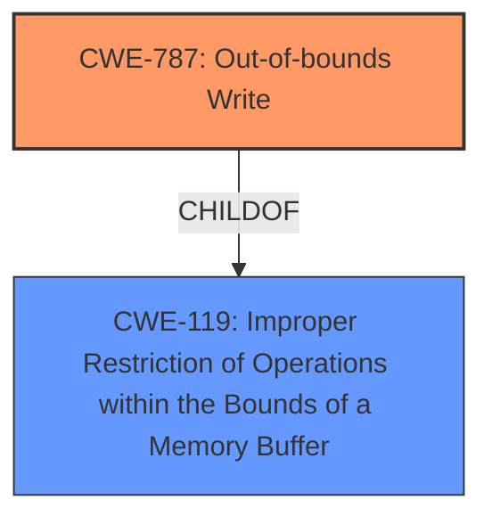

# Enhanced Analysis for CVE-2022-34414

# Summary
| CWE ID | CWE Name | Confidence | CWE Abstraction Level | CWE Vulnerability Mapping Label | CWE-Vulnerability Mapping Notes |
|---|---|---|---|---|---|
| CWE-787 | Out-of-bounds Write | 0.8 | Base | Allowed | Primary CWE |
| CWE-119 | Improper Restriction of Operations within the Bounds of a Memory Buffer | 0.6 | Class | Discouraged | Secondary Candidate |

## Evidence and Confidence

*   **Confidence Score:** 0.7
*   **Evidence Strength:** HIGH

## Relationship Analysis
The primary CWE selected is CWE-787 (**Out-of-bounds Write**), a **Base** level CWE. It is a child of CWE-119 (**Improper Restriction of Operations within the Bounds of a Memory Buffer**), which is a **Class** level CWE. Although CWE-119 appears in the "Top CWEs" section, the more specific CWE-787 is chosen because the vulnerability involves writing data past the end of the buffer, as opposed to simply operating outside the buffer.



## Vulnerability Chain
The vulnerability chain starts with the **Improper SMM communication buffer verification**, leading to potential **Out-of-bounds Write** (CWE-787) which then leads to **arbitrary code execution** and **denial of service**.

## Summary of Analysis
The initial analysis focused on the **Improper SMM communication buffer verification** as the root cause. The description points to a **failure to properly validate** the communication buffer, which could lead to memory corruption. The primary candidate, according to the **CWE for similar CVE Descriptions**, is CWE-119 (**Improper Restriction of Operations within the Bounds of a Memory Buffer**). However, considering the description of the vulnerability, a more specific CWE is needed.

The **CVE Reference Links Content Summary** confirms the "**Improper SMM communication buffer verification vulnerability**". This means that data passed during SMM communication is not properly validated. The impact includes arbitrary code execution and denial of service, which are consequences of memory corruption.

The Retriever Results list CWE-787 (**Out-of-bounds Write**) as a potential candidate. This CWE aligns with the **arbitrary code execution** impact since writing outside of the intended buffer can overwrite critical program data or code.

Given the root cause "**Improper SMM communication buffer verification**" and the potential for writing outside the buffer, CWE-787 (**Out-of-bounds Write**) is chosen as the primary CWE. This decision is further supported by the fact that CWE-787 is at the **Base** level of abstraction.

CWE-119 (**Improper Restriction of Operations within the Bounds of a Memory Buffer**) is considered as a secondary candidate because it is a broader category that encompasses out-of-bounds writes.

Relevant CWE Information:

# Enhanced Context (25 CWEs)

## CWE-1289: Improper Validation of Unsafe Equivalence in Input
**Abstraction Level**: Base
**Similarity Score**: 0.79
**Source**: dense

**Description**:
The product receives an input value that is used as a resource identifier or other type of reference, but it does not validate or incorrectly validates that the input is equivalent to a potentially-unsafe value.
**Rationale**: The input isn't a resource identifier, so this CWE isn't applicable.

## CWE-131: Incorrect Calculation of Buffer Size
**Abstraction Level**: Base
**Similarity Score**: 0.77
**Source**: dense

**Description**:
The product does not correctly calculate the size to be used when allocating a buffer, which could lead to a buffer overflow.
**Rationale**: There is no evidence that the buffer size is incorrectly calculated, so this CWE isn't applicable.

## CWE-807: Reliance on Untrusted Inputs in a Security Decision
**Abstraction Level**: Base
**Similarity Score**: 0.77
**Source**: dense

**Description**:
The product uses a protection mechanism that relies on the existence or values of an input, but the input can be modified by an untrusted actor in a way that bypasses the protection mechanism.
**Rationale**: There is no evidence that untrusted inputs are used in a security decision, so this CWE isn't applicable.

## CWE-252: Unchecked Return Value
**Abstraction Level**: Base
**Similarity Score**: 0.76
**Source**: dense

**Description**:
The product does not check the return value from a method or function, which can prevent it from detecting unexpected states and conditions.
**Rationale**: There is no evidence that the return value isn't checked, so this CWE isn't applicable.

## CWE-703: Improper Check or Handling of Exceptional Conditions
**Abstraction Level**: Pillar
**Similarity Score**: 0.76
**Source**: dense

**Description**:
The product does not properly anticipate or handle exceptional conditions that rarely occur during normal operation of the product.
**Rationale**: This is too abstract and doesn't apply.

## CWE-303: Incorrect Implementation of Authentication Algorithm
**Abstraction Level**: Base
**Similarity Score**: 0.76
**Source**: dense

**Description**:
The requirements for the product dictate the use of an established authentication algorithm, but the implementation of the algorithm is incorrect.
**Rationale**: There is no evidence that the authentication algorithm is incorrectly implemented, so this CWE isn't applicable.

## CWE-667: Improper Locking
**Abstraction Level**: Class
**Similarity Score**: 0.76
**Source**: dense

**Description**:
The product does not properly acquire or release a lock on a resource, leading to unexpected resource state changes and behaviors.
**Rationale**: There is no evidence that the locking isn't implemented, so this CWE isn't applicable.

## CWE-345: Insufficient Verification of Data Authenticity
**Abstraction Level**: Class
**Similarity Score**: 0.76
**Source**: dense

**Description**:
The product does not sufficiently verify the origin or authenticity of data, in a way that causes it to accept invalid data.
**Rationale**: This isn't about data authenticity so this CWE isn't applicable.

## CWE-125: Out-of-bounds Read
**Abstraction Level**: Base
**Similarity Score**: 0.76
**Source**: dense

**Description**:
The product reads data past the end, or before the beginning, of the intended buffer.
**Rationale**: The description focuses on an out-of-bounds write, not read, so this CWE isn't applicable.

## CWE-754: Improper Check for Unusual or Exceptional Conditions
**Abstraction Level**: Class
**Similarity Score**: 0.76
**Source**: dense

**Description**:
The product does not check or incorrectly checks for unusual or exceptional conditions that are not expected to occur frequently during day to day operation of the product.
**Rationale**: This is too abstract and doesn't apply.

## CWE-119: Improper Restriction of Operations within the Bounds of a Memory Buffer
**Abstraction Level**: Class
**Similarity Score**: 7139.49
**Source**: sparse

**Description**:
The product performs operations on a memory buffer, but it reads from or writes to a memory location outside the buffer's intended boundary. This may result in read or write operations on unexpected memory locations that could be linked to other variables, data structures, or internal program data.
**Rationale**: As discussed, this is a broader category and will be kept as secondary.

## CWE-125: Out-of-bounds Read
**Abstraction Level**: Base
**Similarity Score**: 7093.68
**Source**: sparse

**Description**:
The product reads data past the end, or before the beginning, of the intended buffer.
**Rationale**: The description focuses on an out-of-bounds write, not read, so this CWE isn't applicable.

## CWE-190: Integer Overflow or Wraparound
**Abstraction Level**: Base
**Similarity Score**: 6782.68
**Source**: sparse

**Description**:
The product performs a calculation that can
         produce an integer overflow or wraparound when the logic
         assumes that the resulting value will always be larger than
         the original value. This occurs when an integer value is
         incremented to a value that is too large to store in the
         associated representation. When this occurs, the value may
         become a very small or negative number.
**Rationale**: There is no evidence that integer overflow is involved, so this CWE isn't applicable.

## CWE-1284: Improper Validation of Specified Quantity in Input
**Abstraction Level**: Base
**Similarity Score**: 6756.43
**Source**: sparse

**Description**:
The product receives input that


## CWE Relationship Analysis

Current CWEs represent these abstraction levels: .


### Vulnerability Chain Analysis

**Chain starting from CWE-131:**
- 131 (Incorrect Calculation of Buffer Size) - ROOT


**Chain starting from CWE-190:**
- 190 (Integer Overflow or Wraparound) - ROOT


### CWE Relationship Diagram

```mermaid
graph TD
    classDef primary fill:#f96,stroke:#333,stroke-width:2px
    classDef secondary fill:#69f,stroke:#333
    classDef tertiary fill:#9e9,stroke:#333
```