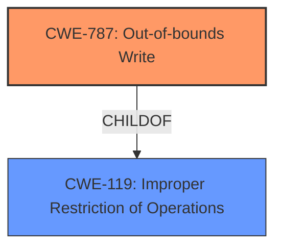

# Enhanced Analysis for CVE-2022-34417

# Summary
| CWE ID | CWE Name | Confidence | CWE Abstraction Level | CWE Vulnerability Mapping Label | CWE-Vulnerability Mapping Notes |
|---|---|---|---|---|---|
| CWE-787 | Out-of-bounds Write | 0.8 | Base | Allowed | Primary CWE |
| CWE-119 | Improper Restriction of Operations within the Bounds of a Memory Buffer | 0.6 | Class | Discouraged | Secondary Candidate |

## Evidence and Confidence

*   **Confidence Score:** 0.8
*   **Evidence Strength:** HIGH

## Relationship Analysis
The primary relationship influencing the CWE selection is the hierarchical relationship between CWE-787 and CWE-119, where CWE-787 (Out-of-bounds Write) is a child of CWE-119 (Improper Restriction of Operations within the Bounds of a Memory Buffer). This suggests that while CWE-119 is a broader classification, CWE-787 offers a more specific and accurate representation of the vulnerability's root cause, which is an out-of-bounds write due to **improper SMM communication buffer verification**. The selection of CWE-787 is further supported by its Base abstraction level, preferred for root cause mapping.



## Vulnerability Chain
The vulnerability chain starts with **improper SMM communication buffer verification**, leading to an out-of-bounds write (CWE-787), which ultimately results in arbitrary code execution or denial of service.

## Summary of Analysis
The initial analysis focused on the **improper SMM communication buffer verification** as the root cause. The vulnerability description clearly indicates that the **improper verification** allows a local malicious user to perform arbitrary code execution or cause denial of service, directly implying a memory corruption issue.

The provided evidence includes the key phrase "**Improper SMM communication buffer verification**" which points towards the root cause. The CVE Reference Links Content Summary explicitly states, "root_cause: **Improper SMM communication buffer verification** vulnerability" and "weaknesses: [**Improper SMM communication buffer verification**]".

The retriever results suggested considering CWE-119 (Improper Restriction of Operations within the Bounds of a Memory Buffer), and CWE-787 (Out-of-bounds Write).

CWE-119 is a Class-level CWE and its mapping is discouraged by MITRE when more specific CWEs are available. CWE-787, a child of CWE-119, provides a more precise description of the vulnerability. The vulnerability involves writing data past the end or before the beginning of the intended buffer due to **improper verification**, which aligns perfectly with CWE-787.

Therefore, CWE-787 (Out-of-bounds Write) is selected as the primary CWE.

Relevant CWE Information:
*   CWE-787: Out-of-bounds Write

    *   The product writes data past the end, or before the beginning, of the intended buffer.
    *   Abstraction: Base
*   CWE-119: Improper Restriction of Operations within the Bounds of a Memory Buffer

    *   The product performs operations on a memory buffer, but it reads from or writes to a memory location outside the buffer's intended boundary.
    *   Abstraction: Class

CWE-125 (Out-of-bounds Read) was considered but not chosen because the vulnerability description specifies a write operation ("may potentially exploit this vulnerability to perform arbitrary code execution"), indicating an out-of-bounds write rather than an out-of-bounds read. CWE-20 (Improper Input Validation) was also considered, but the root cause is more specifically related to buffer handling rather than general input validation.


## CWE Relationship Analysis

Current CWEs represent these abstraction levels: .


### Vulnerability Chain Analysis

**Chain starting from CWE-787:**
- 787 (Out-of-bounds Write) - ROOT


**Chain starting from CWE-119:**
- 119 (Improper Restriction of Operations within the Bounds of a Memory Buffer) - ROOT


### CWE Relationship Diagram

```mermaid
graph TD
    classDef primary fill:#f96,stroke:#333,stroke-width:2px
    classDef secondary fill:#69f,stroke:#333
    classDef tertiary fill:#9e9,stroke:#333
```