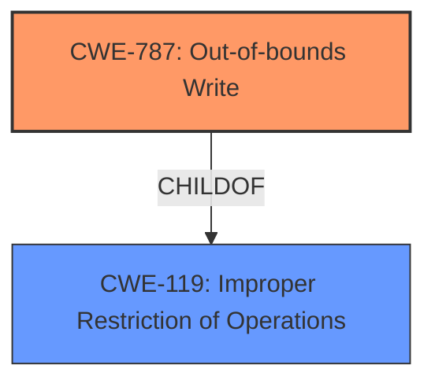

# Analysis for CVE-2022-34419

# Summary
| CWE ID | CWE Name | Confidence | CWE Abstraction Level | CWE Vulnerability Mapping Label | CWE-Vulnerability Mapping Notes |
|---|---|---|---|---|---|
| CWE-787 | Out-of-bounds Write | 0.8 | Base | Allowed | Primary CWE. The vulnerability involves **improper SMM communication buffer verification**, potentially leading to arbitrary code execution. This aligns with the base level CWE-787. |
| CWE-119 | Improper Restriction of Operations within the Bounds of a Memory Buffer | 0.6 | Class | Discouraged | Secondary CWE. CWE-119 is a more general description of memory buffer issues. |

## Evidence and Confidence

*   **Confidence Score:** 0.7
*   **Evidence Strength:** MEDIUM

## Relationship Analysis
The primary CWE, CWE-787, is a child of CWE-119. This hierarchical relationship indicates that CWE-787 is a more specific type of buffer issue than CWE-119. The vulnerability description indicates a memory corruption issue due to **improper verification**, which is best captured by CWE-787, as it can lead to writing data beyond the intended buffer.

## Vulnerability Chain
The vulnerability chain starts with the **improper SMM communication buffer verification** which leads to the possibility of an out-of-bounds write (CWE-787), eventually resulting in arbitrary code execution or denial of service.

## Summary of Analysis
The initial assessment considered CWE-119 due to the high count in similar CVE descriptions and the retriever results. However, the description's emphasis on **improper SMM communication buffer verification** leading to arbitrary code execution suggests a more specific weakness related to out-of-bounds write. Thus, CWE-787 is a more precise classification.

The evidence is derived from the "**Vulnerability Description Key Phrases**" section, specifically the **rootcause** entry: "**Improper SMM communication buffer verification**". The "**CVE Reference Links Content Summary**" also indicates "**Improper SMM communication buffer verification vulnerability.**"

The graph relationship showing CWE-787 as a child of CWE-119 further supports the decision to choose CWE-787 for its higher level of specificity.

CWE-787 aligns with the concept of writing data past the end of a buffer, which directly leads to arbitrary code execution or denial of service. This is the optimal level of specificity because it describes the exact nature of the memory corruption.

Relevant CWE Information:

# Enhanced Context (25 CWEs)
The following CWEs were identified as potentially relevant to this vulnerability:

## CWE-1289: Improper Validation of Unsafe Equivalence in Input
This CWE was considered, but it doesn't directly address the memory corruption aspect of the vulnerability.

## CWE-807: Reliance on Untrusted Inputs in a Security Decision
While SMM communication buffers could involve untrusted inputs, the core issue is the **improper verification**, not solely the reliance on untrusted data.

## CWE-131: Incorrect Calculation of Buffer Size
This could be a contributing factor, but the description specifically mentions **improper verification**, which is a distinct weakness.

## CWE-703: Improper Check or Handling of Exceptional Conditions
This is too high-level and doesn't describe the specific vulnerability.

## CWE-252: Unchecked Return Value
Not applicable based on the provided description.

## CWE-303: Incorrect Implementation of Authentication Algorithm
Not applicable; the vulnerability is not related to authentication.

## CWE-667: Improper Locking
Not applicable; the vulnerability is not related to locking mechanisms.

## CWE-345: Insufficient Verification of Data Authenticity
While data authenticity could be a concern, the root cause is the **improper buffer verification**.

## CWE-754: Improper Check for Unusual or Exceptional Conditions
This is a general class and not specific enough.

## CWE-184: Incomplete List of Disallowed Inputs
Not applicable; the vulnerability doesn't involve a list of disallowed inputs.

## CWE-125: Out-of-bounds Read
The vulnerability description indicates potential arbitrary code execution and denial of service, suggesting an out-of-bounds write is more likely than an out-of-bounds read.

## CWE-119: Improper Restriction of Operations within the Bounds of a Memory Buffer
While relevant, it's a higher-level class. CWE-787 is more specific.

## CWE-190: Integer Overflow or Wraparound
Not directly related to the vulnerability description.

## CWE-1284: Improper Validation of Specified Quantity in Input
This is a possible contributing factor, but the main issue is the **improper verification** of the buffer itself.

## CWE-823: Use of Out-of-range Pointer Offset
This could be a potential consequence, but the description does not clearly point to pointer arithmetic issues.

## CWE-41: Improper Resolution of Path Equivalence
Not related to pathnames or path traversal.

## CWE-130: Improper Handling of Length Parameter Inconsistency
This could be a contributing factor, but the root cause is the **improper verification** of the buffer.

## CWE-787: Out-of-bounds Write
The most appropriate CWE due to the potential for arbitrary code execution, indicating memory corruption through writing outside buffer boundaries.

## CWE-805: Buffer Access with Incorrect Length Value
This could be a contributing factor, but the description does not emphasize length value issues.

## CWE-823: Use of Out-of-range Pointer Offset
Not directly implied by the description.

## CWE-825: Expired Pointer Dereference
Not indicated by the description.

## CWE-190: Integer Overflow or Wraparound
Not directly implied by the description.

## CWE-22: Improper Limitation of a Pathname to a Restricted Directory ('Path Traversal')
Not relevant to the described vulnerability.

## CWE-770: Allocation of Resources Without Limits or Throttling
Not related to resource allocation issues.

## CWE-73: External Control of File Name or Path
Not relevant to the described vulnerability.