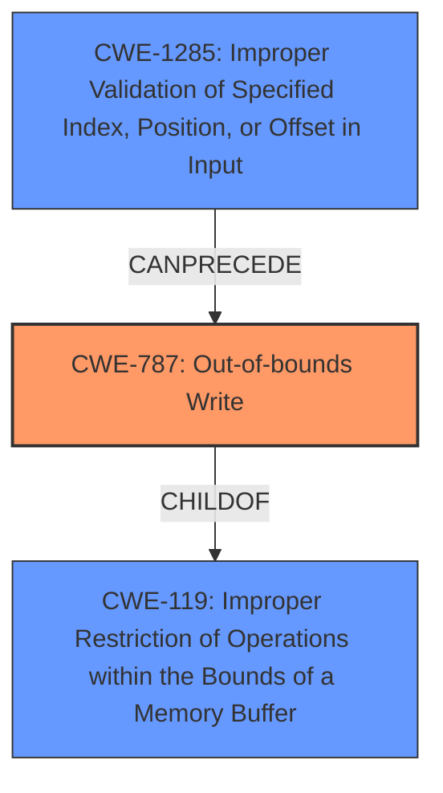

# Raw Analyzer Response for CVE-2022-34420

# Summary
| CWE ID | CWE Name | Confidence | CWE Abstraction Level | CWE Vulnerability Mapping Label | CWE-Vulnerability Mapping Notes |
|---|---|---|---|---|---|
| CWE-787 | Out-of-bounds Write | 0.8 | Base | Primary | Allowed |
| CWE-119 | Improper Restriction of Operations within the Bounds of a Memory Buffer | 0.6 | Class | Secondary | Discouraged |
| CWE-1285 | Improper Validation of Specified Index, Position, or Offset in Input | 0.5 | Base | Secondary | Allowed |

## Evidence and Confidence

*   **Confidence Score:** 0.7
*   **Evidence Strength:** HIGH

## Relationship Analysis
The primary relationship influencing the decision is the parent-child relationship between CWE-787 and CWE-119. CWE-787 is a more specific type of CWE-119. CWE-1285 can precede CWE-787 in a vulnerability chain, where **improper validation** of an index, position, or offset can lead to an **out-of-bounds write**. The abstraction levels were also considered. CWE-787 and CWE-1285 are Base level, which is preferred, while CWE-119 is a Class level.

## Vulnerability Chain
The vulnerability chain starts with an **improper SMM communication buffer verification** (likely leading to **improper validation** of size or index), which results in an **out-of-bounds write**, leading to arbitrary code execution or denial of service.

## Summary of Analysis
The initial assessment, based on the **Vulnerability Description Key Phrases**, pointed towards CWE-119 due to the **Improper SMM communication buffer verification** and the potential for arbitrary code execution. However, further analysis of the **CVE Reference Links Content Summary** revealed that the root cause is specifically related to **improper verification**, which is a validation issue, possibly related to a buffer. The **Retriever Results** listed CWE-787 (Out-of-bounds Write) with a good match score, and the graph relationships show that CWE-787 is a child of CWE-119, making it a more specific and appropriate choice. CWE-1285 (Improper Validation of Specified Index, Position, or Offset in Input) was also considered as a potential preceding weakness.

The primary CWE selected is CWE-787 (Out-of-bounds Write) as the most accurate representation of the vulnerability. The supporting evidence includes:

*   The **Vulnerability Description** states **Improper SMM communication buffer verification**, which strongly suggests a memory buffer is involved.
*   The impact is arbitrary code execution or denial of service, which are common consequences of **out-of-bounds writes**.
*   CWE-787 is a Base level CWE, which is preferred over the Class level CWE-119.
*   The **CVE Reference Links Content Summary** also states **Improper SMM communication buffer verification vulnerability**.

CWE-119 (Improper Restriction of Operations within the Bounds of a Memory Buffer) was considered but is too general. While it encompasses the vulnerability, CWE-787 provides a more precise classification. The MITRE mapping guidance discourages the use of CWE-119 when more specific CWEs are available.

CWE-1285 (Improper Validation of Specified Index, Position, or Offset in Input) was considered as a potential preceding weakness, as **improper verification** often leads to **improper validation** of indexes, offsets, or sizes.

Relevant CWE Information:

# Enhanced Context (25 CWEs)
The following CWEs were identified as potentially relevant to this vulnerability:

## CWE-1289: Improper Validation of Unsafe Equivalence in Input
**Abstraction Level**: Base
**Similarity Score**: 0.79
**Source**: dense

**Description**:
The product receives an input value that is used as a resource identifier or other type of reference, but it does not validate or incorrectly validates that the input is equivalent to a potentially-unsafe value.

**Mapping Guidance**:
- Usage: Allowed
- Rationale: This CWE entry is at the Base level of abstraction, which is a preferred level of abstraction for mapping to the root causes of vulnerabilities.

## CWE-131: Incorrect Calculation of Buffer Size
**Abstraction Level**: Base
**Similarity Score**: 0.77
**Source**: dense

**Description**:
The product does not correctly calculate the size to be used when allocating a buffer, which could lead to a buffer overflow.

**Mapping Guidance**:
- Usage: Allowed
- Rationale: This CWE entry is at the Base level of abstraction, which is a preferred level of abstraction for mapping to the root causes of vulnerabilities.

## CWE-807: Reliance on Untrusted Inputs in a Security Decision
**Abstraction Level**: Base
**Similarity Score**: 0.77
**Source**: dense

**Description**:
The product uses a protection mechanism that relies on the existence or values of an input, but the input can be modified by an untrusted actor in a way that bypasses the protection mechanism.

**Mapping Guidance**:
- Usage: Allowed
- Rationale: This CWE entry is at the Base level of abstraction, which is a preferred level of abstraction for mapping to the root causes of vulnerabilities.

## CWE-703: Improper Check or Handling of Exceptional Conditions
**Abstraction Level**: Pillar
**Similarity Score**: 0.76
**Source**: dense

**Description**:
The product does not properly anticipate or handle exceptional conditions that rarely occur during normal operation of the product.

**Mapping Guidance**:
- Usage: Discouraged
- Rationale: This CWE entry is extremely high-level, a Pillar.

## CWE-252: Unchecked Return Value
**Abstraction Level**: Base
**Similarity Score**: 0.76
**Source**: dense

**Description**:
The product does not check the return value from a method or function, which can prevent it from detecting unexpected states and conditions.

**Mapping Guidance**:
- Usage: Allowed
- Rationale: This CWE entry is at the Base level of abstraction, which is a preferred level of abstraction for mapping to the root causes of vulnerabilities.

## CWE-303: Incorrect Implementation of Authentication Algorithm
**Abstraction Level**: Base
**Similarity Score**: 0.76
**Source**: dense

**Description**:
The requirements for the product dictate the use of an established authentication algorithm, but the implementation of the algorithm is incorrect.

**Mapping Guidance**:
- Usage: Allowed
- Rationale: This CWE entry is at the Base level of abstraction, which is a preferred level of abstraction for mapping to the root causes of vulnerabilities.

## CWE-667: Improper Locking
**Abstraction Level**: Class
**Similarity Score**: 0.76
**Source**: dense

**Description**:
The product does not properly acquire or release a lock on a resource, leading to unexpected resource state changes and behaviors.

**Mapping Guidance**:
- Usage: Allowed-with-Review
- Rationale: This CWE entry is a Class and might have Base-level children that would be more appropriate

## CWE-754: Improper Check for Unusual or Exceptional Conditions
**Abstraction Level**: Class
**Similarity Score**: 0.76
**Source**: dense

**Description**:
The product does not check or incorrectly checks for unusual or exceptional conditions that are not expected to occur frequently during day to day operation of the product.

**Mapping Guidance**:
- Usage: Allowed-with-Review
- Rationale: This CWE entry is a Class and might have Base-level children that would be more appropriate

## CWE-274: Improper Handling of Insufficient Privileges
**Abstraction Level**: Base
**Similarity Score**: 0.76
**Source**: dense

**Description**:
The product does not handle or incorrectly handles when it has insufficient privileges to perform an operation, leading to resultant weaknesses.

**Mapping Guidance**:
- Usage: Discouraged
- Rationale: This CWE entry could be deprecated in a future version of CWE.

## CWE-184: Incomplete List of Disallowed Inputs
**Abstraction Level**: Base
**Similarity Score**: 0.75
**Source**: dense

**Description**:
The product implements a protection mechanism that relies on a list of inputs (or properties of inputs) that are not allowed by policy or otherwise require other action to neutralize before additional processing takes place, but the list is incomplete.

**Mapping Guidance**: