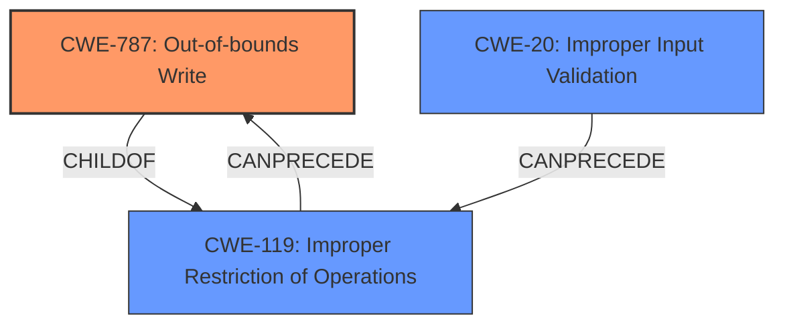

# Analysis for CVE-2022-34421

# Summary
| CWE ID    | CWE Name                                                                 | Confidence | CWE Abstraction Level | CWE Vulnerability Mapping Label | CWE-Vulnerability Mapping Notes |
| :--------- | :----------------------------------------------------------------------- | :--------- | :-------------------- | :------------------------------ | :------------------------------ |
| CWE-787  | Out-of-bounds Write                                                    | 0.8       | Base                  | Primary CWE                    | Allowed                       |
| CWE-119  | Improper Restriction of Operations within the Bounds of a Memory Buffer | 0.6       | Class                 | Secondary Candidate               | Discouraged                   |
| CWE-20   | Improper Input Validation                                                | 0.5       | Class                 | Secondary Candidate               | Discouraged                   |

## Evidence and Confidence

*   **Confidence Score:** 0.8
*   **Evidence Strength:** HIGH

## Relationship Analysis
The primary relationship impacting the decision is that CWE-787, Out-of-bounds Write, is a child of CWE-119, Improper Restriction of Operations within the Bounds of a Memory Buffer. Although the description refers to "Improper SMM communication buffer verification," indicating a potential input validation issue (CWE-20), the core issue leads to writing outside the bounds of a buffer. Therefore, the more specific CWE-787 is chosen over its parent CWE-119 and the related CWE-20.

## Vulnerability Chain
The vulnerability chain starts with **Improper SMM communication buffer verification** leading to an out-of-bounds write, which can further lead to arbitrary code execution or denial of service.

## Summary of Analysis
The initial analysis identified "Improper SMM communication buffer verification" as the root cause, which could potentially be mapped to CWE-20 (Improper Input Validation) or CWE-119 (Improper Restriction of Operations within the Bounds of a Memory Buffer). However, the description and CVE reference summary explicitly mention the possibility of arbitrary code execution and denial of service due to the **improper buffer verification**, suggesting a memory corruption issue. The retriever results also list CWE-787 (Out-of-bounds Write) and CWE-125 (Out-of-bounds Read) as potential candidates. Given that the vulnerability description mentions "arbitrary code execution", which typically results from writing to unintended memory locations, CWE-787 (Out-of-bounds Write) is the more appropriate choice.

The evidence from the vulnerability description is: "Dell PowerEdge BIOS and Dell Precision BIOS contain an **Improper SMM communication buffer verification** vulnerability. A local malicious user with high Privileges may potentially exploit this vulnerability to perform arbitrary code execution or cause denial of service."

CWE-787 is a base-level CWE, making it more specific than CWE-119 (Class) and CWE-20 (Class). This level of specificity is optimal because it directly reflects the nature of the **vulnerability**: writing data outside the intended buffer boundaries.

Other CWEs considered but not used:

*   CWE-119: While this is a parent of CWE-787, it's a more general class. Since we have evidence of an out-of-bounds write, CWE-787 is more appropriate.
*   CWE-20: Although the description mentions "**Improper** SMM communication buffer verification," which could be interpreted as a validation issue, the resulting impact is an out-of-bounds write. Therefore, CWE-787 is more directly related to the vulnerability's technical impact.
*   CWE-125: (Out-of-bounds Read): The description states the possibility of arbitrary code execution, which is usually caused by writing, not reading, out of bounds.
*   CWE-805: (Buffer Access with Incorrect Length Value): This is a good candidate, but ultimately the description points to a broader issue of verification and a direct result of out-of-bounds write (CWE-787).

Relevant CWE Information:

# Enhanced Context (25 CWEs)

## CWE-1289: Improper Validation of Unsafe Equivalence in Input
**Abstraction Level**: Base
**Similarity Score**: 0.79
**Source**: dense

**Description**:
The product receives an input value that is used as a resource identifier or other type of reference, but it does not validate or incorrectly validates that the input is equivalent to a potentially-unsafe value.

**Mapping Guidance**:
- Usage: Allowed
- Rationale: This CWE entry is at the Base level of abstraction, which is a preferred level of abstraction for mapping to the root causes of vulnerabilities.

## CWE-807: Reliance on Untrusted Inputs in a Security Decision
**Abstraction Level**: Base
**Similarity Score**: 0.77
**Source**: dense

**Description**:
The product uses a protection mechanism that relies on the existence or values of an input, but the input can be modified by an untrusted actor in a way that bypasses the protection mechanism.

**Mapping Guidance**:
- Usage: Allowed
- Rationale: This CWE entry is at the Base level of abstraction, which is a preferred level of abstraction for mapping to the root causes of vulnerabilities.

## CWE-131: Incorrect Calculation of Buffer Size
**Abstraction Level**: Base
**Similarity Score**: 0.77
**Source**: dense

**Description**:
The product does not correctly calculate the size to be used when allocating a buffer, which could lead to a buffer overflow.

**Mapping Guidance**:
- Usage: Allowed
- Rationale: This CWE entry is at the Base level of abstraction, which is a preferred level of abstraction for mapping to the root causes of vulnerabilities.

## CWE-703: Improper Check or Handling of Exceptional Conditions
**Abstraction Level**: Pillar
**Similarity Score**: 0.76
**Source**: dense

**Description**:
The product does not properly anticipate or handle exceptional conditions that rarely occur during normal operation of the product.

**Mapping Guidance**:
- Usage: Discouraged
- Rationale: This CWE entry is extremely high-level, a Pillar.

## CWE-252: Unchecked Return Value
**Abstraction Level**: Base
**Similarity Score**: 0.76
**Source**: dense

**Description**:
The product does not check the return value from a method or function, which can prevent it from detecting unexpected states and conditions.

**Mapping Guidance**:
- Usage: Allowed
- Rationale: This CWE entry is at the Base level of abstraction, which is a preferred level of abstraction for mapping to the root causes of vulnerabilities.

## CWE-303: Incorrect Implementation of Authentication Algorithm
**Abstraction Level**: Base
**Similarity Score**: 0.76
**Source**: dense

**Description**:
The requirements for the product dictate the use of an established authentication algorithm, but the implementation of the algorithm is incorrect.

**Mapping Guidance**:
- Usage: Allowed
- Rationale: This CWE entry is at the Base level of abstraction, which is a preferred level of abstraction for mapping to the root causes of vulnerabilities.

## CWE-667: Improper Locking
**Abstraction Level**: Class
**Similarity Score**: 0.76
**Source**: dense

**Description**:
The product does not properly acquire or release a lock on a resource, leading to unexpected resource state changes and behaviors.

**Mapping Guidance**:
- Usage: Allowed-with-Review
- Rationale: This CWE entry is a Class and might have Base-level children that would be more appropriate

## CWE-274: Improper Handling of Insufficient Privileges
**Abstraction Level**: Base
**Similarity Score**: 0.76
**Source**: dense

**Description**:
The product does not handle or incorrectly handles when it has insufficient privileges to perform an operation, leading to resultant weaknesses.

**Mapping Guidance**:
- Usage: Discouraged
- Rationale: This CWE entry could be deprecated in a future version of CWE.

## CWE-754: Improper Check for Unusual or Exceptional Conditions
**Abstraction Level**: Class
**Similarity Score**: 0.76
**Source**: dense

**Description**:
The product does not check or incorrectly checks for unusual or exceptional conditions that are not expected to occur frequently during day to day operation of the product.

**Mapping Guidance**:
- Usage: Allowed-with-Review
- Rationale: This CWE entry is a Class and might have Base-level children that would be more appropriate

## CWE-345: Insufficient Verification of Data Authenticity
**Abstraction Level**: Class
**Similarity Score