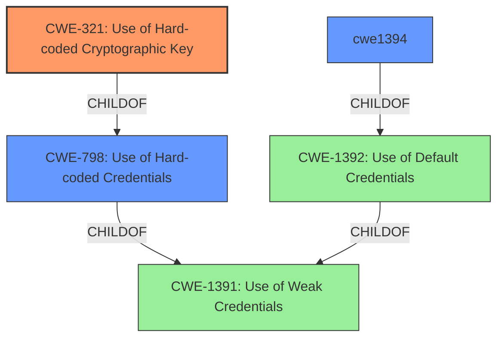

# Analysis for CVE-2022-34425

# Summary
| CWE ID | CWE Name | Confidence | CWE Abstraction Level | CWE Vulnerability Mapping Label | CWE-Vulnerability Mapping Notes |
|---|---|---|---|---|---|
| CWE-321 | Use of Hard-coded Cryptographic Key | 0.9 | Variant | Allowed | Primary CWE |
| CWE-1394 | Use of Default Cryptographic Key | 0.7 | Base | Allowed | Secondary Candidate |
| CWE-798 | Use of Hard-coded Credentials | 0.6 | Base | Allowed | Secondary Candidate |

## Evidence and Confidence

*   **Confidence Score:** 0.9
*   **Evidence Strength:** HIGH

## Relationship Analysis
The primary CWE identified is CWE-321, which is a Variant of CWE-798 (Use of Hard-coded Credentials), which in turn is a child of CWE-1391 (Use of Weak Credentials). This hierarchical relationship helps refine the classification to the most specific level possible based on the available evidence. The relationship clarifies that the vulnerability is not merely about weak credentials but specifically involves a hard-coded cryptographic key.

## Vulnerability Chain
The vulnerability chain begins with the **root cause**: the presence of a **hard-coded cryptographic key (CWE-321)**. This leads to the **impact**: an unauthenticated remote attacker gaining unauthorized access to communication. There are no missing links in the chain based on the information provided.

## Summary of Analysis
The analysis indicates a vulnerability where Dell Enterprise SONiC OS versions 4.0.0 and 4.0.1 contain a **cryptographic key vulnerability** in SSH. An unauthenticated remote attacker could exploit this, leading to unauthorized access.

The primary classification is CWE-321 (Use of Hard-coded Cryptographic Key). This is supported by the vulnerability description stating a "**cryptographic key vulnerability**" and the CVE reference summary indicating "**a cryptographic key vulnerability in the SSH implementation**". The retriever results also list CWE-321 as the top candidate.

The relationship analysis shows that CWE-321 is a variant of CWE-798 (Use of Hard-coded Credentials) and CWE-1391 (Use of Weak Credentials). Selecting CWE-321 provides the most specific classification.

CWE-1394 (Use of Default Cryptographic Key) and CWE-798 (Use of Hard-coded Credentials) were considered as secondary candidates. CWE-1394 was considered because a hard-coded key is often a default key. CWE-798 was considered because CWE-321 is a child of it.

The final selection of CWE-321 is based on the provided evidence and the hierarchical relationship analysis, which helped identify the most specific and accurate representation of the vulnerability. The retriever scores support this decision.