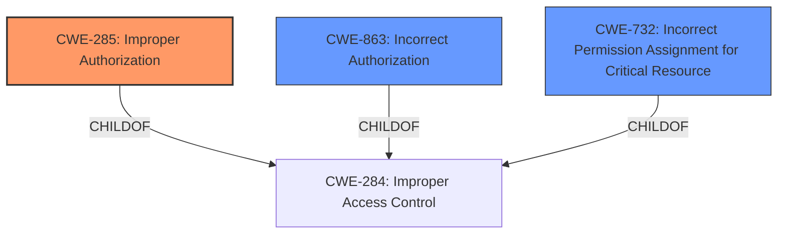

# Analysis Report for CVE-2022-34434

# Vulnerability Analysis Report: CVE-2022-34434

## Description


## Analysis (with Relationship Data)

# Summary
| CWE ID | CWE Name | Confidence | CWE Abstraction Level | CWE Vulnerability Mapping Label | CWE-Vulnerability Mapping Notes |
|---|---|---|---|---|---|
| CWE-285 | Improper Authorization | 0.8 | Class | Primary | Allowed-with-Review |
| CWE-863 | Incorrect Authorization | 0.7 | Class | Secondary | Allowed-with-Review |
| CWE-732 | Incorrect Permission Assignment for Critical Resource | 0.6 | Class | Secondary | Allowed-with-Review |

## Evidence and Confidence

*   **Confidence Score:** 0.8
*   **Evidence Strength:** HIGH

## Relationship Analysis
The primary relationship that impacted the decision was the parent-child relationship between CWE-284 (Improper Access Control) and its children like CWE-285 (Improper Authorization), CWE-863 (Incorrect Authorization), and CWE-732 (Incorrect Permission Assignment for Critical Resource). Although the vulnerability description key phrase includes "Improper Access Control", the root cause is more specifically about authorization and potentially incorrect permission assignments. Therefore, choosing CWE-285 as the primary CWE provides a more accurate and detailed representation of the weakness. CWE-863 and CWE-732 were considered as secondary options because they are more specific types of authorization flaws. The abstraction levels influenced the decision to choose a Class level CWE because Base level CWEs did not seem to fit the evidence.



## Vulnerability Chain
The vulnerability chain starts with the **Improper Access Control** within the Postgres database, leading to the potential modification or deletion of tables.
  - Root Cause: **Improper Access Control** (CWE-284), refined to Improper Authorization (CWE-285).
  - Weakness: Lacking or incorrect checks on user privileges to modify/delete database tables.
  - Impact: Compromise of integrity and availability, leading to malfunctioning/unavailable application.

## Summary of Analysis
Initially, the vulnerability description points towards a general **Improper Access Control** issue. However, after reviewing the details and CVE reference summary, it becomes clear that the root cause lies specifically in the lack of proper authorization mechanisms within the Postgres database. A threat actor with root access can bypass intended access controls and modify critical tables.

The evidence supporting this assessment includes:

*   The "Vulnerability Description Key Phrases" section explicitly states: "rootcause: **Improper Access Control**".
*   The "CVE Reference Links Content Summary" highlights the "**Improper Access Control** issue within the Postgres database".
*   The ability of a threat actor with root access to "modify or delete essential tables" indicates a flaw in authorization.

Given the available information and the hierarchical structure of CWEs, CWE-285 (Improper Authorization) is selected as the primary CWE. This selection is further supported by MITRE's mapping guidance for CWE-284, which suggests considering more specific descendants like CWE-862 (Missing Authorization), CWE-863 (Incorrect Authorization), or CWE-732 (Incorrect Permission Assignment for Critical Resource).

CWE-863 and CWE-732 were considered as secondary options because they offer more specific details, with CWE-863 indicating the authorization check is incorrectly performed, and CWE-732 related to incorrect permission assignments for critical resources.

The decision to select CWE-285 is based on the evidence that there's a failure to properly authorize actions within the database, and root access bypasses intended restrictions. While the other CWEs were considered, the current evidence doesn't strongly point towards "missing" authorization (CWE-862) or a specific error in permission assignment (CWE-732) but rather a general failure in the authorization process itself.

Relevant CWE Information:

# Enhanced Context (25 CWEs)
The following CWEs were identified as potentially relevant to this vulnerability:

## CWE-668: Exposure of Resource to Wrong Sphere
**Abstraction Level**: Class
**Similarity Score**: 0.74
**Source**: dense

**Description**:
The product exposes a resource to the wrong control sphere, providing unintended actors with inappropriate access to the resource.

**Mapping Guidance**:
- Usage: Discouraged
- Rationale: CWE-668 is high-level and is often misused as a catch-all when lower-level CWE IDs might be applicable. It is sometimes used for low-information vulnerability reports [REF-1287]. It is a level-1 Class (i.e., a child of a Pillar). It is not useful for trend analysis.

## CWE-226: Sensitive Information in Resource Not Removed Before Reuse
**Abstraction Level**: Base
**Similarity Score**: 0.73
**Source**: dense

**Description**:
The product releases a resource such as memory or a file so that it can be made available for reuse, but it does not clear or "zeroize" the information contained in the resource before the product performs a critical state transition or makes the resource available for reuse by other entities.

**Mapping Guidance**:
- Usage: Allowed
- Rationale: This CWE entry is at the Base level of abstraction, which is a preferred level of abstraction for mapping to the root causes of vulnerabilities.

## CWE-404: Improper Resource Shutdown or Release
**Abstraction Level**: Class
**Similarity Score**: 0.73
**Source**: dense

**Description**:
The product does not release or incorrectly releases a resource before it is made available for re-use.

**Mapping Guidance**:
- Usage: Allowed-with-Review
- Rationale: This CWE entry is a Class and might have Base-level children that would be more appropriate

## CWE-664: Improper Control of a Resource Through its Lifetime
**Abstraction Level**: Pillar
**Similarity Score**: 0.73
**Source**: dense

**Description**:
The product does not maintain or incorrectly maintains control over a resource throughout its lifetime of creation, use, and release.

**Mapping Guidance**:
- Usage: Discouraged
- Rationale: This CWE entry is high-level when lower-level children are available.

## CWE-345: Insufficient Verification of Data Authenticity
**Abstraction Level**: Class
**Similarity Score**: 0.73
**Source**: dense

**Description**:
The product does not sufficiently verify the origin or authenticity of data, in a way that causes it to accept invalid data.

**Mapping Guidance**:
- Usage: Discouraged
- Rationale: This CWE entry is a level-1 Class (i.e., a child of a Pillar). It might have lower-level children that would be more appropriate

## CWE-274: Improper Handling of Insufficient Privileges
**Abstraction Level**: Base
**Similarity Score**: 0.73
**Source**: dense

**Description**:
The product does not handle or incorrectly handles when it has insufficient privileges to perform an operation, leading to resultant weaknesses.

**Mapping Guidance**:
- Usage: Discouraged
- Rationale: This CWE entry could be deprecated in a future version of CWE.

## CWE-280: Improper Handling of Insufficient Permissions or Privileges 
**Abstraction Level**: Base
**Similarity Score**: 0.72
**Source**: dense

**Description**:
The product does not handle or incorrectly handles when it has insufficient privileges to access resources or functionality as specified by their permissions. This may cause it to follow unexpected code paths that may leave the product in an invalid state.

**Mapping Guidance**:
- Usage: Allowed
- Rationale: This CWE entry is at the Base level of abstraction, which is a preferred level of abstraction for mapping to the root causes of vulnerabilities.

## CWE-807: Reliance on Untrusted Inputs in a Security Decision
**Abstraction Level**: Base
**Similarity Score**: 0.72
**Source**: dense

**Description**:
The product uses a protection mechanism that relies on the existence or values of an input, but the input can be modified by an untrusted actor in a way that bypasses the protection mechanism.

**Mapping Guidance**:
- Usage: Allowed
- Rationale: This CWE entry is at the Base level of abstraction, which is a preferred level of abstraction for mapping to the root causes of vulnerabilities.

## CWE-657: Violation of Secure Design Principles
**Abstraction Level**: Class
**Similarity Score**: 0.72
**Source**: dense

**Description**:
The product violates well-established principles for


## CWE Relationship Analysis

Current CWEs represent these abstraction levels: .


### Vulnerability Chain Analysis

**Chain starting from CWE-862:**
- 862 (Missing Authorization) - ROOT


**Chain starting from CWE-657:**
- 657 (Violation of Secure Design Principles) - ROOT


### CWE Relationship Diagram

```mermaid
graph TD
    classDef primary fill:#f96,stroke:#333,stroke-width:2px
    classDef secondary fill:#69f,stroke:#333
    classDef tertiary fill:#9e9,stroke:#333
```


*Report generated on 2025-03-31 06:59:33*
