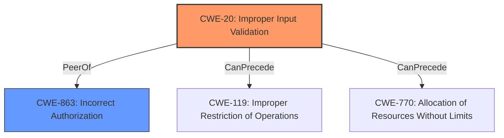

# Analysis for CVE-2022-34436

# Summary
| CWE ID  | CWE Name                        | Confidence | CWE Abstraction Level | CWE Vulnerability Mapping Label | CWE-Vulnerability Mapping Notes |
|---------|---------------------------------|------------|-----------------------|---------------------------------|---------------------------------|
| CWE-20  | Improper Input Validation       | 0.9        | Class                 | Primary                         | Discouraged, using because no more specific CWE is apparent. |
| CWE-863 | Incorrect Authorization         | 0.7        | Class                 | Secondary                       | Allowed-with-Review             |

## Evidence and Confidence

*   **Confidence Score:** 0.8
*   **Evidence Strength:** HIGH

## Relationship Analysis
The primary CWE is CWE-20, which is a Class-level CWE. While it's preferred to use a Base-level CWE, the provided information doesn't point to a more specific type of input validation issue. CWE-863 is a Class-level CWE and a peer of CWE-20, representing the authorization aspect that is impacted by the improper input validation. CWE-20 can precede CWE-119 and CWE-770, suggesting potential impacts related to buffer overflows or resource exhaustion, but these aren't explicitly stated in the description.

## Vulnerability Chain
The vulnerability chain starts with **improper input validation** (CWE-20) in the Racadm component. This leads to the ability to bypass the firmware lock-down configuration, resulting in **incorrect authorization** (CWE-863) and the ability to perform a firmware update.

## Summary of Analysis
The initial assessment pointed towards CWE-20 as the primary weakness due to the explicit mention of **improper input validation** in both the vulnerability description and the CVE reference summary. The retriever results also listed CWE-20 as the top candidate.

The description states "Dell iDRAC8 version 2.83.83.83 and prior contain an **improper input validation** vulnerability in Racadm when the firmware lock-down configuration is set. A remote high privileged attacker could exploit this vulnerability to bypass the firmware lock-down configuration and perform a firmware update."

While CWE-20 is a Class-level CWE and generally discouraged, the lack of more specific details about the type of input validation error prevents the selection of a more granular CWE.

CWE-863 (Incorrect Authorization) is included as a secondary CWE because bypassing the firmware lockdown configuration directly relates to an authorization failure. The **improper input validation** allows an attacker to perform actions they should not be authorized to do.

The final decision is based on the available evidence, with a focus on the root cause (input validation) and its direct impact (authorization bypass). The selected CWEs are at the appropriate level of specificity given the information provided.

Relevant CWE Information:

# Enhanced Context (25 CWEs)

## CWE-1289: Improper Validation of Unsafe Equivalence in Input
**Abstraction Level**: Base
**Similarity Score**: 0.76

**Description**:
The product receives an input value that is used as a resource identifier or other type of reference, but it does not validate or incorrectly validates that the input is equivalent to a potentially-unsafe value.

**Mapping Guidance**:
- Usage: Allowed
- Rationale: This CWE entry is at the Base level of abstraction, which is a preferred level of abstraction for mapping to the root causes of vulnerabilities.

*Not selected:* This CWE could potentially fit if the firmware lock-down configuration involves checking equivalence of inputs, but there is no direct evidence to support this.

## CWE-345: Insufficient Verification of Data Authenticity
**Abstraction Level**: Class
**Similarity Score**: 0.75

**Description**:
The product does not sufficiently verify the origin or authenticity of data, in a way that causes it to accept invalid data.

**Mapping Guidance**:
- Usage: Discouraged
- Rationale: This CWE entry is a level-1 Class (i.e., a child of a Pillar). It might have lower-level children that would be more appropriate

*Not selected:* While related to security, the core issue is about input validation leading to an authorization bypass, not directly related to data authenticity.

## CWE-807: Reliance on Untrusted Inputs in a Security Decision
**Abstraction Level**: Base
**Similarity Score**: 0.75

**Description**:
The product uses a protection mechanism that relies on the existence or values of an input, but the input can be modified by an untrusted actor in a way that bypasses the protection mechanism.

**Mapping Guidance**:
- Usage: Allowed
- Rationale: This CWE entry is at the Base level of abstraction, which is a preferred level of abstraction for mapping to the root causes of vulnerabilities.

*Not selected:* This is similar to the vulnerability, but the root cause is still **improper input validation** that leads to this reliance on untrusted input.

## CWE-274: Improper Handling of Insufficient Privileges
**Abstraction Level**: Base
**Similarity Score**: 0.74

**Description**:
The product does not handle or incorrectly handles when it has insufficient privileges to perform an operation, leading to resultant weaknesses.

**Mapping Guidance**:
- Usage: Discouraged
- Rationale: This CWE entry could be deprecated in a future version of CWE.

*Not selected:* The vulnerability involves bypassing privilege checks, but the root cause is the **improper input validation**, not the handling of privileges themselves.

## CWE-657: Violation of Secure Design Principles
**Abstraction Level**: Class
**Similarity Score**: 0.74

**Description**:
The product violates well-established principles for secure design.

**Mapping Guidance**:
- Usage: Discouraged
- Rationale: This CWE entry is a level-1 Class (i.e., a child of a Pillar). It might have lower-level children that would be more appropriate

*Not selected:* This is too general and doesn't capture the specific weakness.

## CWE-703: Improper Check or Handling of Exceptional Conditions
**Abstraction Level**: Pillar
**Similarity Score**: 0.74

**Description**:
The product does not properly anticipate or handle exceptional conditions that rarely occur during normal operation of the product.

**Mapping Guidance**:
- Usage: Discouraged
- Rationale: This CWE entry is extremely high-level, a Pillar.

*Not selected:* This is a high-level CWE and doesn't fit the specific vulnerability.

## CWE-668: Exposure of Resource to Wrong Sphere
**Abstraction Level**: Class
**Similarity Score**: 0.74

**Description**:
The product exposes a resource to the wrong control sphere, providing unintended actors with inappropriate access to the resource.

**Mapping Guidance**:
- Usage: Discouraged
- Rationale: CWE-668 is high-level and is often misused as a catch-all when lower-level CWE IDs might be applicable. It is sometimes used for low-information vulnerability reports [REF-1287]. It is a level-1 Class (i.e., a child of a Pillar). It is not useful for trend analysis.

*Not selected:* This is too general and doesn't capture the specific weakness.

## CWE-691: Insufficient Control Flow Management
**Abstraction Level**: Pillar
**Similarity Score**: 0.74

**Description**:
The code does not sufficiently manage its control flow during execution, creating conditions in which the control flow can be modified in unexpected ways.

**Mapping Guidance**:
- Usage: Discouraged
- Rationale: This CWE entry is extremely high-level, a Pillar. However, classification research is limited for weaknesses of this type, so there can be gaps or organizational difficulties within CWE that force use of this weakness, even at such a high level of abstraction.

*Not selected:* This is a high-level CWE and doesn't fit the specific vulnerability.

## CWE-653: Improper Isolation or Compartmentalization
**Abstraction Level**: Class
**Similarity Score**: 0.74

**Description**:
The product does not properly compartmentalize or isolate functionality, processes, or resources that require different privilege levels, rights, or permissions.

**Mapping Guidance**:
- Usage: Allowed
- Rationale: This CWE entry is at the Base level of abstraction, which is a preferred level of abstraction for mapping to the root causes of vulnerabilities.

*Not selected:* The vulnerability is related to input validation and authorization bypass, not isolation or compartmentalization.

## CWE-667: Improper Locking
**Abstraction Level**: Class
**Similarity Score**: 0.73

**