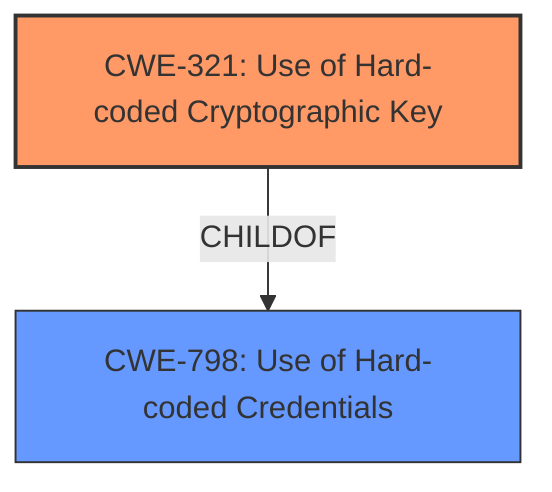

# Enhanced Analysis for CVE-2022-34442

# Summary
| CWE ID | CWE Name | Confidence | CWE Abstraction Level | CWE Vulnerability Mapping Label | CWE-Vulnerability Mapping Notes |
|---|---|---|---|---|---|
| CWE-321 | Use of Hard-coded Cryptographic Key | 1.0 | Variant | Allowed | Primary CWE |

## Evidence and Confidence

*   **Confidence Score:** 1.0
*   **Evidence Strength:** HIGH

## Relationship Analysis
The primary relationship that impacted my decision was the ChildOf relationship where CWE-321 (Use of Hard-coded Cryptographic Key) is a child of CWE-798 (Use of Hard-coded Credentials). Since the vulnerability specifically involves a hard-coded *cryptographic key* rather than more general credentials, the more specific CWE-321 was selected. The abstraction levels also influenced the decision, favoring the more specific "Variant" level for CWE-321 over the "Base" level of CWE-798.



## Vulnerability Chain
The vulnerability chain starts with the **ROOT CAUSE** of a **Hard-coded Cryptographic Key** (CWE-321). An attacker with knowledge of this key can then log into the system and gain LDAP user privileges.

## Summary of Analysis
The initial analysis identified several candidate CWEs, primarily focusing on those related to hard-coded credentials. The retriever results, particularly the sparse retriever, highlighted CWE-321, CWE-259, and CWE-798 as potential matches. Further examination of the vulnerability description, specifically the phrase "**Hard-coded Cryptographic Key**," strongly suggests CWE-321 as the most accurate classification.

The provided evidence explicitly states that the Dell EMC SCG Policy Manager contains a **hard-coded cryptographic key**. The impact is that an attacker with knowledge of this key can gain unauthorized access. This aligns perfectly with the description of CWE-321, "The use of a hard-coded cryptographic key significantly increases the possibility that encrypted data may be recovered," and in this case, allows unauthorized access.

The graph relationships reinforced this decision by showing that CWE-321 is a more specific child of CWE-798 (Use of Hard-coded Credentials). Since the vulnerability involves a cryptographic key, CWE-321 is the more precise and appropriate choice.

The MITRE mapping guidance for CWE-321 supports this decision, stating that it is at the Variant level of abstraction, which is a preferred level for mapping to the root causes of vulnerabilities. The usage is "Allowed."

The selection of CWE-321 is at the optimal level of specificity because it directly addresses the specific weakness (**Hard-coded Cryptographic Key**) present in the vulnerability.

Relevant CWE Information:

# Enhanced Context (25 CWEs)
The following CWEs were identified as potentially relevant to this vulnerability:

## CWE-321: Use of Hard-coded Cryptographic Key
**Abstraction:** Variant
**Status:** Draft

### Description
The use of a hard-coded cryptographic key significantly increases the possibility that encrypted data may be recovered.

### Extended Description
Not provided

### Alternative Terms
None

### Relationships
ChildOf -> CWE-798
ChildOf -> CWE-798
ChildOf -> CWE-798

### Mapping Guidance
**Usage:** Allowed
**Rationale:** This CWE entry is at the Variant level of abstraction, which is a preferred level of abstraction for mapping to the root causes of vulnerabilities.
**Comments:** Carefully read both the name and description to ensure that this mapping is an appropriate fit. Do not try to 'force' a mapping to a lower-level Base/Variant simply to comply with this preferred level of abstraction.
**Reasons:**
- Acceptable-Use

## CWE-798: Use of Hard-coded Credentials
**Abstraction:** Base
**Status:** Draft

### Description
The product contains hard-coded credentials, such as a password or cryptographic key.

### Extended Description
There are two main variations:

*   Inbound: the product contains an authentication mechanism that checks the input credentials against a hard-coded set of credentials. In this variant, a default administration account is created, and a simple password is hard-coded into the product and associated with that account. This hard-coded password is the same for each installation of the product, and it usually cannot be changed or disabled by system administrators without manually modifying the program, or otherwise patching the product. It can also be difficult for the administrator to detect.
*   Outbound: the product connects to another system or component, and it contains hard-coded credentials for connecting to that component. This variant applies to front-end systems that authenticate with a back-end service. The back-end service may require a fixed password that can be easily discovered. The programmer may simply hard-code those back-end credentials into the front-end product.

### Alternative Terms
None

### Relationships
ChildOf -> CWE-1391
ChildOf -> CWE-287
ChildOf -> CWE-344
ChildOf -> CWE-671
PeerOf -> CWE-257

### Mapping Guidance
**Usage:** Allowed
**Rationale:** This CWE entry is at the Base level of abstraction, which is a preferred level of abstraction for mapping to the root causes of vulnerabilities.
**Comments:** Carefully read both the name and description to ensure that this mapping is an appropriate fit. Do not try to 'force' a mapping to a lower-level Base/Variant simply to comply with this preferred level of abstraction.
**Reasons:**
- Acceptable-Use

### Considered but not used
CWE-798 (Use of Hard-coded Credentials) was considered but not used because CWE-321 (Use of Hard-coded Cryptographic Key) is a more specific variant that accurately reflects the vulnerability. While CWE-798 is a parent, CWE-321 provides greater detail and aligns perfectly with the description.

CWE-259 (Use of Hard-coded Password) was considered but not used because the vulnerability specifically involves a cryptographic key, not a password.

CWE-1391 (Use of Weak Credentials) was considered but not used because while it encompasses the concept of weak credentials, it is a more general class. The vulnerability is more precisely described as the use of a hard-coded cryptographic key, making CWE-321 a better fit.


## CWE Relationship Analysis

Current CWEs represent these abstraction levels: .


### Vulnerability Chain Analysis

**Chain starting from CWE-671:**
- 671 (Lack of Administrator Control over Security) - ROOT


**Chain starting from CWE-344:**
- 344 (Use of Invariant Value in Dynamically Changing Context) - ROOT


### CWE Relationship Diagram

```mermaid
graph TD
    classDef primary fill:#f96,stroke:#333,stroke-width:2px
    classDef secondary fill:#69f,stroke:#333
    classDef tertiary fill:#9e9,stroke:#333
```