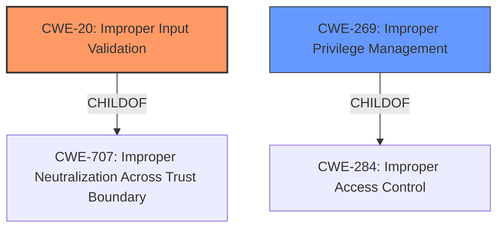

# Raw Analyzer Response for CVE-2022-34443

# Summary
| CWE ID | CWE Name | Confidence | CWE Abstraction Level | CWE Vulnerability Mapping Label | CWE-Vulnerability Mapping Notes |
|---|---|---|---|---|---|
| CWE-20 (Primary) | Improper Input Validation | 0.9 | Class | Discouraged | Consider lower-level children. |
| CWE-269 | Improper Privilege Management | 0.6 | Class | Discouraged |  If an error or mistake allows privilege escalation, then use the CWE ID for that mistake. Avoid using CWE-269 when only phrases such as "privilege escalation" or "gain privileges" are available, as these indicate technical impact of the vulnerability - not the root cause weakness. |

## Evidence and Confidence

*   **Confidence Score:** 0.75
*   **Evidence Strength:** HIGH

## Relationship Analysis
The primary relationship influencing the CWE selection is the parent-child relationship where CWE-20 **Improper Input Validation** is a child of CWE-707 **Improper Neutralization Across Trust Boundary**. While CWE-20 is a class-level CWE and thus discouraged, the evidence strongly points to input validation as the root cause. CWE-269 **Improper Privilege Management** is considered as a secondary weakness given the impact leads to privilege escalation. It's a child of CWE-284 **Improper Access Control**.

## Vulnerability Chain
The vulnerability chain starts with **Improper Input Validation** (CWE-20) in the Service EndPoint, which allows a local low-privilege attacker to escalate privileges.

## Summary of Analysis
The initial analysis identified CWE-20 **Improper Input Validation** as the primary weakness due to the explicit mention of "**Improper Input Validation**" in the vulnerability description and the CVE Reference Links Content Summary. The description states that the Dell Rugged Control Center "contain an **Improper Input Validation** in the Service EndPoint". The CVE Reference Links Content Summary reinforces this by stating the root cause is "**Improper Input Validation** in the Service EndPoint".

While CWE-20 is a Class-level CWE and normally discouraged, the evidence directly supports its selection. The suggested alternatives for CWE-20, such as CWE-1284 (Improper Validation of Specified Quantity in Input), CWE-1285 (Improper Validation of Specified Index, Position, or Offset), etc., require more specific details about the type of input and the validation error, which are not provided in the description.

CWE-269 **Improper Privilege Management** is considered as a secondary weakness given the impact is privilege escalation. The provided vulnerability information mentions that the **impact** of the vulnerability is an "Escalation of privileges". It's important to note that privilege escalation is the impact of the **Improper Input Validation**, not the root cause.

The final decision is based on the provided evidence, which strongly indicates that **Improper Input Validation** is the root cause of the vulnerability, leading to a potential escalation of privileges.