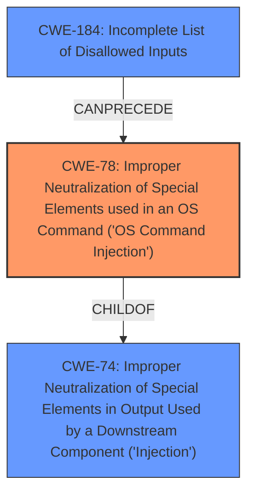

# Raw Analyzer Response for CVE-2022-34456

# Summary
| CWE ID | CWE Name | Confidence | CWE Abstraction Level | CWE Vulnerability Mapping Label | CWE-Vulnerability Mapping Notes |
|---|---|---|---|---|---|
| CWE-78 | Improper Neutralization of Special Elements used in an OS Command ('OS Command Injection') | 1.0 | Base | Allowed | Primary CWE |
| CWE-74 | Improper Neutralization of Special Elements in Output Used by a Downstream Component ('Injection') | 0.5 | Class | Discouraged | Secondary Candidate |

## Evidence and Confidence

*   **Confidence Score:** 1.0
*   **Evidence Strength:** HIGH

## Relationship Analysis
The primary relationship influencing the selection is the ChildOf relationship between CWE-78 and CWE-74. CWE-78 is a specific type of CWE-74. Additionally, CWE-78 can follow CWE-184 (Incomplete List of Disallowed Inputs), suggesting a potential scenario where an incomplete list of disallowed inputs leads to OS command injection. The abstraction levels guided the selection toward the more specific Base level (CWE-78) over the higher-level Class (CWE-74).

## Vulnerability Chain
The vulnerability chain starts with the **Code Injection Vulnerability** due to **improper neutralization**. An attacker with authenticated and non-privileged access can then exploit this to achieve arbitrary OS command execution on the application. This leads to a full system compromise.

## Summary of Analysis
The primary assessment is based on the evidence provided in the vulnerability description and the CVE reference summary.

The vulnerability description states a "**Code Injection Vulnerability**" leading to "execution of arbitrary OS commands". The CVE reference summary explicitly mentions: "**Root Cause:** The vulnerability is due to a code injection flaw...**Weaknesses/Vulnerabilities Present:** Code Injection...**Impact of Exploitation:** Successful exploitation could allow an attacker to execute arbitrary OS commands...".

CWE-78 (Improper Neutralization of Special Elements used in an OS Command ('OS Command Injection')) directly addresses the scenario where externally influenced input is used to construct an OS command without proper neutralization, leading to arbitrary command execution. This aligns precisely with the vulnerability description. The retriever results also list CWE-78 as the top candidate.

CWE-74 (Improper Neutralization of Special Elements in Output Used by a Downstream Component ('Injection')) was considered but deemed too general. While the vulnerability is indeed an injection issue, the specific impact is OS command execution, making CWE-78 a more precise fit. The mapping guidance for CWE-74 discourages its use when lower-level weaknesses are more appropriate.

The selection of CWE-78 is at the optimal level of specificity because it clearly defines the root cause (improper neutralization) and the specific impact (OS command injection). It is a Base-level CWE, which is the preferred level of abstraction.

Relevant CWE Information:

# Enhanced Context (25 CWEs)

## CWE-78: Improper Neutralization of Special Elements used in an OS Command ('OS Command Injection')
**Abstraction:** Base
**Status:** Stable

### Description
The product constructs all or part of an OS command using externally-influenced input from an upstream component, but it does not neutralize or incorrectly neutralizes special elements that could modify the intended OS command when it is sent to a downstream component.

### Extended Description
This weakness can lead to a vulnerability in environments in which the attacker does not have direct access to the operating system, such as in web applications. Alternately, if the weakness occurs in a privileged program, it could allow the attacker to specify commands that normally would not be accessible, or to call alternate commands with privileges that the attacker does not have. The problem is exacerbated if the compromised process does not follow the principle of least privilege, because the attacker-controlled commands may run with special system privileges that increases the amount of damage.

## CWE-74: Improper Neutralization of Special Elements in Output Used by a Downstream Component ('Injection')
**Abstraction:** Class
**Status:** Incomplete

### Description
The product constructs all or part of a command, data structure, or record using externally-influenced input from an upstream component, but it does not neutralize or incorrectly neutralizes special elements that could modify how it is parsed or interpreted when it is sent to a downstream component.

### Extended Description
Software or other automated logic has certain assumptions about what constitutes data and control respectively. It is the lack of verification of these assumptions for user-controlled input that leads to injection problems.