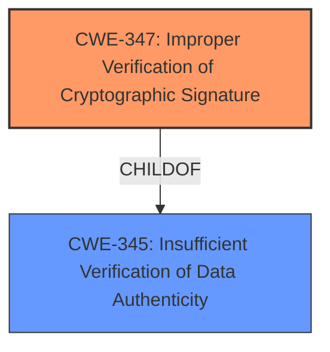

# Enhanced Analysis for CVE-2022-34459

# Summary
| CWE ID | CWE Name | Confidence | CWE Abstraction Level | CWE Vulnerability Mapping Label | CWE-Vulnerability Mapping Notes |
|---|---|---|---|---|---|
| CWE-347 | Improper Verification of Cryptographic Signature | 1.0 | Base | Allowed | Primary CWE |

## Evidence and Confidence

*   **Confidence Score:** 1.0
*   **Evidence Strength:** HIGH

## Relationship Analysis
The primary relationship that influenced the decision was the direct match of the **root cause** to the CWE description. CWE-347 is a base level CWE, which is the preferred level of abstraction. It is a child of CWE-345: Insufficient Verification of Data Authenticity, but CWE-347 is more specific.



## Vulnerability Chain
The vulnerability chain is straightforward:
1.  **Root Cause**: **Improper verification of cryptographic signature** (CWE-347)
2.  **Impact**: Malicious payload execution

## Summary of Analysis
The primary **weakness** identified in the vulnerability description is the **"improper verification of cryptographic signature"**. The "CVE Reference Links Content Summary" section confirms this as the root cause.

The Retriever Results list CWE-347 as the top combined result, with a "Base" abstraction level and "Allowed" usage. This aligns perfectly with the observed **root cause** and MITRE's mapping guidance.

The vulnerability description clearly states the **root cause** and the impact, which directly corresponds to CWE-347. There's no need to consider higher-level or more generic CWEs like CWE-20 (Improper Input Validation), since the specific **weakness** is well-defined.

Relevant CWE Information:

# Enhanced Context (25 CWEs)
The following CWEs were identified as potentially relevant to this vulnerability:

## CWE-347: Improper Verification of Cryptographic Signature
**Abstraction:** Base
**Similarity Score**: 6812.49
**Source**: sparse

**Description**:
The product does not verify, or incorrectly verifies, the cryptographic signature for data.

**Mapping Guidance**:
- Usage: Allowed
- Rationale: This CWE entry is at the Base level of abstraction, which is a preferred level of abstraction for mapping to the root causes of vulnerabilities.

## CWE-119: Improper Restriction of Operations within the Bounds of a Memory Buffer
**Abstraction:** Class
**Similarity Score**: 6845.93
**Source**: sparse

**Description**:
The product performs operations on a memory buffer, but it reads from or writes to a memory location outside the buffer's intended boundary. This may result in read or write operations on unexpected memory locations that could be linked to other variables, data structures, or internal program data.

**Mapping Guidance**:
- Usage: Discouraged
- Rationale: CWE-119 is commonly misused in low-information vulnerability reports when lower-level CWEs could be used instead, or when more details about the vulnerability are available.

## CWE-287: Improper Authentication
**Abstraction:** Class
**Similarity Score**: 6812.49
**Source**: sparse

**Description**:
When an actor claims to have a given identity, the product does not prove or insufficiently proves that the claim is correct.

**Mapping Guidance**:
- Usage: Discouraged
- Rationale: This CWE entry might be misused when lower-level CWE entries are likely to be applicable. It is a level-1 Class (i.e., a child of a Pillar).
**Comments:** Consider children or descendants, beginning with CWE-1390: Weak Authentication or CWE-306: Missing Authentication for Critical Function.
**Reasons:**
- Frequent Misuse
**Suggested Alternatives:**
- CWE-1390: Weak Authentication
- CWE-306: Missing Authentication for Critical Function

## Other Considered CWEs:
*   **CWE-119:** Improper Restriction of Operations within the Bounds of a Memory Buffer: This was considered but rejected as it doesn't directly relate to the **root cause** of the vulnerability.
*   **CWE-287:** Improper Authentication: This was considered but rejected as it is a more general class and doesn't specifically address the cryptographic signature verification issue.
*   **CWE-327:** Use of a Broken or Risky Cryptographic Algorithm: Considered, but the description indicates **improper verification**, not the use of a broken algorithm.
*   **CWE-787:** Out-of-bounds Write and CWE-125: Out-of-bounds Read: These were considered but rejected as they deal with memory buffer issues, which is not the case here.
*   **CWE-822:** Untrusted Pointer Dereference: This was considered but rejected as the vulnerability is related to the **improper verification** of the signature and not to pointer dereferences.


## CWE Relationship Analysis

Current CWEs represent these abstraction levels: .


### Vulnerability Chain Analysis

**Chain starting from CWE-327:**
- 327 (Use of a Broken or Risky Cryptographic Algorithm) - ROOT


**Chain starting from CWE-306:**
- 306 (Missing Authentication for Critical Function) - ROOT


### CWE Relationship Diagram

```mermaid
graph TD
    classDef primary fill:#f96,stroke:#333,stroke-width:2px
    classDef secondary fill:#69f,stroke:#333
    classDef tertiary fill:#9e9,stroke:#333
```