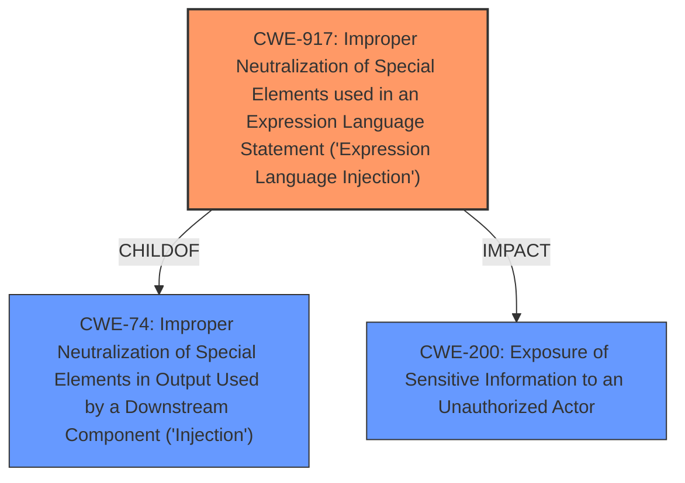

# Raw Analyzer Response for CVE-2022-34466

# Summary
| CWE ID | CWE Name | Confidence | CWE Abstraction Level | CWE Vulnerability Mapping Label | CWE-Vulnerability Mapping Notes |
|---|---|---|---|---|---|
| CWE-917 | Improper Neutralization of Special Elements used in an Expression Language Statement ('Expression Language Injection') | 1.0 | Base | Allowed | Primary CWE. The vulnerability is caused by **expression injection** due to **improper neutralization**. |
| CWE-200 | Exposure of Sensitive Information to an Unauthorized Actor | 0.7 | Class | Discouraged | Secondary CWE. The vulnerability leads to leakage of sensitive information. |

## Evidence and Confidence

*   **Confidence Score:** 0.9
*   **Evidence Strength:** HIGH

## Relationship Analysis
The primary CWE is CWE-917, which is a Base level CWE. It is related to CWE-74 (Improper Neutralization of Special Elements in Output Used by a Downstream Component ('Injection')) as a ChildOf. CWE-917 represents the specific case of expression language injection, which aligns well with the vulnerability description. CWE-200 represents the impact of the vulnerability where sensitive information is exposed.

## Vulnerability Chain
The vulnerability chain starts with the **expression injection** (CWE-917), which allows a malicious user to **leak sensitive information** (CWE-200).

## Summary of Analysis
The primary weakness is CWE-917, **Improper Neutralization of Special Elements used in an Expression Language Statement ('Expression Language Injection')**. This is based on the vulnerability description stating an **expression injection** vulnerability exists. The CVE Reference Links Content Summary also mentions this as the **root cause of the vulnerability**. The "Vulnerability Description Key Phrases" section also mentions **expression injection** as a root cause.

The vulnerability description states: "An **expression injection** vulnerability was discovered in the Workflow subsystem of Mendix Runtime, that can affect the running applications. The vulnerability could allow a malicious user to **leak sensitive information** in a certain configuration."

CWE-917 is a Base level CWE, which is the preferred level of abstraction. The "Retriever Results" also lists CWE-917 as the top combined result.

CWE-200, **Exposure of Sensitive Information to an Unauthorized Actor**, is included as a secondary CWE because the impact of the **expression injection** is the leakage of sensitive information. However, CWE-200 is a Class level CWE and is often misused, as it represents the impact rather than the root cause.

Relevant CWE Information:

# Enhanced Context (25 CWEs)
The following CWEs were identified as potentially relevant to this vulnerability:

## CWE-74: Improper Neutralization of Special Elements in Output Used by a Downstream Component ('Injection')
**Abstraction Level**: Class
**Similarity Score**: 0.78
**Source**: dense

**Description**:
The product constructs all or part of a command, data structure, or record using externally-influenced input from an upstream component, but it does not neutralize or incorrectly neutralizes special elements that could modify how it is parsed or interpreted when it is sent to a downstream component.

**Mapping Guidance**:
- Usage: Discouraged
- Rationale: CWE-74 is high-level and often misused when lower-level weaknesses are more appropriate.

## CWE-917: Improper Neutralization of Special Elements used in an Expression Language Statement ('Expression Language Injection')
**Abstraction Level**: Base
**Similarity Score**: 0.75
**Source**: dense

**Description**:
The product constructs all or part of an expression language (EL) statement in a framework such as a Java Server Page (JSP) using externally-influenced input from an upstream component, but it does not neutralize or incorrectly neutralizes special elements that could modify the intended EL statement before it is executed.

**Mapping Guidance**:
- Usage: Allowed
- Rationale: This CWE entry is at the Base level of abstraction, which is a preferred level of abstraction for mapping to the root causes of vulnerabilities.

## CWE-200: Exposure of Sensitive Information to an Unauthorized Actor
**Abstraction Level**: Class
**Similarity Score**: 7773.95
**Source**: sparse

**Description**:
The product exposes sensitive information to an actor that is not explicitly authorized to have access to that information.

**Mapping Guidance**:
- Usage: Discouraged
- Rationale: CWE-200 is commonly misused to represent the loss of confidentiality in a vulnerability, but confidentiality loss is a technical impact - not a root cause error. As of CWE 4.9, over 400 CWE entries can lead to a loss of confidentiality. Other options are often available. [REF-1287].