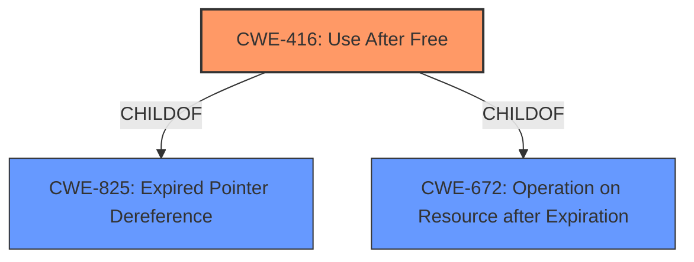

# Raw Analyzer Response for CVE-2022-3449

# Summary

| CWE ID  | CWE Name                                                                        | Confidence | CWE Abstraction Level | CWE Vulnerability Mapping Label | CWE-Vulnerability Mapping Notes |
| :-------- | :------------------------------------------------------------------------------ | :--------- | :---------------------- | :------------------------------ | :------------------------------ |
| CWE-416 | Use After Free                                                                | 1.0        | Variant               | Primary                         | Allowed                       |

## Evidence and Confidence

*   **Confidence Score:** 1.0
*   **Evidence Strength:** HIGH

## Relationship Analysis

The primary relationship influencing the decision is that CWE-416 is a Variant-level CWE, providing a specific description of the **use-after-free** vulnerability. It is also a ChildOf CWE-825 (Expired Pointer Dereference) and CWE-672 (Operation on Resource after Expiration), indicating its place within a hierarchy of memory management issues. The vulnerability description clearly indicates a **use-after-free** condition, making CWE-416 the most appropriate and specific choice.



## Vulnerability Chain

The vulnerability chain is relatively simple:

1.  **Root Cause:** **Use After Free** (CWE-416) due to **improper** memory management in Safe Browsing.
2.  **Impact:** Heap corruption leading to potential remote code execution.

## Summary of Analysis

The analysis is strongly based on the evidence provided in the vulnerability description and the "CVE Reference Links Content Summary". The key phrase "**Use after free**" directly aligns with the CWE-416 description.

The "CVE Reference Links Content Summary" confirms this with:
```
{
  "vulnerability_details": {
    "root_cause": "Use after free in Safe Browsing.",
    "weaknesses": [
      "Use after free"
    ],
    "impact": "Remote code execution",
    "attack_vectors": [
      "Web browsing"
    ]
  }
}
```

CWE-416 is at the optimal level of specificity (Variant) as it directly describes the vulnerability. The retriever results also list CWE-416 as the top candidate.

The alternatives, such as CWE-366 (Race Condition within a Thread) and CWE-843 (Access of Resource Using Incompatible Type ('Type Confusion')), were considered but deemed less appropriate as they do not directly address the **use-after-free** condition. While race conditions can lead to use-after-free, there's no evidence of a race condition in the description. Similarly, type confusion doesn't align with the provided root cause.

Relevant CWE Information:

# Enhanced Context (25 CWEs)

## CWE-366: Race Condition within a Thread
**Abstraction Level**: Base
**Similarity Score**: 0.83
**Source**: dense

**Description**:
If two threads of execution use a resource simultaneously, there exists the possibility that resources may be used while invalid, in turn making the state of execution undefined.

**Mapping Guidance**:
- Usage: Allowed
- Rationale: This CWE entry is at the Base level of abstraction, which is a preferred level of abstraction for mapping to the root causes of vulnerabilities.

## CWE-843: Access of Resource Using Incompatible Type ('Type Confusion')
**Abstraction Level**: Base
**Similarity Score**: 0.72
**Source**: dense

**Description**:
The product allocates or initializes a resource such as a pointer, object, or variable using one type, but it later accesses that resource using a type that is incompatible with the original type.

**Mapping Guidance**:
- Usage: Allowed
- Rationale: This CWE entry is at the Base level of abstraction, which is a preferred level of abstraction for mapping to the root causes of vulnerabilities.

## CWE-416: Use After Free
**Abstraction Level:** Variant
**Status:** Stable

### Description
The product reuses or references memory after it has been freed. At some point afterward, the memory may be allocated again and saved in another pointer, while the original pointer references a location somewhere within the new allocation. Any operations using the original pointer are no longer valid because the memory "belongs" to the code that operates on the new pointer.

### Mapping Guidance
**Usage:** Allowed
**Rationale:** This CWE entry is at the Variant level of abstraction, which is a preferred level of abstraction for mapping to the root causes of vulnerabilities.