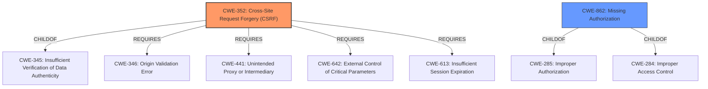

# Enhanced Analysis for CVE-2022-3451

# Summary
| CWE ID | CWE Name | Confidence | CWE Abstraction Level | CWE Vulnerability Mapping Label | CWE-Vulnerability Mapping Notes |
|---|---|---|---|---|---|
| CWE-352 | Cross-Site Request Forgery (CSRF) | 1.0 | Compound | Allowed | Primary CWE |
| CWE-862 | Missing Authorization | 1.0 | Class | Allowed-with-Review | Secondary Candidate |

## Evidence and Confidence

*   **Confidence Score:** 1.0
*   **Evidence Strength:** HIGH

## Relationship Analysis
The primary weakness identified is CWE-352, Cross-Site Request Forgery (CSRF), which is a compound weakness. CWE-352 has a child relationship with CWE-345, which represents Insufficient Verification of Data Authenticity. It also REQUIRES CWE-346, CWE-441, CWE-642, and CWE-613. The secondary weakness is CWE-862, Missing Authorization, which is a class-level CWE. It has a child relationship with CWE-285, Improper Authorization, and CWE-284, Improper Access Control. These relationships indicate a hierarchy from general access control issues to specific authorization flaws.



## Vulnerability Chain
The vulnerability chain begins with the **lack of authorization and CSRF checks**. This allows an attacker with low privileges (subscriber role) to perform unauthorized actions. Specifically, they can update arbitrary options, leading to privilege escalation (changing the default role to administrator) and ultimately full site compromise.

## Summary of Analysis
The initial assessment pointed to both CWE-352 (Cross-Site Request Forgery) and CWE-862 (Missing Authorization) as the primary weaknesses. The vulnerability description clearly states the plugin **"does not have authorization and proper CSRF checks"**. The "CVE Reference Links Content Summary" confirms the **"Missing Authorization"** because "AJAX actions can be accessed by users with roles as low as 'subscriber,' which should not be allowed" and **"Missing CSRF Protection"**. The content summary also mentions that the vulnerability is categorized under "OWASP Top 10: A5: Broken Access Control and CWE-862 (Missing Authorization)".

The retriever results also support both CWE-352 and CWE-862. Given that the vulnerability description explicitly mentions both missing authorization and CSRF checks, both CWEs are relevant.

CWE-352 is a compound weakness representing a specific type of attack where the application cannot verify if a request was intentionally provided by the user. The presence of **"proper CSRF checks"** in the vulnerability description supports this classification.

CWE-862 is a class-level weakness describing a scenario where the product does not perform an authorization check. The phrase **"does not have authorisation"** in the vulnerability description indicates this weakness.

The selection of CWE-352 as the primary CWE is based on the explicit mention of CSRF in the vulnerability description and the nature of the attack. CWE-862 is a secondary weakness as it describes the general lack of authorization. Both CWEs are at appropriate levels of specificity.

Relevant CWE Information:

# Enhanced Context (25 CWEs)
The following CWEs were identified as potentially relevant to this vulnerability:

## CWE-472: External Control of Assumed-Immutable Web Parameter
**Abstraction Level**: Base
**Similarity Score**: 0.78
**Source**: dense

**Description**:
The web application does not sufficiently verify inputs that are assumed to be immutable but are actually externally controllable, such as hidden form fields.

**Mapping Guidance**:
- Usage: Allowed
- Rationale: This CWE entry is at the Base level of abstraction, which is a preferred level of abstraction for mapping to the root causes of vulnerabilities.

## CWE-639: Authorization Bypass Through User-Controlled Key
**Abstraction Level**: Base
**Similarity Score**: 0.77
**Source**: dense

**Description**:
The system's authorization functionality does not prevent one user from gaining access to another user's data or record by modifying the key value identifying the data.

**Mapping Guidance**:
- Usage: Allowed
- Rationale: This CWE entry is at the Base level of abstraction, which is a preferred level of abstraction for mapping to the root causes of vulnerabilities.

## CWE-184: Incomplete List of Disallowed Inputs
**Abstraction Level**: Base
**Similarity Score**: 0.76
**Source**: dense

**Description**:
The product implements a protection mechanism that relies on a list of inputs (or properties of inputs) that are not allowed by policy or otherwise require other action to neutralize before additional processing takes place, but the list is incomplete.

**Mapping Guidance**:
- Usage: Allowed
- Rationale: This CWE entry is at the Base level of abstraction, which is a preferred level of abstraction for mapping to the root causes of vulnerabilities.

## CWE-74: Improper Neutralization of Special Elements in Output Used by a Downstream Component ('Injection')
**Abstraction Level**: Class
**Similarity Score**: 0.76
**Source**: dense

**Description**:
The product constructs all or part of a command, data structure, or record using externally-influenced input from an upstream component, but it does not neutralize or incorrectly neutralizes special elements that could modify how it is parsed or interpreted when it is sent to a downstream component.

**Mapping Guidance**:
- Usage: Discouraged
- Rationale: CWE-74 is high-level and often misused when lower-level weaknesses are more appropriate.

## CWE-807: Reliance on Untrusted Inputs in a Security Decision
**Abstraction Level**: Base
**Similarity Score**: 0.76
**Source**: dense

**Description**:
The product uses a protection mechanism that relies on the existence or values of an input, but the input can be modified by an untrusted actor in a way that bypasses the protection mechanism.

**Mapping Guidance**:
- Usage: Allowed
- Rationale: This CWE entry is at the Base level of abstraction, which is a preferred level of abstraction for mapping to the root causes of vulnerabilities.

## CWE-1289: Improper Validation of Unsafe Equivalence in Input
**Abstraction Level**: Base
**Similarity Score**: 0.76
**Source**: dense

**Description**:
The product receives an input value that is used as a resource identifier or other type of reference, but it does not validate or incorrectly validates that the input is equivalent to a potentially-unsafe value.

**Mapping Guidance**:
- Usage: Allowed
- Rationale: This CWE entry is at the Base level of abstraction, which is a preferred level of abstraction for mapping to the root causes of vulnerabilities.

## CWE-425: Direct Request ('Forced Browsing')
**Abstraction Level**: Base
**Similarity Score**: 0.76
**Source**: dense

**Description**:
The web application does not adequately enforce appropriate authorization on all restricted URLs, scripts, or files.

**Mapping Guidance**:
- Usage: Allowed
- Rationale: This CWE entry is at the Base level of abstraction, which is a preferred level of abstraction for mapping to the root causes of vulnerabilities.

## CWE-116: Improper Encoding or Escaping of Output
**Abstraction Level**: Class
**Similarity Score**: 0.76
**Source**: dense

**Description**:
The product prepares a structured message for communication with another component, but encoding or escaping of the data is either missing or done incorrectly. As a result, the intended structure of the message is not preserved.

**


## CWE Relationship Analysis

Current CWEs represent these abstraction levels: .


### Vulnerability Chain Analysis

**Chain starting from CWE-862:**
- 862 (Missing Authorization) - ROOT


**Chain starting from CWE-425:**
- 425 (Direct Request ('Forced Browsing')) - ROOT


### CWE Relationship Diagram

```mermaid
graph TD
    classDef primary fill:#f96,stroke:#333,stroke-width:2px
    classDef secondary fill:#69f,stroke:#333
    classDef tertiary fill:#9e9,stroke:#333
```