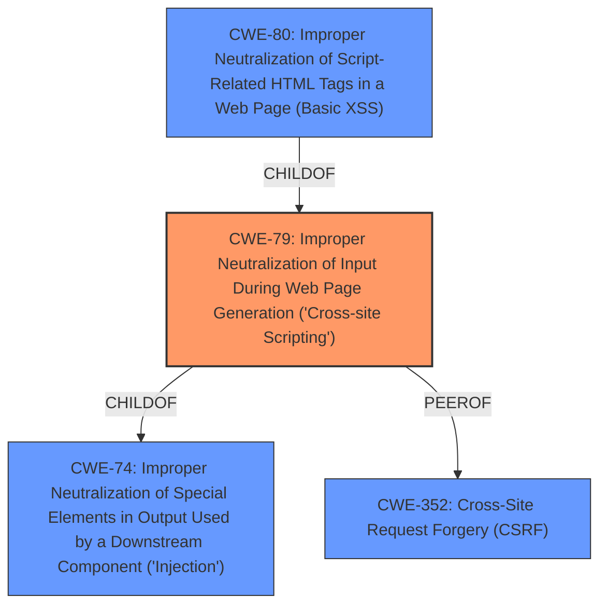

# Raw Analyzer Response for CVE-2022-3452

# Summary
| CWE ID | CWE Name | Confidence | CWE Abstraction Level | CWE Vulnerability Mapping Label | CWE-Vulnerability Mapping Notes |
|---|---|---|---|---|---|
| CWE-79 | Improper Neutralization of Input During Web Page Generation ('Cross-site Scripting') | 1.0 | Base | Allowed | Primary CWE |

## Evidence and Confidence

*   **Confidence Score:** 1.0
*   **Evidence Strength:** HIGH

## Relationship Analysis
The primary relationship impacting the decision is that CWE-79 is a base-level CWE, which is preferred for vulnerability mapping. It also has child CWEs like CWE-80, which is a variant, but the description of the vulnerability aligns more closely with the base CWE. There are also peer relationships to CWE-352, which suggests that XSS and CSRF can be related, although CSRF is not present in this specific case.

## Vulnerability Chain
The vulnerability chain starts with **improper input sanitization**, leading to **cross-site scripting**. The attacker manipulates the `category_name` argument. The lack of proper neutralization allows the injected script to be rendered in the web page, leading to potential compromise of data integrity.

## Summary of Analysis
The vulnerability is a clear case of cross-site scripting (XSS) due to **improper input sanitization** of the `category_name` parameter. The "Vulnerability Description Key Phrases" section explicitly mentions "**rootcause: improper input sanitization**" and "**weakness: cross-site scripting**". The "CVE Reference Links Content Summary" section states, "The application fails to properly neutralize user-controllable input in the `category_name` parameter before displaying it in the web page," reinforcing this assessment.

The retriever results also list CWE-79 as the top candidate with a high score. The CWE-79 description perfectly matches the vulnerability: "The product does not neutralize or incorrectly neutralizes user-controllable input before it is placed in output that is used as a web page that is served to other users." The CWE-79 mapping guidance indicates "Usage: Allowed" and "Rationale: This CWE entry is at the Base level of abstraction, which is a preferred level of abstraction for mapping to the root causes of vulnerabilities."

Other CWEs were considered but deemed less appropriate. CWE-80 is a variant of CWE-79 that focuses on script-related HTML tags, but the description is more general, so the base CWE is more fitting. CWE-89 (SQL Injection) and CWE-352 (CSRF) were also considered but are not relevant to the specific details of this XSS vulnerability.

The selection of CWE-79 is at the optimal level of specificity, accurately capturing the root cause and impact of the vulnerability based on the evidence provided.