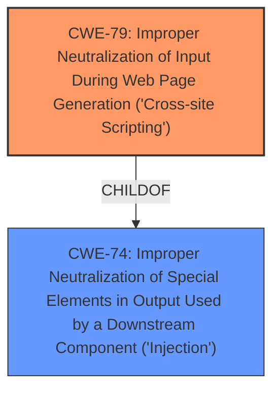

# Analysis Report for CVE-2022-3453

# Vulnerability Analysis Report: CVE-2022-3453

## Description


## Analysis (with Relationship Data)

# Summary
| CWE ID | CWE Name | Confidence | CWE Abstraction Level | CWE Vulnerability Mapping Label | CWE-Vulnerability Mapping Notes |
|---|---|---|---|---|---|
| CWE-79 | Improper Neutralization of Input During Web Page Generation ('Cross-site Scripting') | 1.0 | Base | Allowed | Primary CWE |

## Evidence and Confidence

*   **Confidence Score:** 1.0
*   **Evidence Strength:** HIGH

## Relationship Analysis
The primary relationship that influenced my decision was the parent-child relationship between CWE-74 (Improper Neutralization of Special Elements in Output Used by a Downstream Component ('Injection')) and CWE-79. CWE-79 is a child of CWE-74, making it a more specific and appropriate choice for this vulnerability. No other chain or peer relationships were relevant in this case. The vulnerability description clearly points to a Cross-Site Scripting issue due to **improper input sanitization**, which aligns perfectly with CWE-79's description.



## Vulnerability Chain
The vulnerability chain consists of:
1.  **Root Cause:** **Improper input sanitization** of the `buyer_name` argument in `transcation.php`.
2.  **Weakness:** Failure to neutralize special elements in the input, allowing malicious script injection.
3.  **Impact:** Cross-site scripting vulnerability, enabling attackers to execute malicious scripts in the victim's browser.

## Summary of Analysis
The initial analysis clearly points to a Cross-Site Scripting (XSS) vulnerability due to **improper input sanitization**. The vulnerability description and CVE Reference Links Content Summary explicitly mention the failure to neutralize user-provided input, specifically the `buyer_name` argument, before using it in the output of a web page.

The evidence is strong: "The application fails to properly neutralize user-provided input before using it in the output of a web page. Specifically, the `buyer_name` argument is vulnerable."

The graph relationships further solidify the choice of CWE-79. While CWE-74 is a parent, CWE-79 is a base-level weakness that accurately represents the vulnerability's root cause. The mapping guidance for CWE-79 explicitly states that it is at the Base level of abstraction, which is a preferred level for mapping.

The selected CWE is at the optimal level of specificity because it directly addresses the **improper neutralization** of input during web page generation, leading to XSS. This aligns with the detailed description and observed examples provided in the CWE specifications.

Relevant CWE Information:

# Enhanced Context (25 CWEs)

## CWE-79: Improper Neutralization of Input During Web Page Generation ('Cross-site Scripting')
**Abstraction:** Base
**Status:** Stable

### Description
The product does not neutralize or incorrectly neutralizes user-controllable input before it is placed in output that is used as a web page that is served to other users.

### Extended Description

Cross-site scripting (XSS) vulnerabilities occur when:

1.  Untrusted data enters a web application, typically from a web request.
2.  The web application dynamically generates a web page that contains this untrusted data.
3.  During page generation, the application does not prevent the data from containing content that is executable by a web browser, such as JavaScript, HTML tags, HTML attributes, mouse events, Flash, ActiveX, etc.
4.  A victim visits the generated web page through a web browser, which contains malicious script that was injected using the untrusted data.
5.  Since the script comes from a web page that was sent by the web server, the victim's web browser executes the malicious script in the context of the web server's domain.
6.  This effectively violates the intention of the web browser's same-origin policy, which states that scripts in one domain should not be able to access resources or run code in a different domain.

### Mapping Guidance
**Usage:** Allowed
**Rationale:** This CWE entry is at the Base level of abstraction, which is a preferred level of abstraction for mapping to the root causes of vulnerabilities.

### Observed Examples
- **CVE-2021-25926:** Python Library Manager did not sufficiently neutralize a user-supplied search term, allowing reflected XSS.

I considered other CWEs such as CWE-89 (Improper Neutralization of Special Elements used in an SQL Command ('SQL Injection')) and CWE-434 (Unrestricted Upload of File with Dangerous Type), but they did not align with the specifics of the vulnerability, which is clearly an XSS issue.


## CWE Relationship Analysis

Current CWEs represent these abstraction levels: .


### Vulnerability Chain Analysis

**Chain starting from CWE-89:**
- 89 (Improper Neutralization of Special Elements used in an SQL Command ('SQL Injection')) - ROOT


**Chain starting from CWE-74:**
- 74 (Improper Neutralization of Special Elements in Output Used by a Downstream Component ('Injection')) - ROOT


### CWE Relationship Diagram

```mermaid
graph TD
    classDef primary fill:#f96,stroke:#333,stroke-width:2px
    classDef secondary fill:#69f,stroke:#333
    classDef tertiary fill:#9e9,stroke:#333
```


*Report generated on 2025-03-31 00:49:59*
